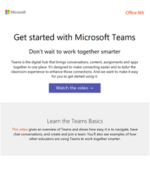
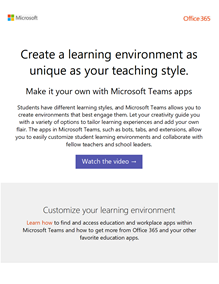
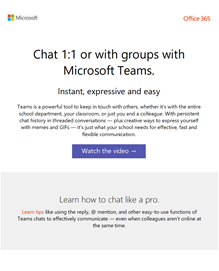
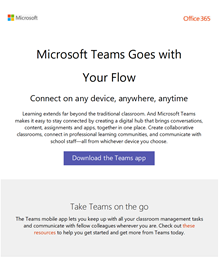
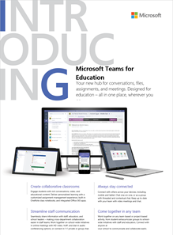
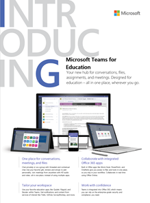
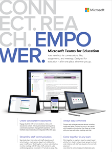
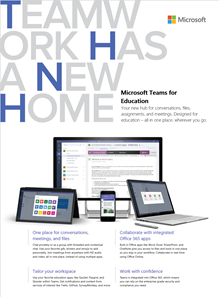
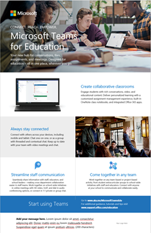
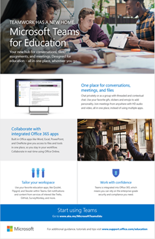

Microsoft Teams resources for Education admins
==============================================

## Adoption content

Create customized email messages, posters, and flyers with your school's information and logo. Or use ready-to-print posters, flyers, and other handouts to get your organization excited about Microsoft Teams.

|Customizable email templates |         |
|---------|---------|
|**Learn the Teams Basics** [Download the .zip file](https://github.com/MicrosoftDocs/OfficeDocs-SkypeForBusiness/blob/live/Teams/downloads/edu-resources/getting-started.zip?raw=true)     |**Customize your learning environment** [Download the .zip file](https://github.com/MicrosoftDocs/OfficeDocs-SkypeForBusiness/blob/live/Teams/downloads/edu-resources/customize-learning.zip?raw=true)        |
|**See how to streamline your workflow in Teams** [Download the .zip file](https://github.com/MicrosoftDocs/OfficeDocs-SkypeForBusiness/blob/live/Teams/downloads/edu-resources/workflows.zip?raw=true)      |**Learn how to chat like a pro** [Download the .zip file](https://github.com/MicrosoftDocs/OfficeDocs-SkypeForBusiness/blob/live/Teams/downloads/edu-resources/chat.zip?raw=true)         |
|**Take Teams on the go** [Download the .zip file](https://github.com/MicrosoftDocs/OfficeDocs-SkypeForBusiness/blob/live/Teams/downloads/edu-resources/get-teams.zip?raw=true)     |          |

|Customizable and ready-to-print flyers and posters  |        |
|---------|---------|
|**Introducing Microsoft Teams for Education - Values** [Download the customizable .docx file](https://github.com/MicrosoftDocs/OfficeDocs-SkypeForBusiness/blob/live/Teams/downloads/edu-resources/teams-edu-customizable-poster-intro-values.docx?raw=true) [Download the ready-to-print .pdf file](https://github.com/MicrosoftDocs/OfficeDocs-SkypeForBusiness/blob/live/Teams/downloads/edu-resources/teams-edu-posters-values.pdf?raw=true)     |**Introducing Microsoft Teams for Education - Features** [Download the customizable .docx file](https://github.com/MicrosoftDocs/OfficeDocs-SkypeForBusiness/blob/live/Teams/downloads/edu-resources/team-edu-customizable-poster-intro-features.docx?raw=true) [Download the ready-to-print .pdf file](https://github.com/MicrosoftDocs/OfficeDocs-SkypeForBusiness/blob/live/Teams/downloads/edu-resources/teams-edu-poster-features.pdf?raw=true)           |
|**Empower with Microsoft Teams - Values** [Download the customizable .docx file](https://github.com/MicrosoftDocs/OfficeDocs-SkypeForBusiness/blob/live/Teams/downloads/edu-resources/teams-edu-customizable-poster-empower-values.docx?raw=true) [Download the ready-to-print .pdf file](https://github.com/MicrosoftDocs/OfficeDocs-SkypeForBusiness/blob/live/Teams/downloads/edu-resources/teams-edu-posters-values.pdf?raw=true)    |**Empower with Microsoft Teams - Features** [Download the customizable .docx file](https://github.com/MicrosoftDocs/OfficeDocs-SkypeForBusiness/blob/live/Teams/downloads/edu-resources/teams-edu-customizable-poster-empower-features.docx?raw=true) [Download the ready-to-print .pdf file](https://github.com/MicrosoftDocs/OfficeDocs-SkypeForBusiness/blob/live/Teams/downloads/edu-resources/teams-edu-poster-features.pdf?raw=true)           |
|**The value of Microsoft Teams for Education** [Download the customizable .docx file](https://github.com/MicrosoftDocs/OfficeDocs-SkypeForBusiness/blob/live/Teams/downloads/edu-resources/teams-edu-customizable-flyer-values.docx?raw=true) [Download the ready-to-print .pdf file](https://github.com/MicrosoftDocs/OfficeDocs-SkypeForBusiness/blob/live/Teams/downloads/edu-resources/teams-edu-flyer-values.pdf?raw=true)     |**The features of Microsoft Teams for Education** [Download the customizable .docx file](https://github.com/MicrosoftDocs/OfficeDocs-SkypeForBusiness/blob/live/Teams/downloads/edu-resources/teams-edu-customizable-flyer-values.docx?raw=true) [Download the ready-to-print .pdf file](https://github.com/MicrosoftDocs/OfficeDocs-SkypeForBusiness/blob/live/Teams/downloads/edu-resources/teams-edu-flyer-features.pdf?raw=true)         |

|Ready-to-print packets  |        |
|---------|---------|
|**Get started with Microsoft Teams for Education - Tips and Tricks** [Download the ready-to-print .pdf file](https://github.com/MicrosoftDocs/OfficeDocs-SkypeForBusiness/blob/live/Teams/downloads/edu-resources/teams-edu-packet-get-started.pdf?raw=true)     |

## Call to action

- Check out our hands-on [Microsoft Teams Interactive Demo](https://teamsdemo.office.com/) (5 minutes to complete)
- Turn on Microsoft Teams in the [Microsoft 365 admin center](https://portal.office.com/adminportal/home#/Settings/ServicesAndAddIns) (sign in as an Office 365 admin)
- Download Teams clients: [Get Teams on all your devices](https://teams.microsoft.com/downloads)
- Learn more about Office 365 for Education at the [Education help center](https://support.office.com/education)

## Additional resources

- [Microsoft Teams roadmap](https://aka.ms/teamsroadmap)
- Stay up to date with our [Tech Community Blog](https://techcommunity.microsoft.com/t5/Microsoft-Teams-Blog/bg-p/MicrosoftTeamsBlog)
- Matt Soseman's "The Productive Cloud" Blog about [Microsoft Teams PowerShell Support](https://blogs.technet.microsoft.com/skypehybridguy/2017/11/07/microsoft-teams-powershell-support/)
- [Send a suggestion](https://aka.ms/eduuservoice)
- [Contact support](https://aka.ms/o365portal)
- [Ask the Teams community](https://aka.ms/msteamscommunity)
- [Find more resources for education](https://education.microsoft.com/)

