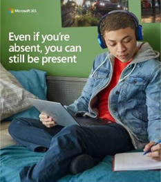

Microsoft Teams resources for Education admins
==============================================

## Adoption content

Get your school excited about Microsoft Teams with emails, posters, handouts, and more resources that you are free to use now. You can also reach students online and across campus with the new digital toolkit filled with banners, GIFs, and videos. Get started today!

Please read the terms and conditions before you use these materials.

### Physical assets

| |  |
|---------|---------|
|[Posters](https://github.com/MicrosoftDocs/OfficeDocs-SkypeForBusiness/blob/live/Teams/downloads/edu-resources/posters.zip?raw=true)      |[Handouts](https://github.com/MicrosoftDocs/OfficeDocs-SkypeForBusiness/blob/live/Teams/downloads/edu-resources/handouts.zip?raw=true) |
|[Flyers](https://github.com/MicrosoftDocs/OfficeDocs-SkypeForBusiness/blob/live/Teams/downloads/edu-resources/flyers.zip?raw=true)    |[Book adverts](https://github.com/MicrosoftDocs/OfficeDocs-SkypeForBusiness/blob/live/Teams/downloads/edu-resources/book-adverts.zip?raw=true)          |

### Digital assets

Be sure to check out the Digital Toolkit Guidance to maximize your Teams launch! 

|  |  |
|---------|---------|
|Email templates      |GIFs         |
|Web banners     |Videos           |
|Digital screen alerts    |      |

## Call to action

- Visit the [Teams for Education page](https://www.microsoft.com/education/products/teams) for trainings, videos, and interactive demos
- Turn on Teams in the [Microsoft 365 admin center](https://portal.office.com/adminportal/home#/Settings/ServicesAndAddIns) (sign in as an Office 365 admin)
- Download Teams clients: [Get Teams on all your devices](https://teams.microsoft.com/downloads)
- Learn more about Office 365 for Education at the [Education help center](https://support.office.com/education)

## Additional resources

- [Teams roadmap](https://aka.ms/teamsroadmap)
- Stay up to date with our [Tech Community Blog](https://techcommunity.microsoft.com/t5/Microsoft-Teams-Blog/bg-p/MicrosoftTeamsBlog)
- [Teams PowerShell overview](teams-powershell-overview.md)
- [Send a suggestion](https://aka.ms/eduuservoice)
- [Contact support](https://aka.ms/o365portal)
- [Ask the Teams community](https://aka.ms/msteamscommunity)
- [Find more resources for education](https://education.microsoft.com/)

*******

|Customizable email templates |         |
|---------|---------|
|**Learn the Teams basics**  [download the .zip file](https://github.com/MicrosoftDocs/OfficeDocs-SkypeForBusiness/blob/live/Teams/downloads/edu-resources/LearnTheBasics.oft?raw=true)     |**Customize your learning environment**  [Download the .oft file](https://github.com/MicrosoftDocs/OfficeDocs-SkypeForBusiness/blob/live/Teams/downloads/edu-resources/CustomizeLearningEnvironment.oft?raw=true)        |
|**See how to streamline your workflow in Teams** [Download the .oft file](https://github.com/MicrosoftDocs/OfficeDocs-SkypeForBusiness/blob/live/Teams/downloads/edu-resources/FocusOnStudents.oft?raw=true)      |**Better tools for better assignments** [Download the .oft file](https://github.com/MicrosoftDocs/OfficeDocs-SkypeForBusiness/blob/live/Teams/downloads/edu-resources/BetterTools.oft?raw=true)         |
|**Put the home back in homework** [Download the .oft file](https://github.com/MicrosoftDocs/OfficeDocs-SkypeForBusiness/blob/live/Teams/downloads/edu-resources/HomeInHomework.oft?raw=true)     |          |

|Customizable and ready-to-print flyers and posters  |        |
|---------|---------|
|**Introducing Microsoft Teams for Education - Values** [Download the customizable .docx file](https://github.com/MicrosoftDocs/OfficeDocs-SkypeForBusiness/blob/live/Teams/downloads/edu-resources/Teams_EDU_Adoption_Posters_11x17_FlyingColors.docx?raw=true) [Download the ready-to-print .pdf file](https://github.com/MicrosoftDocs/OfficeDocs-SkypeForBusiness/blob/live/Teams/downloads/edu-resources/Teams_EDU_Adoption_Posters_18x24_FlyingColors.pdf?raw=true)     |**Introducing Microsoft Teams for Education - Features** [Download the customizable .docx file](https://github.com/MicrosoftDocs/OfficeDocs-SkypeForBusiness/blob/live/Teams/downloads/edu-resources/Teams_EDU_Adoption_Posters_11x17_Teamwork.docx?raw=true) [Download the ready-to-print .pdf file](https://github.com/MicrosoftDocs/OfficeDocs-SkypeForBusiness/blob/live/Teams/downloads/edu-resources/Teams_EDU_Adoption_Posters_18x24_Teamwork.pdf?raw=true)           |
|**Empower with Microsoft Teams - Values** [Download the customizable .docx file](https://github.com/MicrosoftDocs/OfficeDocs-SkypeForBusiness/blob/live/Teams/downloads/edu-resources/Teams_EDU_Adoption_Posters_11x17_TeamsPresent.docx?raw=true) [Download the ready-to-print .pdf file](https://github.com/MicrosoftDocs/OfficeDocs-SkypeForBusiness/blob/live/Teams/downloads/edu-resources/Teams_EDU_Adoption_Posters_18x24_TeamsPresent.pdf?raw=true)   |**Empower with Microsoft Teams - Features** [Download the customizable .docx file](https://github.com/MicrosoftDocs/OfficeDocs-SkypeForBusiness/blob/live/Teams/downloads/edu-resources/Teams_EDU_Adoption_Posters_11x17_TeamsApps.docx?raw=true) [Download the ready-to-print .pdf file](https://github.com/MicrosoftDocs/OfficeDocs-SkypeForBusiness/blob/live/Teams/downloads/edu-resources/Teams_EDU_Adoption_Posters_18x24_TeamsApps.pdf?raw=true)           |
|**The value of Microsoft Teams for Education** [Download the customizable .docx file](https://github.com/MicrosoftDocs/OfficeDocs-SkypeForBusiness/blob/live/Teams/downloads/edu-resources/Teams_EDU_Adoption_Posters_11x17_TeamsCircle.docx?raw=true) [Download the ready-to-print .pdf file](https://github.com/MicrosoftDocs/OfficeDocs-SkypeForBusiness/blob/live/Teams/downloads/edu-resources/Teams_EDU_Adoption_Posters_18x24_TeamsCircle.pdf?raw=true)     |**The features of Microsoft Teams for Education** [Download the customizable .docx file](https://github.com/MicrosoftDocs/OfficeDocs-SkypeForBusiness/blob/live/Teams/downloads/edu-resources/Teams_EDU_Adoption_Posters_11x17_Homework.docx?raw=true) [Download the ready-to-print .pdf file](https://github.com/MicrosoftDocs/OfficeDocs-SkypeForBusiness/blob/live/Teams/downloads/edu-resources/Teams_EDU_Adoption_Posters_18x24_Homework.pdf?raw=true)         |

|Ready-to-print packets  |        |
|---------|---------|
|**Get started with Microsoft Teams for Education - Tips and Tricks** [Download the ready-to-print .pdf file](https://github.com/MicrosoftDocs/OfficeDocs-SkypeForBusiness/blob/live/Teams/downloads/edu-resources/teams-edu-packet-get-started.pdf?raw=true)     |
