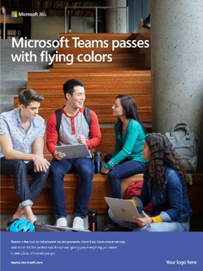
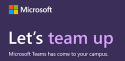

# Share Teams adoption resources

## Resources for remote learning

Help your users get up and running with the [Getting Started one-pager](https://github.com/MicrosoftDocs/OfficeDocs-SkypeForBusiness/blob/live/Teams/downloads/edu-resources/teams-for-education-getting-started-1-pager.pdf?raw=true) and any of the below adoption materials.

## Adoption content

Get your school excited about Microsoft Teams with free emails, posters, handouts, and more.

You can also reach students online and across campus with our digital toolkit of banners, GIFs, and videos.

Read the [terms and conditions](https://github.com/MicrosoftDocs/OfficeDocs-SkypeForBusiness/blob/live/Teams/downloads/edu-resources/license_agreement_teams_for_education.pdf?raw=true) before using these materials.

### Physical assets

|&nbsp; | &nbsp; |
|---------|---------|
|Posters - [customizable](https://github.com/MicrosoftDocs/OfficeDocs-SkypeForBusiness/blob/live/Teams/downloads/edu-resources/posters-customizable.zip?raw=true) and [print-ready](https://github.com/MicrosoftDocs/OfficeDocs-SkypeForBusiness/blob/live/Teams/downloads/edu-resources/posters-print-ready.zip?raw=true)      |[Handouts](https://github.com/MicrosoftDocs/OfficeDocs-SkypeForBusiness/blob/live/Teams/downloads/edu-resources/handouts.zip?raw=true) |
|[Flyers](https://github.com/MicrosoftDocs/OfficeDocs-SkypeForBusiness/blob/live/Teams/downloads/edu-resources/flyers.zip?raw=true)    |[Book adverts](https://github.com/MicrosoftDocs/OfficeDocs-SkypeForBusiness/blob/live/Teams/downloads/edu-resources/book-adverts.zip?raw=true)          |
|[Photo of Tips and Tricks booklet.](https://github.com/MicrosoftDocs/OfficeDocs-SkypeForBusiness/blob/live/Teams/downloads/edu-resources/get-started-tips-tricks.zip?raw=true)      |

### Digital assets

Check out the [Digital Toolkit Guidance](https://github.com/MicrosoftDocs/OfficeDocs-SkypeForBusiness/blob/live/Teams/downloads/edu-resources/digital-toolkit-guidance.zip?raw=true) to help your Teams launch.

| &nbsp; |&nbsp;  |
|---------|---------|
|[Email templates](https://github.com/MicrosoftDocs/OfficeDocs-SkypeForBusiness/blob/live/Teams/downloads/edu-resources/email-templates.zip?raw=true)      |[GIFs](https://github.com/MicrosoftDocs/OfficeDocs-SkypeForBusiness/blob/live/Teams/downloads/edu-resources/gifs.zip?raw=true)         |
|[Web banners](https://github.com/MicrosoftDocs/OfficeDocs-SkypeForBusiness/blob/live/Teams/downloads/edu-resources/web-banners.zip?raw=true)     |[Videos](https://github.com/MicrosoftDocs/OfficeDocs-SkypeForBusiness/blob/live/Teams/downloads/edu-resources/videos.zip?raw=true)           |
|[Digital screen adverts](https://github.com/MicrosoftDocs/OfficeDocs-SkypeForBusiness/blob/live/Teams/downloads/edu-resources/digital-screen-adverts.zip?raw=true)    |      |

## Call to action

- Visit the [Teams for Education page](https://www.microsoft.com/education/products/teams/default.aspx) for trainings, videos, and interactive demos.
- Turn on Teams in the [Microsoft 365 admin center](https://portal.office.com/adminportal/home#/Settings/ServicesAndAddIns).
- Download Teams clients: [Get Teams on all your devices](https://teams.microsoft.com/downloads).
- Learn more about Microsoft 365 for Education at the [Education help center](https://support.office.com/education).

## Additional resources

- [Teams roadmap](https://aka.ms/teamsroadmap).
- Stay up to date with our [Tech Community Blog](https://techcommunity.microsoft.com/t5/Microsoft-Teams-Blog/bg-p/MicrosoftTeamsBlog).
- [Teams PowerShell overview](teams-powershell-overview.md).
- [Send a suggestion](https://aka.ms/eduuservoice).
- [Contact support](https://aka.ms/o365portal).
- [Ask the Teams community](https://aka.ms/msteamscommunity).
- [Find more resources for education](https://education.microsoft.com/).
