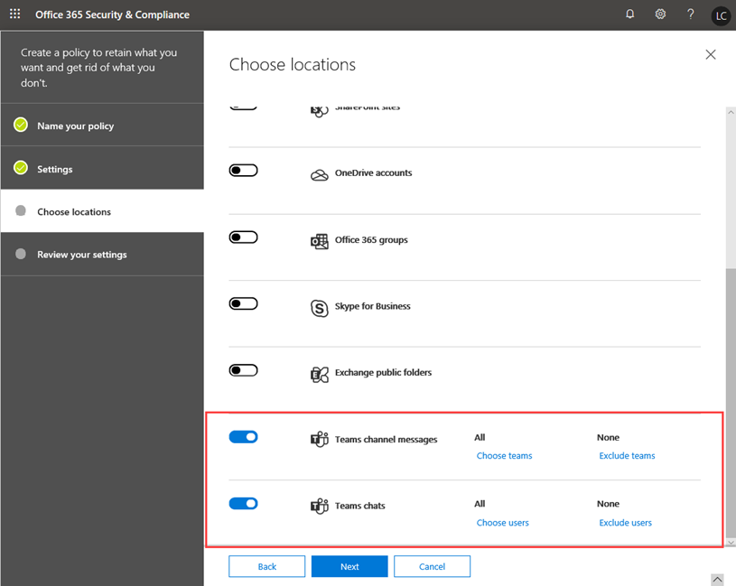
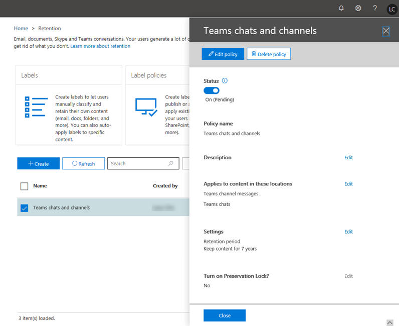

# Retention policies in Microsoft Teams

Retention policies help you to more effectively manage the information in your organization. Use retention policies to keep data that's needed to comply with your organization's internal policies, industry regulations, or legal needs, and to delete data that's considered a liability, that you're no longer required to keep, or has no legal or business value.

By default, Teams chat, channel, and files data are retained forever. As an admin, you can set up Teams retention policies for chat and channel messages and decide proactively whether to retain the data, delete it, or retain it for a specific period of time and then delete it.

You create and manage retention policies for Teams and other workloads in the [Office 365 Security & Compliance Center](https://protection.office.com/) or by using the Security & Compliance Center PowerShell cmdlets. You can apply a Teams retention policy to your entire organization or to specific users and teams.

> [!NOTE]
> We don't yet support configuration for retention of private channel messages. Retention of files shared in private channels is supported.

To learn more about retention policies for Office 365, see [Overview of retention policies](https://support.office.com/article/overview-of-retention-policies-5e377752-700d-4870-9b6d-12bfc12d2423).

## What are retention policies for Teams?

When you set up a retention policy for Teams or any other workload, you can set them up to:

- **Retain data**: Use a retention policy to ensure that your data is retained for a specified period of time, regardless of what happens in the user app. Data is retained for compliance reasons and is available for eDiscovery until the retention period expires, after which your policy indicates whether to do nothing or delete the data. For example, if you create a Teams retention policy to retain channel messages for 7 years, the messages are retained for eDiscovery for 7 years, even if users delete their messages in Teams.
- **Delete data**: Use a retention policy to delete data to ensure that it's not a liability for your organization. With a Teams retention policy, when you delete data, it's permanently deleted from all storage locations on the Teams service.

With retention policies for Teams, you can:

- Retain Teams chats and/or channel messages for a specified duration and then do nothing.
- Retain Teams chats and/or channel messages for a specified duration and then delete the data.
- Delete Teams chats and/or channel messages after a specified duration.

> [!NOTE]
> Remember that in Teams, files that users share in private chats are stored in the OneDrive for Business account of the user who shared the file. And, files that team members upload to a channel conversation are stored in the team's SharePoint site. Therefore, to retain or delete files in Teams, create retention policies that apply to OneDrive for Business and SharePoint Online.

When data is subject to a retention policy, users can continue to work with it because the data is retained in place, in its original location. If a user edits or deletes data that's subject to the policy, a copy is saved to a secure location where it's retained while the policy is in effect.

The minimum licensing requirement for retention policies is Office 365 E3. To learn more about licensing, see [Office 365 licensing for Teams](Office-365-licensing.md).

## How Teams retention policies work

Teams chats are stored in a hidden SubstrateHolds folder in the mailbox of each user in the chat, and Teams channel messages are stored in a hidden SubstratesHolds folder in the group mailbox for a team. Teams uses an Azure-powered chat service that also stores this data, and by default this service stores the data forever. With a Teams retention policy, when you delete data, the data is permanently deleted from both the Exchange mailboxes and the underlying chat service.

When you apply a retention policy to Teams chats and channel messages, here's what happens:

- If a chat or channel message is edited or deleted by a user during the retention period, the message is copied (if it was edited) or moved (if it was deleted) to the SubstrateHolds folder and stored there until the retention period expires. If the policy is configured to delete data when the retention period expires, messages are permanently deleted on the day the retention period expires.
- If a chat or channel message isn't deleted by a user during the retention period, the message is moved to the SubstrateHolds folder within one day after the retention period expires. If the policy is configured to delete data when the retention period expires, the message is permanently deleted one day after it's moved to the folder.

> [!NOTE]
> The same flow works for Skype for Business Online and Teams interop chats. When a Skype for Business Online chat comes into Teams, it becomes a message in a Teams chat thread and is ingested into the appropriate mailbox. Teams retention policies will delete these messages from the Teams thread. However, if conversation history is turned on for Skype for Business Online and from the Skype for Business Online client side those are being saved into a mailbox, that chat data isn't handled by a Teams retention policy.

Retention policies in Teams are based on the date the chat or channel messages were created and are retroactive. In other words, if you create a retention policy to delete data older than 90 days, Teams data created more than 90 days ago is deleted.

It's possible that a retention policy that's applied to SharePoint Online or OneDrive for Business could delete a file that's referenced in a Teams chat or channel message before those messages get deleted. In this scenario, the file will still show up in the Teams message, but when users click the file, they'll get a "File not found" error. This can also happen in the absence of a policy, if someone manually deletes a file from SharePoint Online or OneDrive for Business.

### Considerations and limitations

Here's some considerations and limitations to be aware of when working with Teams retention policies:

- Teams requires a retention policy that's separate from other workloads. In other words, you have to create specific retention policies for Teams chats and/or channel messages. For this reason, you can't include Teams in org-wide retention policies.

- Private channel messages aren't supported. At this time, retention policies for Teams only apply to standard channel messages.

- Teams doesn't support advanced retention settings, such as the ability to apply a policy to content that contains keywords or sensitive information. Currently, retention policies in Teams apply to all chat and/or channel message content.

- Teams may take up to three to seven days to clean up expired messages. A Teams retention policy will delete chat and channel messages when the retention period expires. However, it may take up to three to seven days to clean up these messages and permanently delete them. Also, chat and channel messages will be searchable with eDiscovery tools between the time after the retention period expires and when messages are permanently deleted.

### Multiple retention policies and the principles of retention

If you set up multiple Teams retention policies with varying durations, the [principles of retention policies](https://docs.microsoft.com/microsoft-365/compliance/retention-policies#the-principles-of-retention-or-what-takes-precedence) apply. Here's an overview of what takes precedence:

- Preservation always wins over deletion
- Longest preservation period always wins
- Explicit inclusion wins over implicit inclusion in terms of locations
- Shortest deletion period wins

## When to use retention policies for Teams

In many cases, organizations consider private chat data as more of a liability than channel messages, which are typically more project-related conversations.

You can set up separate retention policies for private chats (1:1 or 1:many chats) and channel messages. You can also configure unique policies that apply to specific users or teams in your organization. For Teams chats, you can select which users the policy applies to. For Teams channel messages, you can select which teams the policy applies to.

For example, for channel messages, you can apply a one-year deletion policy to specific teams in your organization and apply a three-year deletion policy to all other teams.

## Manage retention policies for Teams

### Using the Security & Compliance Center

#### Create a retention policy

To create a retention policy for Teams chats and channel messages, do the following:

1. In the left navigation of the Security & Compliance Center, go to **Information governance** > **Retention**.
2. Select **Create**.
3. On the **Name your policy** page, enter a name and description for your policy, and then click **Next**.
4. On the **Settings** page, specify whether you want to retain data, delete it, or both, the retention period, and then click **Next**.
5. On the **Choose locations** page, do the following, and then click **Next**:

    - To apply the policy to channel messages, turn on **Teams channel messages**.  If you want to apply the policy to specific teams in your organization, select **Choose teams**, and then select the teams that you want.
    - To apply the policy to chats, turn on **Teams chats**. If you want to apply the policy to specific users in your organization, select **Choose users**, and then select the users that you want.
      > [!NOTE]
      > When you turn on **Teams channel messages** and/or **Teams chats**, all other locations are  automatically turned off. A Teams retention policy can only include Teams locations.

        

      > [!IMPORTANT]
      > Teams chats and channel messages aren't affected by retention policies applied to user or group mailboxes in the **Exchange email** or **Office 365 groups** locations. Even though Teams chats and channel messages are stored in Exchange, they're only affected by retention policies applied to the Teams locations.

6. Review your settings, and then when you're ready, select **Create this policy**.

#### Edit a retention policy

To edit a Teams retention policy, do the following:

1. In the left navigation of the Security & Compliance Center, go to **Information governance** > **Retention**.
2. In the list of retention policies, select the check box next to the retention policy you want to edit.
3. Select **Edit** next to what you want to edit, make your changes, click **Save**, and then click **Close**.

    

#### Delete a retention policy

To delete a Teams retention policy, do the following:

1. In the left navigation of the Security & Compliance Center, go to **Information governance** > **Retention**.
2. In the list of retention policies, select the check box next to the retention policy you want to delete.
3. Select **Delete policy**.

### Using PowerShell

To create and manage Teams retention policies by using [Office 365 Security & Compliance PowerShell](https://docs.microsoft.com/powershell/exchange/office-365-scc/connect-to-scc-powershell/connect-to-scc-powershell), use the following cmdlets:

|Policy|Rule|
|---|---|
|[New-RetentionCompliancePolicy](https://docs.microsoft.com/powershell/module/exchange/policy-and-compliance-retention/new-retentioncompliancepolicy?view=exchange-ps)| [New-RetentionComplianceRule](https://docs.microsoft.com/powershell/module/exchange/policy-and-compliance-retention/new-retentioncompliancerule?view=exchange-ps)|
|[Get-RetentionCompliancePolicy](https://docs.microsoft.com/powershell/module/exchange/policy-and-compliance-retention/get-retentioncompliancepolicy?view=exchange-ps)| [Get-RetentionComplianceRule](https://docs.microsoft.com/powershell/module/exchange/policy-and-compliance-retention/get-retentioncompliancerule?view=exchange-ps)|
|[Set-RetentionCompliancePolicy](https://docs.microsoft.com/powershell/module/exchange/policy-and-compliance-retention/set-retentioncompliancepolicy?view=exchange-ps)| [Set-RetentionComplianceRule](https://docs.microsoft.com/powershell/module/exchange/policy-and-compliance-retention/set-retentioncompliancerule?view=exchange-ps)|
|[Remove-RetentionCompliancePolicy](https://docs.microsoft.com/powershell/module/exchange/policy-and-compliance-retention/remove-retentioncompliancepolicy?view=exchange-ps)| [Remove-RetentionComplianceRule](https://docs.microsoft.com/powershell/module/exchange/policy-and-compliance-retention/remove-retentioncompliancerule?view=exchange-ps)|

## Known issues

The following are known issues for retention policies in Teams that are being tracked and investigated.

- Under **Choose teams** in the **Teams channel messages** location row, you may see Office 365 Groups that aren't also Teams. This will be addressed in the future.

- Under **Choose users** in the **Teams chats** location row, you may see guests and non-mailbox users. Retention policies aren't meant to be set for guests, and we're working to remove these from the list.

- Exchange Life Cycle assistant (ELC) runs daily, but it has an SLA of 7 days. As a result, it's possible that, if you have a Teams retention policy to delete items older than 60 days, these items could persist for up to 67 days. This isn't a new situation - it follows the Exchange model. Of course, in most cases, there's no delay.

## Related topics

- [Overview of retention policies](https://support.office.com/article/overview-of-retention-policies-5e377752-700d-4870-9b6d-12bfc12d2423)
