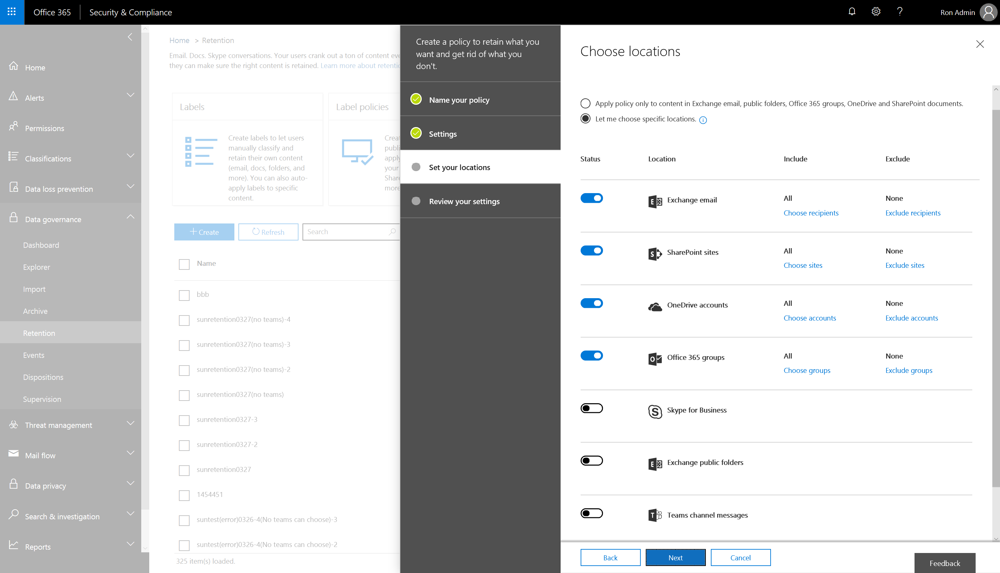

# Retention policies in Microsoft Teams

Teams conversations are persistent and retained forever by default. With the introduction of retention policies, admins can configure retention policies (both preservation and deletion) in the Security & Compliance Center for Teams chat and channel messages. This helps organizations either retain data for compliance (namely, preservation policy) for a specific period or get rid of data (namely, deletion policy) if it is considered a liability after a specific period. Teams retention policies ensure that when you delete data, it is removed from all permanent data storage locations on the Teams service. 

To manage Teams retention policies, use the settings and cmdlets in the Office 365 Security & Compliance Center under **Data Governance** > **Retention**.

Teams retention policies do support: 
    
- Preservation: Keep Teams data for a specified duration and then do nothing
- Preservation and then delete: Keep Teams data for a specified duration and then delete
- Deletion: Delete Teams data after a specified duration

Teams retention policies do not yet support:

- Advanced retention policies don't apply to Teams chat and Teams channel message locations
- Duration of fewer than 30 days

Admins can set up separate retention policies for Teams private chats (1:1 or 1:Many chats) and Teams channel messages. In many cases, organizations consider private chat data as more of a liability than channel messages, which are usually more project-related conversations. Set up these policies in the Security & Compliance Center, **Data governance** > **Retention**. Turn on **Teams channel messages** and **Teams chats** and then define retention policies for these locations (also shown in the diagram below). 

When you turn on **Teams channel messages**, you can specify Teams to which this policy will apply. For example, for teams X, Y, and Z, the admin can set the deletion policies for 1 year (by selecting those teams individually), and apply a 3-year deletion policy to the rest of the teams. 

You can do the same thing for **Teams chats** by selecting specific users and applying unique retention policies. 

> [!IMPORTANT]
> The Teams channel message locations and Teams chats locations only address the Teams conversations stored in Exchange Online mailboxes (user and group mailboxes). The messages are deleted from all relevant storage locations, namely the mailboxes, substrate, and chat service. 
> 
> To manage retention policies for Teams files, which are stored in OneDrive for Business and SharePoint, use their retention policies.

By design, deletion policies for Teams files are configured through SharePoint Online and OneDrive for Business locations. As a result, it's possible that a policy could delete a file referenced in a Teams chat or channel message before those messages get deleted. In this case, the file will still show up in the Teams message, but if you click the file, you'll get a "File not found" error (this could also happen in the absence of a policy, if someone manually deletes a file from SharePoint Online or OneDrive for Business).

For detailed information about configuring retention policies for Office 365, read [Overview of retention policies](https://support.office.com/article/overview-of-retention-policies-5e377752-700d-4870-9b6d-12bfc12d2423).
 
