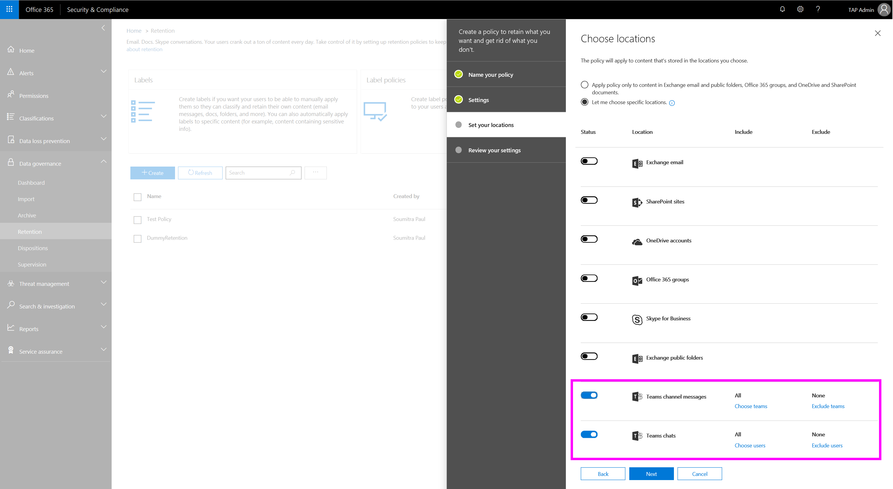

# Retention policies in Microsoft Teams

Teams conversations are persistent and retained forever by default. As an admin, you can set up retention policies for Teams chat and channel messages. Use retention policies to retain data for compliance for a specific period of time or delete data if it's considered a liability after a specific period of time. Teams retention policies ensure that when you delete data, it's removed from all permanent data storage locations on the Teams service.

You create and manage retention policies in the [Office 365 Security & Compliance Center](https://protection.office.com/).

> [!NOTE]
> We don’t yet support configuration for retention of private channel messages. Retention of files shared in private channels is supported.

## What are retention policies

With a retention policy, you decide whether to retain data, delete data, or both-retain and then delete the data. When data is subject to a retention policy, users can continue to work with it as if nothing's changed because the data is retained in place, in its original location. If a user edits or deletes data that's subject to the policy, a copy is saved to a secure location where it's retained while the policy is in effect.

When you set up a retention policy for Teams or any other workload, you can set up two main types of policies:

- Preservation: These policies ensure that your data is preserved for a given period of time, no matter what happens in the end user tools. They ensure that data is preserved for compliance reasons and available in eDiscovery until this time expires. After the time expires, your policy can indicate whether to do nothing or delete the data. In Teams, if you create a preservation policy for 7 years, even if end users delete their Teams messages, these messages are still preserved for eDiscovery for 7 years.
- Deletion: These policies ensure that data is not a liability for your organization. After the specified duration, data is deleted from all relevant storage in Teams.

Teams retention policies support the following:
    
- Retain Teams data for a specified duration and then do nothing
- Retain Teams data for a specified duration and then delete
- Delete Teams data after a specified duration

Teams retention policies don't yet support the following:

- Advanced retention policies don't apply to Teams chat and Teams channel message locations
- Duration of fewer than 30 days

## Why and when to use retention policies

You can set up separate retention policies for private chats (1:1 or 1:many chats) and channel messages in Teams. In many cases, organizations consider private chat data as more of a liability than channel messages, which are usually more project-related conversations.

### Principles of retention

If you set up multiple retention policies, each with a different action (retain, delete, or both). the following principles of retention apply.

## Create and manage retention policies

To create a Teams retention policy for chats and channel messages, do the following:

1. In the left navigation of the Security & Compliance Center, go to **Information governance** > **Retention**.
2. Select **Create**.
3. On the **Name your policy** page, enter a name and description for your policy, and then click **Next**.
4. On the **Settings** page, specify whether you want to retain data, delete it, or both, and the retention period, and then click **Next**.
5. On the **Choose locations** page, do the following, and then click **Next**:

    
    - To apply the policy to channel messages, turn on **Teams channel messages**.  If you want to apply the policy to specific teams in your organization, select **Choose teams**, and then select the teams that you want.
    - To apply the policy to chats, turn on **Teams chats**. If you want to apply the policy to specific users in your organization, select **Choose users**, and then select the users that you want.
6. Review your settings, and then when you're ready, select **Create this policy**.

> [!IMPORTANT]
> The Teams channel message locations and Teams chats locations only address the Teams conversations stored in Exchange Online mailboxes (user and group mailboxes). The messages are deleted from all relevant storage locations, namely the mailboxes, substrate, and chat service. 
> 
> To manage retention policies for Teams files, which are stored in OneDrive for Business and SharePoint, use their retention policies.

By design, deletion policies for Teams files are configured through SharePoint Online and OneDrive for Business locations. As a result, it's possible that a policy could delete a file referenced in a Teams chat or channel message before those messages get deleted. In this case, the file will still show up in the Teams message, but if you click the file, you'll get a "File not found" error (this could also happen in the absence of a policy, if someone manually deletes a file from SharePoint Online or OneDrive for Business).

++++++++++++

Teams chats are stored in a hidden folder in the mailbox of each user included in the chat, and Teams channel messages are stored in a similar hidden folder in the group mailbox for the team. However, it's important to understand that Teams uses an Azure-powered chat service that also stores this data, and by default this service stores the data forever. For this reason, we strongly recommend that you use the Teams location to retain and delete Teams data. Using the Teams location will permanently delete data from both the Exchange mailboxes and the underlying Azure-powered chat service.

Teams chats and channel messages are not affected by retention policies applied to user or group mailboxes in the Exchange or Office 365 groups locations. Even though Teams chats and channel messages are stored in Exchange, they're affected only by a retention policy that's applied to the Teams location.

## Related topics

- [Overview of retention policies](https://support.office.com/article/overview-of-retention-policies-5e377752-700d-4870-9b6d-12bfc12d2423)

+++++++++++

Teams conversations are persistent and retained forever by default. With the introduction of retention policies, admins can configure retention policies (both preservation and deletion) in the Security & Compliance Center for Teams chat and channel messages. This helps organizations either retain data for compliance (namely, preservation policy) for a specific period or get rid of data (namely, deletion policy) if it is considered a liability after a specific period. Teams retention policies ensure that when you delete data, it is removed from all permanent data storage locations on the Teams service.

> [!NOTE]
> We don’t yet support configuration for retention of private channel messages. Retention of files shared in private channels is supported.

To manage Teams retention policies, use the settings and cmdlets in the Office 365 Security & Compliance Center under **Information governance** > **Retention**.

Teams retention policies do support: 
    
- Preservation: Keep Teams data for a specified duration and then do nothing
- Preservation and then delete: Keep Teams data for a specified duration and then delete
- Deletion: Delete Teams data after a specified duration

Teams retention policies do not yet support:

- Advanced retention policies don't apply to Teams chat and Teams channel message locations
- Duration of fewer than 30 days

Admins can set up separate retention policies for Teams private chats (1:1 or 1:Many chats) and Teams channel messages. In many cases, organizations consider private chat data as more of a liability than channel messages, which are usually more project-related conversations. Set up these policies in the Security & Compliance Center, **Information governance** > **Retention**. Turn on **Teams channel messages** and **Teams chats** and then define retention policies for these locations (also shown in the diagram below). 

When you turn on **Teams channel messages**, you can specify Teams to which this policy will apply. For example, for teams X, Y, and Z, the admin can set the deletion policies for 1 year (by selecting those teams individually), and apply a 3-year deletion policy to the rest of the teams. 

You can do the same thing for **Teams chats** by selecting specific users and applying unique retention policies. 

> [!IMPORTANT]
> The Teams channel message locations and Teams chats locations only address the Teams conversations stored in Exchange Online mailboxes (user and group mailboxes). The messages are deleted from all relevant storage locations, namely the mailboxes, substrate, and chat service. 
> 
> To manage retention policies for Teams files, which are stored in OneDrive for Business and SharePoint, use their retention policies.

By design, deletion policies for Teams files are configured through SharePoint Online and OneDrive for Business locations. As a result, it's possible that a policy could delete a file referenced in a Teams chat or channel message before those messages get deleted. In this case, the file will still show up in the Teams message, but if you click the file, you'll get a "File not found" error (this could also happen in the absence of a policy, if someone manually deletes a file from SharePoint Online or OneDrive for Business).

For detailed information about configuring retention policies for Office 365, read [Overview of retention policies](https://support.office.com/article/overview-of-retention-policies-5e377752-700d-4870-9b6d-12bfc12d2423).

