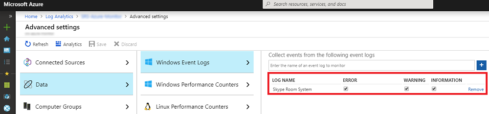
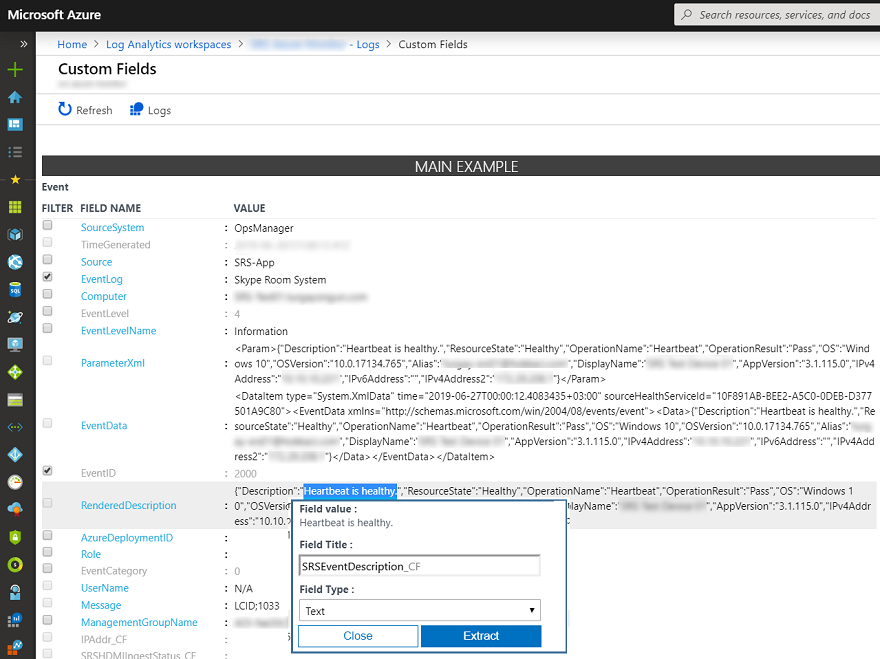
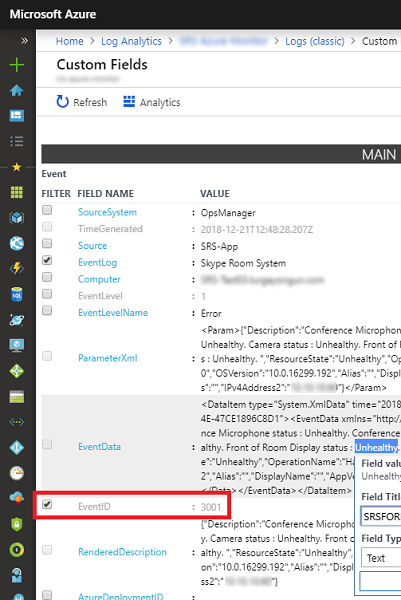
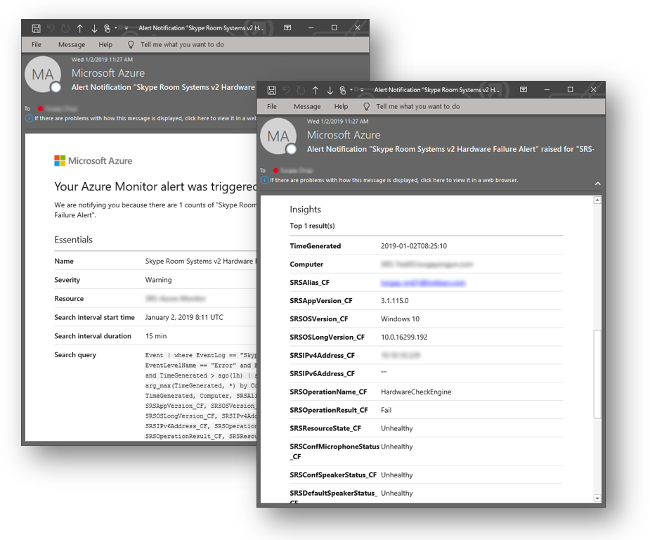

# Deploy Microsoft Teams Rooms management with Azure Monitor

This article discusses how to set up and deploy integrated, end-to-end management of Microsoft Teams Rooms devices by using Azure Monitor.

You can configure Log Analytics within Azure Monitor to provide basic telemetry and alerts that will help you manage Microsoft Teams Rooms meeting room devices. As your management solution matures, you might decide to deploy additional data and management capabilities to create a more detailed view of device availability and performance.

By following this guide, you can use a dashboard like the following example to get detailed status reporting for device availability, application and hardware health, and Microsoft Teams Rooms application and operating system version distribution.


At a high level, you need to perform the following tasks:


1.  [Validate Log Analytics configuration](azure-monitor-deploy.md#validate_LogAnalytics)
2.  [Configure test devices for Log Analytics management setup](azure-monitor-deploy.md#configure_test_devices)
3.  [Map custom fields](azure-monitor-deploy.md#Custom_fields)
4.  [Define the Microsoft Teams Rooms views in Log Analytics](azure-monitor-deploy.md#Define_Views)
5.  [Define alerts](azure-monitor-deploy.md#Alerts)
6.  [Configure all devices for Monitoring](azure-monitor-deploy.md#configure_all_devices)
7.  [Configure additional Azure Monitor solutions](azure-monitor-deploy.md#Solutions)

> [!IMPORTANT]
> Although with minimal configuration, Azure Monitor Log Analytics can monitor a computer running a Windows operating system, there are still some Microsoft Teams Rooms–specific steps that you need to take before you start deploying agents to all Microsoft Teams Rooms devices.
> Therefore, we highly recommend you perform all configuration steps in the right order for a controlled setup and configuration. The quality of the end result very much depends on the quality of the initial configuration.

## Validate Log Analytics configuration
<a name="validate_LogAnalytics"> </a>

You need to have a Log Analytics workspace to start collecting logs from Microsoft Teams Rooms devices. A workspace is a unique Log Analytics environment with its own data repository, data sources, and solutions. If you already have an existing Log Analytics workspace, you might use it to monitor your Microsoft Teams Rooms deployment or alternatively, you can create a dedicated Log Analytics workspace specific to your Microsoft Teams Rooms monitoring needs.

If you need to create a new Log Analytics workspace, follow the instructions in the article [Create a Log Analytics workspace in the Azure portal](https://docs.microsoft.com/azure/azure-monitor/learn/quick-create-workspace)

> [!NOTE]
> To use Log Analytics with Azure Monitor, you need to have an active Azure subscription. If you don’t have an Azure subscription, you can create [a free trial subscription](https://azure.microsoft.com/free) as a starting point.

### Configure Log Analytics to collect Microsoft Teams Rooms event logs

Log Analytics only collects events from the Windows event logs that are specified in the settings. For each log, only the events with the selected severities are collected.

You need to configure Log Analytics to collect the logs required to monitor Microsoft Teams Rooms device and application status. Microsoft Teams Rooms devices use the **Skype Room System** event log.

To configure Log Analytics to collect the Microsoft Teams Rooms events, see [Windows event log data sources in Azure Monitor](https://docs.microsoft.com/azure/azure-monitor/platform/data-sources-windows-events)



> [!IMPORTANT]
> Configure Windows Event Log settings and enter **Skype Room System** as event log name, and then select the **Error**, **Warning**, and **Information** check boxes.

## Configure test devices for Azure Monitoring
<a name="configure_test_devices"> </a>

You need to prepare Log Analytics to be able to monitor Microsoft Teams Rooms–related events. To start with, you need to deploy Microsoft Monitoring agents to just one or two Microsoft Teams Rooms devices that you have physical access to, and get those test devices generate some data and push it to the Log Analytics workspace.

### Install Microsoft Monitoring agents to test devices

Deploy the Microsoft Monitoring agent to the test devices by using the instructions provided in [Connect Windows computers to the Log Analytics service in Azure](https://docs.microsoft.com/azure/azure-monitor/platform/agent-windows). This article provides detailed information about the steps for deploying Microsoft Monitoring Agent for Windows, instructions for obtaining the Log Analytics ***Workspace ID*** and the ***primary key*** to get Microsoft Teams Rooms devices connected to your Azure Monitor deployment, and steps to verify agent connectivity to Log Analytics instance.

### Generate sample Microsoft Teams Rooms events

After the Microsoft Monitoring agent is deployed onto the test devices, verify that the required event log data is collected by Azure Monitor.

> [!NOTE]
> Reboot the device after the installation of the Microsoft Monitoring agent, and make sure that Microsoft Teams Rooms Meeting app is started, so that it can generate new events into the Event Log.

1.  Sign in to the [Microsoft Azure portal](https://portal.azure.com) and go to Log Analytics and select your workspace.

2.  List the heartbeat events generated by a Microsoft Teams Rooms device:
    1.  Select your workspace and go to **Logs** and use a query to retrieve the heartbeat records that will have the custom fields for Microsoft Teams Rooms.
    2.  Sample query: `Event | where Source == "SRS-App" and EventID == 2000`

3.  Make sure that the query returns log records that include events generated by the Microsoft Teams Rooms meetings app.

4.  Generate a hardware issue, and validate that the required events are logged in Azure Log Analytics.
    1.  Unplug one of the peripheral devices on the test Microsoft Teams Rooms system. This could be the camera, speakerphone, microphone, or Front Room Display
    2.  Wait 10 minutes for the event log to be populated in Azure Log Analytics.
    3.  Use a query to list hardware error events: `Event | where Source == "SRS-App" and EventID == 3001`

5.  Generate an application issue, and validate that the required events are logged.
    1.  Modify Microsoft Teams Rooms application configuration, and type an incorrect Session Initiation Protocol (SIP) address/password pair.
    2.  Wait 10 minutes for the event log to be populated in Azure Log Analytics.
    3.  Use a query to list application error events: `Event | where Source == "SRS-App" and EventID == 2001 and EventLevel == 1`

> [!IMPORTANT]
> These sample event logs are required before custom fields can be configured. Don’t proceed to the next step until you have collected the required event logs.

## Map custom fields
<a name="Custom_fields"> </a>

You use custom fields to extract specific data from the event logs. You need to define custom fields that will be used later with your tiles, dashboard views, and alerts. See [Custom fields in Log Analytics](https://docs.microsoft.com/azure/azure-monitor/platform/custom-fields) and become familiar with the concepts before you start creating your custom fields.

To extract your custom fields out of the captured event logs, follow these steps:

1.  Sign in to the [Microsoft Azure portal](https://portal.azure.com) and go to Log Analytics and select your workspace.

2. List the events generated by a Microsoft Teams Rooms device:
   1.  Go to **Logs** and use a query to retrieve the records that will have the custom field.
   2.  Sample query: `Event | where Source == "SRS-App" and EventID == 2000`

3. Select one of the records, select the button to the left, and start the field extraction wizard.
4. Highlight the data you’d like to extract from the RenderedDescription and provide a Field Title. The field names that you should use are provided in Table 1.

   

5. Use the mappings shown in *Table 1*. Log Analytics will automatically append the **\_CF** string when you define the new field.

> [!IMPORTANT]
> Remember that all JSON and Log Analytics fields are case-sensitive.
> 
> Pay attention to the queries required for each custom field in the table below. You need to use the correct queries for Log Analytics to successfully extract custom field values.
> 
 

**Table 1**

| **JSON field**                   | **Log Analytics custom field** | **Event ID** | **Query to use with the extraction**                   |
|:---------------------------------|:-------------------------------|:-------------|:-------------------------------------------------------|
| Description                      | SRSEventDescription         | **2000**     | Event \| where Source == "SRS-App" and EventID == 2000 |
| ResourceState                    | SRSResourceState            | **2000**     | Event \| where Source == "SRS-App" and EventID == 2000 |
| OperationName                    | SRSOperationName            | **2000**     | Event \| where Source == "SRS-App" and EventID == 2000 |
| OperationResult                  | SRSOperationResult          | **2000**     | Event \| where Source == "SRS-App" and EventID == 2000 |
| OS                               | SRSOSVersion                | **2000**     | Event \| where Source == "SRS-App" and EventID == 2000 |
| OSVersion                        | SRSOSLongVersion            | **2000**     | Event \| where Source == "SRS-App" and EventID == 2000 |
| Alias                            | SRSAlias                    | **2000**     | Event \| where Source == "SRS-App" and EventID == 2000 |
| DisplayName                      | SRSDisplayName              | **2000**     | Event \| where Source == "SRS-App" and EventID == 2000 |
| AppVersion                       | SRSAppVersion               | **2000**     | Event \| where Source == "SRS-App" and EventID == 2000 |
| IPv4Address                      | SRSIPv4Address              | **2000**     | Event \| where Source == "SRS-App" and EventID == 2000 |
| IPv6Address                      | SRSIPv6Address              | **2000**     | Event \| where Source == "SRS-App" and EventID == 2000 |
| Conference Microphone status     | SRSConfMicrophoneStatus     | **3001**     | Event \| where Source == "SRS-App" and EventID == 3001 |
| Conference Speaker status        | SRSConfSpeakerStatus        | **3001**     | Event \| where Source == "SRS-App" and EventID == 3001 |
| Default Speaker status           | SRSDefaultSpeakerStatus     | **3001**     | Event \| where Source == "SRS-App" and EventID == 3001 |
| Camera status                    | SRSCameraStatus             | **3001**     | Event \| where Source == "SRS-App" and EventID == 3001 |
| Front of Room Display status     | SRSFORDStatus               | **3001**     | Event \| where Source == "SRS-App" and EventID == 3001 |
| Motion Sensor status             | SRSMotionSensorStatus       | **3001**     | Event \| where Source == "SRS-App" and EventID == 3001 |
| HDMI Ingest status               | SRSHDMIIngestStatus         | **3001**     | Event \| where Source == "SRS-App" and EventID == 3001 |


## Define the Microsoft Teams Rooms views in Log Analytics
<a name="Define_Views"> </a>

After data is collected and custom fields are mapped, you can use View Designer to develop a dashboard containing various tiles to monitor Microsoft Teams Rooms events. Use View Designer to create the following tiles. For more information, see [Create custom views by using View Designer in Log Analytics](https://docs.microsoft.com/azure/azure-monitor/platform/view-designer)

> [!NOTE]
> Previous steps in this guide should have been completed for the dashboard tiles to work properly.

### Create a Microsoft Teams Rooms dashboard by using the import method

You can import an Microsoft Teams Rooms dashboard and start monitoring your devices quickly. Take the following steps to import the dashboard:

1.  Get the [SkypeRoomSystems_v2.omsview](https://go.microsoft.com/fwlink/?linkid=835675) dashboard file.
2.  Sign in to the [Microsoft Azure portal](https://portal.azure.com) and go to Log Analytics and select your workspace.
3.  Open **View Designer**.
4.  Select **Import**, and then select the **SkypeRoomSystems_v2.omsview** file.
5.  Select **Save**.

### Create a Microsoft Teams Rooms dashboard manually

Alternatively, you can create your own dashboard and add only the tiles that you wish to monitor.

#### Configure the Overview Tile

1.  Open **View Designer**.
2.  Select **Overview Tile**, and then select **Two numbers** from the gallery.
3.  Name the tile **Microsoft Teams Rooms**.
4.  Define the **First Tile**:<br>
    **Legend:** Devices that sent a heartbeat at least once within the last month<br>
    **Query:** ```Event | where EventLog == "Skype Room System" and TimeGenerated > ago(30d) | summarize TotalSRSDevices = dcount(Computer)```
5.  Define the **Second Tile**:<br>
    **Legend:** Active devices that sent a heartbeat within the last hour<br>
    **Query:** ```Event | where EventLog == "Skype Room System" and SRSOperationName_CF == "Heartbeat" and TimeGenerated > ago(1h) | summarize TotalSRSDevices = dcount(Computer)```
6.  Select **Apply**.

### Create a tile that displays active devices

1.  Select **View Dashboard** to start adding your tiles.
2.  Select **Number & list** from the gallery
3.  Define the **General** properties:<br>
    **Group Title:** Heartbeat Status<br>
    **New Group:** Selected
4.  Define the **Tile** properties:<br>
    **Legend:** Active devices (heartbeat sent in the last 20 minutes)<br>
    **Tile Query:** ```Event | where EventLog == "Skype Room System" and SRSOperationName_CF == "Heartbeat" and TimeGenerated > ago(20m) | summarize AggregatedValue = count() by Computer | count```
5.  Define the **List** properties:<br>
    **List Query:** ```Event | where EventLog == "Skype Room System" and SRSOperationName_CF == "Heartbeat" and TimeGenerated > ago(20m) | summarize TimeGenerated = max(TimeGenerated) by Computer | order by TimeGenerated```
6.  Define **Column Titles**:<br>
    **Name:** Computer Name<br>
    **Value:** Last Heartbeat
7.  Define **Navigation Query**.<br>
    ```search {selected item} | where EventLog == "Skype Room System" and SRSOperationName_CF == "Heartbeat" | summarize arg_max(TimeGenerated, *) by Computer | project TimeGenerated, Computer, SRSAlias_CF, SRSAppVersion_CF, SRSOSVersion_CF, SRSOSLongVersion_CF, SRSIPv4Address_CF, SRSIPv6Address_CF, SRSOperationName_CF, SRSOperationResult_CF, SRSResourceState_CF, SRSEventDescription_CF```
8.  Select **Apply**, and then **Close**.

### Create a tile that displays devices that have connectivity issues

1.  Select **Number & list** from the gallery, and then add a new tile.
2.  Define the **General** properties:<br>
    **Group Title:** Leave empty<br>
    **New Group:** Not Selected
3.  Define the **Tile** properties:<br>
    **Legend:** Inactive Devices (no heartbeat message sent in the last 20 minutes)<br>
    **Tile Query:** ```Event | where EventLog == "Skype Room System" and SRSOperationName_CF == "Heartbeat" | summarize LastHB = max(TimeGenerated) by Computer | where LastHB < ago(20m) | count```
4.  Define the **List** properties:<br>
    **List Query:** ```Event | where EventLog == "Skype Room System" and SRSOperationName_CF == "Heartbeat" | summarize TimeGenerated = max(TimeGenerated) by Computer | where TimeGenerated < ago(20m) | order by TimeGenerated```
5.  Define **Column Titles**:<br>
    **Name:** Computer Name<br>
    **Value:** Last Heartbeat
6.  Define **Navigation Query**:<br>
    ```search {selected item} | where EventLog == "Skype Room System" and SRSOperationName_CF == "Heartbeat" | summarize arg_max(TimeGenerated, *) by Computer | project TimeGenerated, Computer, SRSAlias_CF, SRSAppVersion_CF, SRSOSVersion_CF, SRSOSLongVersion_CF, SRSIPv4Address_CF, SRSIPv6Address_CF, SRSOperationName_CF, SRSOperationResult_CF, SRSResourceState_CF, SRSEventDescription_CF```
7.  Select **Apply**, and then **Close**.

### Create a tile that displays devices that have a hardware error

1.  Select **Number & list** from the gallery, and then add a new tile.
2.  Define the **General** properties:<br>
    **Group Title:** Hardware Status<br>
    **New Group:** Selected
3.  Define the **Tile** properties:<br>
    **Legend:** Devices that experienced a hardware error in the last hour<br>
    **Tile Query:** ```Event | where EventLog == "Skype Room System" and EventLevelName == "Error" and EventID == "3001" and TimeGenerated > ago(1h) | summarize AggregatedValue = count() by Computer | count```
4.  Define the **List** properties:<br>
    **List Query:** ```Event | where EventLog == "Skype Room System" and EventLevelName == "Error" and EventID == "3001" and TimeGenerated > ago(1h) | summarize TimeGenerated = max(TimeGenerated) by Computer | order by TimeGenerated```
5.  Define **Column Titles**:<br>
    **Name:** Computer Name<br>
    **Value:** Last Error
6.  Define **Navigation Query**:<br>
    ```search {selected item} | where EventLog == "Skype Room System" and EventID == 3001 and EventLevelName == "Error" | summarize arg_max(TimeGenerated, *) by Computer | project TimeGenerated, Computer, SRSAlias_CF, SRSAppVersion_CF, SRSOSVersion_CF, SRSOSLongVersion_CF, SRSIPv4Address_CF, SRSIPv6Address_CF, SRSOperationName_CF, SRSOperationResult_CF, SRSResourceState_CF, SRSConfMicrophoneStatus_CF, SRSConfSpeakerStatus_CF, SRSDefaultSpeakerStatus_CF, SRSCameraStatus_CF, SRSFORDStatus_CF, SRSMotionSensorStatus_CF, SRSHDMIIngestStatus_CF, SRSEventDescription_CF | sort by TimeGenerated desc```
7.  Select **Apply**, and then **Close**.

### Create a tile that displays Microsoft Teams Rooms Operating System versions

1.  Select **Donut & list** from the gallery, and then add a new tile.
2.  Define the **General** properties:<br>
    **Group Title:** Operating System details<br>
    **New Group:** Selected
3.  Define the **Header** properties:<br>
    **Title:** Operating System versions<br>
    **Subtitle:** Devices running specific OS versions
4.  Define the **Donut** properties:<br>
    **Query:** ```Event | where EventLog == "Skype Room System" and SRSOperationName_CF == "Heartbeat" | summarize OS_Version = max(SRSOSLongVersion_CF) by Computer | summarize AggregatedValue = count() by OS_Version | sort by OS_Version asc```<br>
    **Center Text:** Devices<br>
    **Operation:** Sum
5.  Define the **List** properties.<br>
    **List Query:** ```Event | where EventLog == "Skype Room System" and SRSOperationName_CF == "Heartbeat" | summarize SRSOSLongVersion_CF = max(SRSOSLongVersion_CF) by Computer | sort by Computer asc```<br>
    **Hide Graph:** Selected<br>
    **Enable Sparklines:** Not selected
6.  Define **Column Titles**.<br>
    **Name:** Computer Name<br>
    **Value:** Leave Empty
7.  Define **Navigation Query**.<br>
    ```search {selected item} | where EventLog == "Skype Room System" and SRSOperationName_CF == "Heartbeat" | summarize arg_max(TimeGenerated, *) by Computer | project TimeGenerated, Computer, SRSDisplayName_CF, SRSAlias_CF, SRSAppVersion_CF, SRSOSVersion_CF, SRSOSLongVersion_CF, SRSIPv4Address_CF, SRSIPv6Address_CF, SRSOperationName_CF, SRSOperationResult_CF, SRSResourceState_CF, SRSEventDescription_CF```
8.  Select **Apply** and then **Close**.

### Create a tile that displays Microsoft Teams Rooms application versions

1.  Select **Donut & list** from the gallery, and then add a new tile.
2.  Define the **General** properties:<br>
    **Group Title:** Microsoft Teams Rooms application details<br>
    **New Group:** Selected
3.  Define the **Header** properties:<br>
    **Title:** Application versions<br>
    **Subtitle:** Devices running specific application versions
4.  Define the **Donut** properties:<br>
    **Query:** ```Event | where EventLog == "Skype Room System" and SRSOperationName_CF == "Heartbeat" | summarize App_Version = max(SRSAppVersion_CF) by Computer | summarize AggregatedValue = count() by App_Version | sort by App_Version asc```<br>
    **Center Text:** Devices<br>
    **Operation:** Sum
5.  Define the **List** properties.<br>
    **List Query:** ```Event | where EventLog == "Skype Room System" and SRSOperationName_CF == "Heartbeat" | summarize SRSAppVersion_CF = max(SRSAppVersion_CF) by Computer | sort by Computer asc```<br>
    **Hide Graph:** Selected<br>
    **Enable Sparklines:** Not selected
6.  Define **Column Titles**.<br>
    **Name:** Computer Name<br>
    **Value:** Leave Empty
7.  Define **Navigation Query**.<br>
    ```search {selected item} | where EventLog == "Skype Room System" and SRSOperationName_CF == "Heartbeat" | summarize arg_max(TimeGenerated, *) by Computer | project TimeGenerated, Computer, SRSAlias_CF, SRSAppVersion_CF, SRSOSVersion_CF, SRSOSLongVersion_CF, SRSIPv4Address_CF, SRSIPv6Address_CF, SRSOperationName_CF, SRSOperationResult_CF, SRSResourceState_CF, SRSEventDescription_CF```
8.  Select **Apply** and then **Close**.

### Create a tile that displays devices that have an application error

1.  Select **Number & list** from the gallery, and then add a new tile.
2.  Define the **General** properties.<br>
    **Group Title:** Leave empty<br>
    **New Group:** Not Selected
3.  Define the **Tile** properties.<br>
    **Legend:** Devices that experienced an application error in the last hour<br>
    **Tile Query:** ```Event | where EventLog == "Skype Room System" and EventLevelName == "Error" and EventID == "2001" and TimeGenerated > ago(1h) | summarize AggregatedValue = count() by Computer | count```
4.  Define the **List** properties.<br>
    **List Query:** ```Event | where EventLog == "Skype Room System" and EventLevelName == "Error" and EventID == "2001" and TimeGenerated > ago(1h) | summarize TimeGenerated = max(TimeGenerated) by Computer | order by TimeGenerated```
5.  Define **Column Titles**.<br>
    **Name:** Computer Name<br>
    **Value:** Last Error
6.  Define **Navigation Query**.<br>
    ```search {selected item} | where EventLog == "Skype Room System" and EventID == 2001 and EventLevelName == "Error" | summarize arg_max(TimeGenerated, *) by Computer | project TimeGenerated, Computer, SRSAlias_CF, SRSAppVersion_CF, SRSOSVersion_CF, SRSOSLongVersion_CF, SRSIPv4Address_CF, SRSIPv6Address_CF, SRSOperationName_CF, SRSOperationResult_CF, SRSResourceState_CF, SRSEventDescription_CF | sort by TimeGenerated desc```
7.  Select **Apply** and then **Close**.

### Create a tile that displays devices that have been restarted

1.  Select **Number & list** from the gallery, and then add a new tile.
2.  Define the **General** properties.<br>
    **Group Title:** Leave empty<br>
    **New Group:** Not Selected
3.  Define the **Tile** properties.<br>
    **Legend:** Devices where the application was restarted in the last 24 hours, and number of restarts<br>
    **Tile Query:** ```Event | where EventLog == "Skype Room System" and EventID == "4000" and TimeGenerated > ago(24h) | summarize AggregatedValue = count() by Computer | count```
4.  Define the **List** properties.<br>
    **List Query:** ```Event | where EventLog == "Skype Room System" and EventID == "4000" and TimeGenerated > ago(24h) | order by TimeGenerated | summarize AggregatedValue = count(EventID) by Computer```
5.  Define **Column Titles**.<br>
    **Name:** Computer Name<br>
    **Value:** Number of Restarts
6.  Define **Navigation Query**.<br>
    ```search {selected item} | where EventLog == "Skype Room System" and EventID == "4000" and TimeGenerated > ago(24h) | project TimeGenerated, Computer, SRSAlias_CF, SRSAppVersion_CF, SRSOSVersion_CF, SRSOSLongVersion_CF, SRSIPv4Address_CF, SRSIPv6Address_CF, SRSOperationName_CF, SRSOperationResult_CF, SRSResourceState_CF, SRSEventDescription_CF```
7.  Select **Apply** and then **Close**.
8.  Select **Save** to save your dashboard.

Now you’ve completed creating your views.

## Configure Alerts in Azure Monitor
<a name="Alerts"> </a>

Azure Monitor can raise alerts to notify the administrators, when a Microsoft Teams Rooms console encounters an issue.

Azure Monitor includes a built-in alerting mechanism that runs through scheduled log searches at regular intervals. If the results of the log search match some particular criteria, an alert record is created.

The rule can then automatically run one or more actions to proactively notify you of the alert or invoke another process. The possible options with alerts are:
-   Sending an email
-   Invoking an external process through an HTTP POST request
-   Starting a runbook in Azure Automation service

See [Log alerts in Azure Monitor](https://docs.microsoft.com/azure/azure-monitor/platform/alerts-unified-log) to learn more about the alerts in Azure Monitor.

> [!NOTE]
> The following examples send email alerts when a Microsoft Teams Rooms device generates a hardware or an application error.

### Configure an email alert for Microsoft Teams Rooms hardware issues

Configure an alert rule that checks for Microsoft Teams Rooms devices that have encountered hardware issues within the last hour.
1.  Sign in to the [Microsoft Azure portal](https://portal.azure.com) and go to Log Analytics and select your workspace.

2. Navigate to your Log Analytics workspace and select **Alerts** and then select **New alert rule**

3. Select **Add condition** and then **Custom log search**

4.  Enter the following query to the Search query text box.<br>
    ```
    Event
    | where EventLog == "Skype Room System" and EventLevelName == "Error" and EventID == "3001" and TimeGenerated > ago(1h)
    | summarize arg_max(TimeGenerated, *) by Computer
    | project TimeGenerated, Computer, SRSAlias_CF, SRSAppVersion_CF, SRSOSVersion_CF, SRSOSLongVersion_CF, SRSIPv4Address_CF, SRSIPv6Address_CF, SRSOperationName_CF, SRSOperationResult_CF, SRSResourceState_CF, SRSConfMicrophoneStatus_CF, SRSConfSpeakerStatus_CF, SRSDefaultSpeakerStatus_CF, SRSCameraStatus_CF, SRSFORDStatus_CF, SRSMotionSensorStatus_CF, SRSHDMIIngestStatus_CF, SRSEventDescription_CF
    |sort by TimeGenerated desc
    ```

5.  Configure the Alert logic settings:<br>
    **Based on:** Number of results<br>
    **Condition:** Greater then<br>
    **Treshold:** 0<br>

6. Configure Evaluation settings and select **Done**: <br>
    **Period (in minutes):** 60<br>
    **Frequency (in minutes):** 60<br>

7. Configure action groups:
    1.  Select **Create New**
    2.  Provide suitable names for the *Action group name* and *Short Name* fields.
    3.  Specify a unique *Action Name* and select **Email/SMS/Push/Voice**, and then select **Edit details**.
    4.  Select the Email checkbox and provide the email address of the person or group that will recieve the alerts.
    5.  You may also provide your phone number to get notified with SMS, a voice call or both.
    6. Select **OK**.

8. **Customize Actions** if you like to override the subject line of the alert emails.

9. Specify a rule name and description.<br>
    **Rule Name:** Microsoft Teams Rooms Hardware Failure Alert<br>
    **Description:** List of devices that encountered a hardware issue within the last hour<br>

10. Select the intended severity and make sure the rule is enabled.

11. Select **Create alert rule**.

### Configure an email alert for Microsoft Teams Rooms application issues

Repeat the same procedure but use the following query to list devices that have encountered application issues within the last hour.

    ```
    Event
    | where EventLog == "Skype Room System" and EventLevelName == "Error" and EventID == "2001" and TimeGenerated > ago(1h)
    | summarize arg_max(TimeGenerated, *) by Computer
    | project TimeGenerated, Computer, SRSAlias_CF, SRSAppVersion_CF, SRSOSVersion_CF, SRSOSLongVersion_CF, SRSIPv4Address_CF, SRSIPv6Address_CF, SRSOperationName_CF, SRSOperationResult_CF, SRSResourceState_CF, SRSEventDescription_CF
    | sort by TimeGenerated desc
    ```

Now you’ve completed defining alerts. You can define additional alerts by using the examples above.

When an alert is generated, you’ll get an email that lists the devices that encountered an issue within the last hour.



## Configure all devices for Azure Monitoring
<a name="configure_all_devices"> </a>
After the dashboards and alerts are configured, you can set up and configure Microsoft Monitoring agent on all Microsoft Teams Rooms devices to complete your monitoring deployment.

Although you can install and configure the Microsoft Monitoring agent manually on each device, we highly recommend you leverage existing software deployment tools and methods.

If you’re building your Microsoft Teams Rooms devices for the first time, you might want to include the Microsoft Monitoring agent setup and configuration steps as part of your build process. For more information, see [Install the agent using the command line](https://docs.microsoft.com/azure/azure-monitor/platform/agent-windows#install-the-agent-using-the-command-line).

### Deploying Microsoft Monitoring agent by using a Group Policy Object (GPO)

If you already deployed your Microsoft Teams Rooms devices before you implement Azure Monitoring, you can use the provided script to set up and configure the agents by using Active Directory group policy objects.

1.  Create a shared network path and grant read access to **Domain Computers** group.

2.  Download the 64-bit version of the Microsoft Monitoring Agent for Windows from <https://go.microsoft.com/fwlink/?LinkID=517476>

3.  Extract the contents of the setup package into the network share.
    1.  Open a Command Prompt window, and then execute **MMASetup-AMD64.exe /c**
    2.  Specify the share you just created, and extract the content.

4.  Create a new Group Policy Object and assign it to the organizational unit where Microsoft Teams Rooms machine accounts are located.

5.  Configure PowerShell execution policy:
    1.  Edit the newly created Group Policy Object and navigate to Computer Configuration \\ Policies \\ Administrative Templates \\ Windows Components \\ Windows PowerShell
    2.  Enable the **Turn on Script Execution** and set **Execution Policy** to **Allow Local Scripts**.

6.  Configure the startup script:
    1.  Copy the following script and save it as Install-MMAgent.ps1.
    2.  Modify WorkspaceId, WorkspaceKey, and SetupPath parameters to match your configuration.
    3.  Edit the same Group Policy Object and navigate to Computer Configuration \\ Policies \\ Windows Settings \\ Scripts (Startup/Shutdown)
    4.  Double-click to select **Startup**, and then select **PowerShell Scripts**.
    5.  Select **Show Files**, and then copy the **Install-MMAgent.ps1** file to that folder.
    6.  Select **Add**, and then **Browse**.
    7.  Select the ps1 script you just copied.

7.  Microsoft Teams Rooms devices should install and configure the Microsoft Monitoring agent with the second reboot.

```
# Install-MMAgent.ps1
<#
Date:        04/20/2018
Script:      Install-MMAgent.ps1
Version:     1.0
#>

# Set the parameters
$WorkspaceId = "<your workspace id>"
$WorkspaceKey = "<your workspace key>"
$SetupPath = "\\Server\Share"

$SetupParameters = "/qn NOAPM=1 ADD_OPINSIGHTS_WORKSPACE=1 OPINSIGHTS_WORKSPACE_AZURE_CLOUD_TYPE=0 OPINSIGHTS_WORKSPACE_ID=$WorkspaceId OPINSIGHTS_WORKSPACE_KEY=$WorkspaceKey AcceptEndUserLicenseAgreement=1"

# $SetupParameters = $SetupParameters + " OPINSIGHTS_PROXY_URL=<Proxy server URL> OPINSIGHTS_PROXY_USERNAME=<Proxy server username> OPINSIGHTS_PROXY_PASSWORD=<Proxy server password>"

# Start PowerShell logging
Start-Transcript -Path C:\Temp\MMA-Install.Log

# Check if the Microsoft Monitoring Agent is installed
$mma = New-Object -ComObject 'AgentConfigManager.MgmtSvcCfg'

# Check if the Microsoft Monitoring agent is installed
if (!$mma)
{
    #Install agent
    Start-Process -FilePath "$SetupPath\Setup.exe" -ArgumentList $SetupParameters -ErrorAction Stop -Wait
}

# Check if the agent has a valid configuration
$CheckMMA = $mma.GetCloudWorkspace($WorkspaceId).AgentId
if (!$CheckMMA)
{
    # Apply new configuration
    $mma.AddCloudWorkspace($WorkspaceId, $WorkspaceKey)
    $mma.ReloadConfiguration()
}

Stop-Transcript
```

> [!NOTE]
> You can refer to the article [Managing and maintaining the Log Analytics agent](https://docs.microsoft.com/azure/azure-monitor/platform/agent-manage) when you need to reconfigure an agent, move it to a different workspace, or modify proxy settings after the initial installation.

## Additional Solutions
<a name="Solutions"> </a>

Azure Monitor provides built-in management solutions through its [solution gallery](https://docs.microsoft.com/azure/azure-monitor/insights/solutions) to further help you monitor your environment. We highly recommend that you add [Alert Management](https://docs.microsoft.com/azure/azure-monitor/platform/alert-management-solution) and [Azure Log Analytics Agent Health](https://docs.microsoft.com/azure/azure-monitor/insights/solution-agenthealth) solutions to your workspace as well.

> [!NOTE]
> The Agent Health solution can help you identify outdated or broken Microsoft Monitoring agents within your environment, and the Alert Management solution provides details about the alerts that have been raised within a given period.

## See also

[Plan Microsoft Teams Rooms management with Azure Monitor](azure-monitor-plan.md)

[Manage Microsoft Teams Rooms devices with Azure Monitor](azure-monitor-manage.md)
