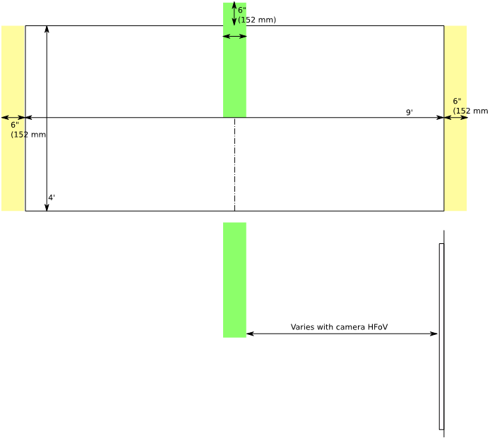
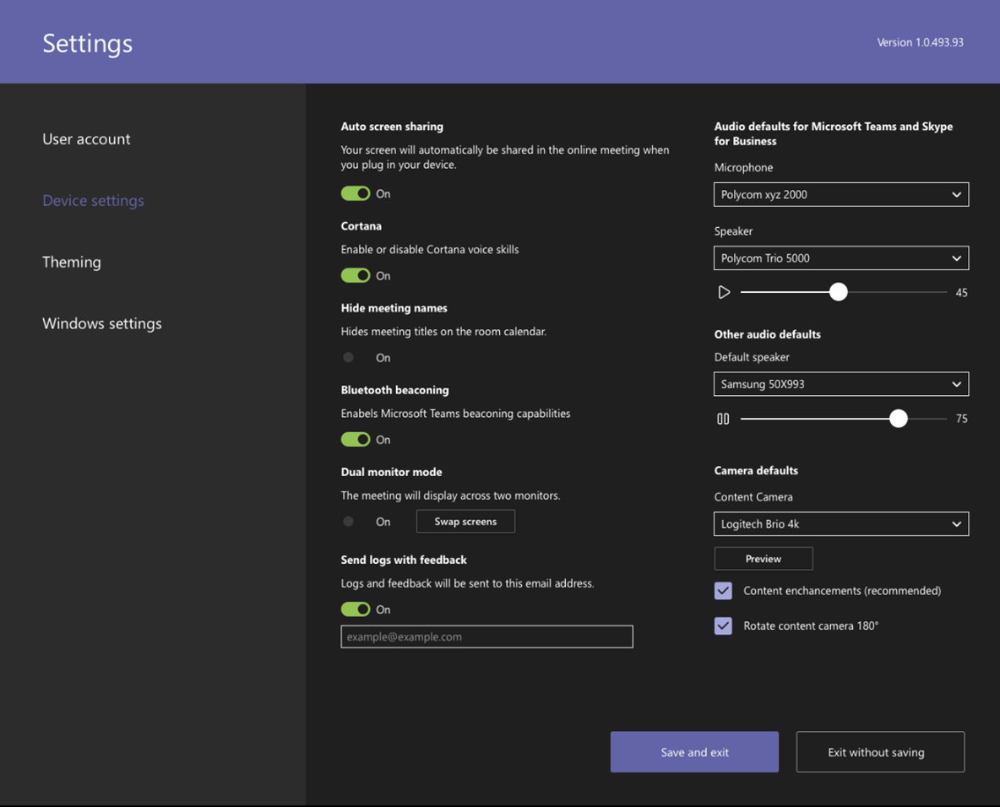

# Content cameras

You can now use a content camera with a Microsoft Teams Room system. A content camera interacts with special image-processing software and a whiteboard to allow a presenter to draw on an analog whiteboard and share the content with remote participants.

See the video [Work like you are in one place, with Microsoft Teams Rooms](https://www.youtube.com/watch?v=1XvgH2rNpmk) for an example of content camera functionality.

## Set up a content camera

> [!NOTE]
> Always adhere to your country or area's building code, which may define a minimum distance from the floor or a requirement that ceiling-mounted equipment be secured to a rafter or other structure. Follow the mounting instruction for the hardware provided with the camera you‘ve selected. OEM camera mounting kits include a camera, USB 2.0 extenders and required cabling.

The size of the whiteboard used for sharing affects the placement of the camera. Board size recommendations are:

- 3–6 ft. (0.9–1.8 m) wide — Supported
- 6–9 ft. (1.8–2.7 m) wide — Recommended
- 9–12 ft. (2.7–3.6 m) wide — Supported
- Above 12 ft. (3.6 m) wide — camera covers 9–12 ft. (2.7–3.6 m) and crops the rest.

## Camera location

Ideal placement of a content camera is centered vertically and horizontally on the whiteboard. Local building codes may have height restrictions that require the camera be elevated higher than the top of the white board.

You can install the camera up to 6 in. (152 mm) higher than the top of the whiteboard, and centered on the white board as shown. Make sure that the camera image includes at least a 6 in. (152 mm) border on both sides horizontally. You can use the camera preview in the Microsoft Teams Rooms app to determine final placement of the camera.

### Camera distances

Using typical whiteboard markers, the optimal remote user experience is to share ink strokes in the 1–2 mm per pixel range in the content camera image, and the best results use 1.5 mm per pixel. All supported cameras provide 1920 x 1080 resolution, and some can exceed that resolution.

The distance of the camera from the whiteboard combines with the camera resolution and HFoV to determine the distance from the whiteboard. The following table shows examples of distances for various whiteboard sizes. You can use these values as starting points to determine final placement of the content camera.

**Camera distance from whiteboard**

| Camera HFoV |3 ft. (0.91 m)     | 6 ft. (1.8 m)    | 9 ft. (2.74 m)        |12 ft.  (3.65 m)         | Max distance from Whiteboard  |
|:---         |:---               |:---                |:---                 |:---             | :--- |
| 80°         | 1.79 ft. (0.54 m) | 3.58 ft. (1.09 m)  | 5.36 ft. (1.6 m)    |7.15 ft. (2.17 m) |7.51 ft. (2.28 m) |
| 90°         | 1.5 ft. (0.45 m) | 3.00 ft. (0.91 m)   | 4.5 ft. (1.37 m)    |6.0 ft. (1.82 m)    |6.3 ft. (1.92 m) |
| 100°        | 1.26 ft. (0.38 m)| 2.52 ft. (0.77 m)   | 3.78 ft. (1.15 m)   |5.03 ft. (1.53 m)   |5.29 ft. (1.61 m) |
| 110°        | 1.05 ft. (0.32 m)| 2.10 ft. (0.64 m)   | 3.15 ft. (0.96 m)   |4.2 ft. (1.28 m)    |4.41 ft. (1.31 m) |
| 120°        | 0.87 ft. (0.26 m)| 1.73 ft. (0.52 m)   | 2.60 ft. (0.79 m)   |3.46 ft. (1.05 m)   |3.64 ft. (1.10 m) |
|             |               |                  |                  |        |                    |                  |

The distance between the content camera and the wall the whiteboard is mounted on depends on the HFoV for that model of camera, which varies. Install cameras with a larger HFoV (120 degrees for example) closer to the wall, and cameras with a narrower HFoV farther away from the wall. Check the HFoV before you start to install the chosen camera.

If you have whiteboards larger than 12 ft. (3.65 m) or with no corners (like full wall whiteboards), you can place the camera anywhere in the middle. The enhancement software selects an area in the middle if it fails to find whiteboard corners.

> [!NOTE]
> You can use dark-colored tape or other items to create a defined content camera area on a full-wall white board.
>
> You can choose to have the camera mounted on a moveable tripod instead of a permanent mount. Place the tripod centered on the whiteboard. This setup may be temporary or used where there is little chance of knocking over the equipment. If you use a temporary mount, remember that content enhancement will be impacted if you move the camera after the initial share and you will need to re-share to correct for movement.
>
> A writing board that isn't white is not supported.

## Supported cameras

To determine whether you can use a camera as a content camera, refer to [Certified firmware versions for USB audio and video peripherals](requirements.md#certified-firmware-versions-for-usb-audio-and-video-peripherals).

Or, refer to the Microsoft Teams devices marketplace for supported Content Camera Kits at [aka.ms/teamsdevices](https://aka.ms/teamsdevices).

## Camera settings

Once the camera is installed in the room, set it up on that room's Microsoft Teams Rooms console:

1. Select **Settings** ,  log in as Admin, and select **Device Settings**.
2. In the **Camera Defaults** section, select the content camera and make sure that the **Content enhancements** option is selected.
3. (Optional) If the camera was installed upside down because the camera was mounted from the ceiling, check the **Rotate content camera 180°** option.
4. Select **Save and exit**.

You can also adjust these settings remotely using an [XML configuration file](xml-config-file.md).

## See also

[Manage a Microsoft Teams Rooms console settings remotely with an XML configuration file](xml-config-file.md)

[Microsoft Teams Rooms requirements](requirements.md)
