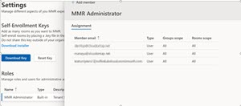
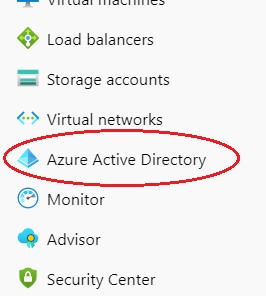
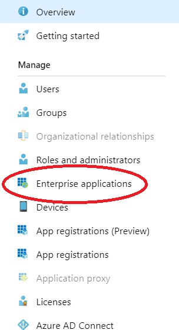

# Access control: Adding Managed Service Administator roles in the service portal 

1. Log in with your tenant user account to ervice portal. 
1. Navigate to the Settings panel.
1. Click "Managed Service Administrator" text takes you to the following experience.   

 

5. Select  "Add Member"  to add the email address of the users you want to add to this role. You must do this one user at a time.  

<!--[Figure 14](media/rooms-portal-guide.014.jpg)  -->

### Access control for the portal: Set Policy 
Important: Please review this section and make sure that access to the portal is limited based on your business needs. 

1. Navigate to Azure portal and select Azure Active Directory. 

 

1. Select Enterprise Applications.

  

1. Select FastTrack Rooms in the Application List.

 

 

1. Within FastTrack Rooms, select the **Properties** tab, and check **User Assignment Required**. 

1. Navigate to “Users and Groups” to control access to the application. Currently, role assignment is not relevant to the program and does NOT have any effect on user privileges. 

<!-- -->