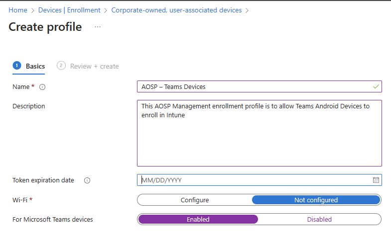
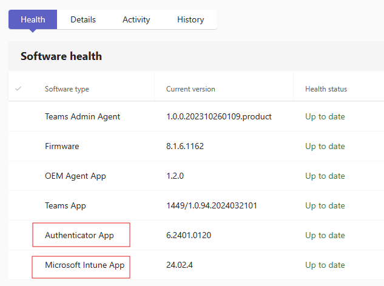

# Migrating Teams Android Devices to AOSP Device Management from Device Administrator

> [!IMPORTANT] 
> This article is being published ahead of the firmware update which supports the migration to Android Open Source Project (AOSP) Management. Publishing this article early allows organizations the time to prepare their environment to migrate from Android Device Administrator to the new mobile device enrollment (MDM) method created by Intune called Android Open Source Project (AOSP) Management. A message center post will be sent to your organization when the AOSP Management firmware is available.

[!INCLUDE [Preview feature](../includes/preview-feature.md)]

This document describes how IT administrators can prepare their Teams Android Device environment for a migration. This migration is from Android Device Administrator to the new mobile device enrollment (MDM) method that was created and called Android Open Source Project (AOSP) Device Management. This new MDM enrollment method replaces the legacy Device Administrator enrollment method and serves as the basis for new features and functionality that are rolled out. For this migration to be successful, organizational IT administrators have specific actions they must take and all of which are covered in this article.

This article covers:

- Set up new AOSP Management Enrollment Profiles
- Set up AOSP Management Configuration & Compliance Policies
- Deploy AOSP Management capable device firmware
  
## Step 1 - Set up new AOSP management enrollment profiles

In order for Teams Android Devices to enroll in AOSP Management, an enrollment profile must be created.

### Prerequisites

To migrate from Android Device Administrator to Android AOSP management, you must have:

- Teams Android Devices deployed which are enrolled using Device Administrator.
- Teams Android Devices that are supported with AOSP Management. Any devices not listed aren't supported on AOSP Management: [Click Here](/microsoftteams/devices/teams-ip-phones).
- Intune admin permissions in your Microsoft 365 environment.

> [!IMPORTANT]
> If your organization doesn't enroll your Teams Android devices in Intune (typically by disabling the Intune license on your resource accounts) then there is no need to set up an enrollment profile or create AOSP Management policies. Just upgrade your devices to the AOSP Management capable firmware at release to stay on current firmware but no Intune configuration is required.

### Setup AOSP management enrollment profiles

These steps are specific to Teams Android devices. If you have non Teams devices, refer to the Intune guidance for setting up profiles: [Set up Android (AOSP) device management in Intune for corporate-owned user-associated devices - Microsoft Intune | Microsoft Learn](/mem/intune/enrollment/android-aosp-corporate-owned-user-associated-enroll)

When creating an enrollment profile, verify it doesn't conflict with any enrollment profiles that were created before.

1. Sign in to the Intune Management Console with an account with Intune administrator permissions: [https://intune.microsoft.com/](https://intune.microsoft.com/).
2. Select **Devices** > **Enrollment** > then **Android**.
3. Under **Enrollment Profiles**, select **Corporate-owned, user-associated device**.
4. Select **Create policy**.
5. Use the following settings for the profile configuration:

   - **Name** Give the profile a name like 'AOSP – Teams Devices'.
   - **Description** Put in a description so others in the organization know what this enrollment profile is used for. Use something like 'This AOSP Management enrollment profile is to allow Teams Android Devices to enroll in Intune'.
   - **Token expiration date** This defaults to 65 years into the future and is best left at 65 years to avoid policy expiration which would block enrollment.
   - **Wi-Fi** Select **Not configured**.
   - **Microsoft Teams devices** Select **Enabled**.

   

> [!IMPORTANT]
> The enrollment profile defaults to a 65 year token expiration. If you are a customer participating in private preview of AOSP DM, you will need to have a 90 day or shorter expiration configured, customers waiting for general availability of AOSP DM can utilize the 65 year expiration. An expired enrollment token will not impact any existing devices, just new device enrollments and sign ins.

6. Select **Next**.
7. Review the profile and then select **Create**.

The enrollment profile has been created and is now ready to enroll devices.

## Step 2 - Set up AOSP Management Configuration & Compliance Policies

These steps aren't required for your Teams devices, any Teams Android Devices that are enrolled in AOSP Management support both Intune configuration policies and Intune compliance policies. While they aren't required for the devices to function properly, it's likely you want to use them on the Teams devices in your organization because they bring additional features, functionality, and security for your Teams devices.

### AOSP management configuration policies

Currently, the only supported configuration policy for Teams Android Devices enrolled with AOSP Management is the Device Restrictions profile and only the “block screen capture” restriction inside of that profile. Support for more configuration policies is planned in the future.

### Creating a AOSP Management Configuration Policy

These steps are specific to Teams Android devices.  For non-Teams devices or for more information, please refer to the Intune guidance for setting up profiles: [Device restriction settings for Android (AOSP) in Microsoft Intune | Microsoft Learn](/mem/intune/configuration/device-restrictions-android-aosp)

1. Sign in to the Intune Management Console with an account with Intune administrator permissions: [https://intune.microsoft.com/](https://intune.microsoft.com/).
2. Select **Devices** > **Configuration**.
3. Select **Create** > **New Policy**.
4. For **Platform** select **Android (AOSP)**.
5. Under **Profile** type select **Device Restrictions**, then select **Create**.
6. Provide a name and description for the policy, then select **Next**.
7. Under **General** set **Block screen capture** to **Yes**, then select **Next**.
8. Assign this profile to all devices or an Entra ID group of devices, select **Next**, then select **Create**.

### AOSP Management Compliance Policies

There's currently a limited set of supported compliance policies for Teams Android Devices enrolled with AOSP Management but more are planned for in future releases:

- **Device Health** Rooted devices (Block).
- **Device Properties** Minimum OS version.
- **Device Properties** Maximum OS version.
- **System Security** Require encryption of data storage on device.

### Creating a AOSP Management Compliance Policy

These steps are specific to Teams Android devices.  For non-Teams devices or for more information, please refer to the Intune guidance for setting up profiles:  [Android (AOSP) compliance settings in Microsoft Intune | Microsoft Learn](/mem/intune/protect/compliance-policy-create-android-aosp)

1. Sign in to the Intune Management Console with an account with Intune administrator permissions: [https://intune.microsoft.com/](https://intune.microsoft.com/).
2. Select **Devices** > **Compliance**, then **Create policy**.
3. Under **Platform** > **Android (AOSP)**, then select **Create**.
4. Provide a name and description for the policy.
5. Select **Next**.
6. Enable the desired compliance settings from the supported list.
7. Select **Next**, then select **Next**.
8. Assign this profile to all devices or an Entra ID group of devices.
9. Select **Next**, then select **Create**.

## Step 3 - Deploy AOSP Management capable device firmware

> [!IMPORTANT]
> You might not be able to complete these steps because they depend if the AOSP Management firmware is available for your devices or not. However, you'll still need to complete the enrollment profile creation prior to following these steps.

During the second half of 2024, a new Team Android Device firmware version will be released that supports the migration to AOSP Management both for currently deployed devices and any new Teams devices. This firmware update will be available in the Teams Admin Center as a manual update to allow admins the time needed to slowly migrate their devices over to AOSP.

### Updating devices

These steps provide the guidance for how to update your devices through Teams Admin Center:

1. Sign in to Microsoft Teams admin center with an account with Teams device administrator permissions: [https://admin.teams.microsoft.com/](https://admin.teams.microsoft.com/).
2. Select **Teams** then **Devices**.
3. Select the desired device type.
4. Select the display name of the device you wish to update.
5. Select **Update software**.
6. Open **Manual updates**.
7. Select the new firmware update, then you can choose to **update immediately** or **during a maintenance window**.
8. Select **Update**.
9. Allow time for your device to update.

Once the device updates, it should automatically sign back in to Teams and function as normal.

### Confirming the AOSP Management update is installed

1. Log in to Microsoft Teams admin center with an account with Teams device administrator permissions: [https://admin.teams.microsoft.com/](https://admin.teams.microsoft.com/).
2. Select **Teams**, then select **Devices**.
3. Select the desired device type.
4. Select the display name of the device you wish to update.
5. Select **History**.
6. Look for a recent Software update action and confirm the status is **Successful**.
7. When it's successful, select the **Health** tab.

A 'Microsoft Intune App' and 'Authenticator App' should be listed under software type and **Up to date** this message confirms that the device is now running an AOSP Management capable firmware.

   
