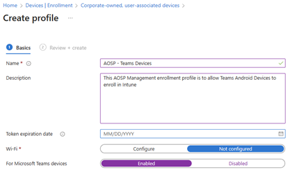
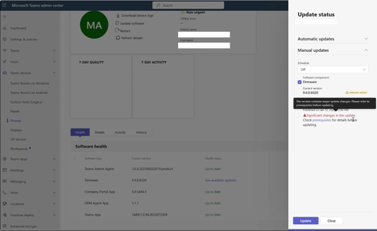

# Migrating Teams Android Devices to AOSP Management from Device Administrator

> [!IMPORTANT] 
> This article is being published ahead of the firmware update which supports the migration to Android Open Source Project (AOSP) Management. Publishing this article early allows organizations the time to prepare their environment to migrate from Android Device Administrator to the new mobile device enrollment (MDM) method created by Intune called Android Open Source Project (AOSP) Management. A message center post will be sent to your organization when the AOSP Management firmware is available.

[!INCLUDE [Preview feature](../includes/preview-feature.md)]

This document describes how IT administrators can prepare their Teams Android Device environment for a migration. This migration is from Android Device Administrator to the new mobile device enrollment (MDM) method which was created by Intune called Android Open Source Project (AOSP) Device Management. This new MDM enrollment method replaces the legacy Device Administrator enrollment method and serves as the basis for new features and functionality that are rolled out. For this migration to be successful, organizational IT administrators have specific actions they must take and all of which are covered in this article.

This article covers multiple topics:

- Setting up new AOSP Management Enrollment Profiles
- AOSP Management Configuration & Compliance Policies
- Deploying AOSP Management capable device firmware
  
## Step 1 - Setting up new AOSP management enrollment profiles

In order for Teams Android Devices to enroll in AOSP Management, an enrollment profile must be created.

### Prerequisites

To migrate from Android Device Administrator to Android AOSP management, you must have:

- Teams Android Devices deployed today which are enrolled using Device Administrator.
- Teams Android Devices which will be supported with AOSP Management (Any devices not listed, won't be supported on AOSP Management: [Click Here](/microsoftteams/devices/teams-ip-phones))
- Intune admin permissions in your Microsoft 365 environment.

> [!IMPORTANT]

> If your organization does not enroll your Teams Android devices in Intune (typically by disabling the Intune license on your resource accounts) then there is no need to set up an enrollment profile or create AOSP Management policies. Just upgrade your devices to the AOSP Management capable firmware at release to stay on current firmware but no Intune configuration is required.

### Setup AOSP Management Enrollment Profiles

These steps are specific to Teams Android devices, for non-Teams devices or for more information, please refer to the Intune guidance for setting up profiles: [Set up Android (AOSP) device management in Intune for corporate-owned user-associated devices - Microsoft Intune | Microsoft Learn](/mem/intune/enrollment/android-aosp-corporate-owned-user-associated-enroll)

When creating an enrollment profile, verify it doesn't conflict with any enrollment profiles that were created before.

1. Log in to the Intune Management Console with an account with Intune administrator permissions: [https://intune.microsoft.com/](https://intune.microsoft.com/)

1. Select **Devices** > **Enrollment** > then **Android**.

1. Under **Enrollment Profiles**, select **Corporate-owned, user-associated device**.

1. Select **Create profile**.

1. Use the following settings for the profile configuration:

   1. **Name** Give the profile a name like 'OSP – Teams Devices'.
   
   1. **Description** Put in a description so others in the organization know what this enrollment profile is used for. Use something like 'This AOSP Management enrollment profile is to allow Teams Android Devices to enroll in Intune'.
   
   1. **Token expiration date** Leave this blank. (The current enrollment profiles are limited to a 90-day expiration. However, this limitation may be adjusted in the future.)
      
   1. **Wi-Fi** Select **Not configured**
   
   1. **Microsoft Teams devices** Select **Enabled**
   
      
      
1. Select **Next**.

1. Review the profile and then select **Create**

The enrollment profile has been created successfully and is ready to enroll devices.

## Step 2 - AOSP Management Configuration & Compliance Policies

Teams Android Devices enrolled with AOSP Management support Intune configuration policies and Intune compliance policies which you may want to use on your Teams Devices. These steps aren't required for functionality but may offer desired functionality.

### AOSP management configuration policies

Currently, the only supported configuration policy for Teams Android Devices enrolled with AOSP Management is the Device Restrictions profile and only the “block screen capture” restriction inside of that profile. Support for more configuration policies is planned in the future.

### Creating a AOSP Management Configuration Policy

These steps are specific to Teams Android devices, for non-Teams devices or for more information, please refer to the Intune guidance for setting up profiles: [Device restriction settings for Android (AOSP) in Microsoft Intune | Microsoft Learn](/mem/intune/configuration/device-restrictions-android-aosp)

1. Log in to the Intune Management Console with an account with Intune administrator permissions: [https://intune.microsoft.com/](https://intune.microsoft.com/)

1. Select __Devices__

1. Select __Configuration__

1. Select __Create__ > __New Policy__

1. Under Platform select __Android (AOSP)__

1. Under Profile type select __Device Restrictions__

1. Select __Create__

1. Provide a name & description for the policy

1. Select __Next__

1. Under General set __Block screen capture__ to __Yes__

1. Select __Next__

1. Assign this profile to all devices or an Entra ID group of devices

1. Select __Next__

1. Select __Create__

### AOSP Management Compliance Policies

There's a limited set of supported compliance policies for Teams Android Devices enrolled with AOSP Management more are planned in the future:

- Device Health: Rooted devices (Block)

- Device Properties: Minimum OS version

- Device Properties: Maximum OS version

- System Security: Require encryption of data storage on device

### Creating a AOSP Management Compliance Policy

These steps are specific to Teams Android devices, for non-Teams devices or for more information, please refer to the Intune guidance for setting up profiles:  [Android (AOSP) compliance settings in Microsoft Intune | Microsoft Learn](/mem/intune/protect/compliance-policy-create-android-aosp)

1. Log in to the Intune Management Console with an account with Intune administrator permissions: [https://intune.microsoft.com/](https://intune.microsoft.com/)

1. Select __Devices__

1. Select __Compliance__

1. Select __Create policy__

1. Under Platform select __Android (AOSP)__

1. Select __Create__

1. Provide a name & description for the policy

1. Select __Next__

1. Enable the desired compliance settings from the supported list

1. Select __Next__

1. Select __Next__

1. Assign this profile to all devices or a Entra ID group of devices

1. Select __Next__

1. Select __Create__

## Step 3 - Deploying AOSP Management capable device firmware

> [!NOTE]
> This section may not be appliable yet if new AOSP Management capable firmware has not been made available for your devices. You will want to complete the enrollment profile creation prior to following these steps.

### Updating devices

During the second half of 2024, new Team Android Device firmware will be released which will support the migration to AOSP Management for currently deployed devices and any new Teams Device deployments. When the firmware update is made available from Teams Admin Center, it will be available as a manual update to allow time to migrate slowly. These steps provide the guidance for how to update your devices through Teams Admin Center:

1. Log in to Teams Admin Center with an account with Teams device administrator permissions: [https://admin.teams.microsoft.com/](https://admin.teams.microsoft.com/)

1. Select __Teams__ __devices__

1. Select the desired device type

1. Select the display name of the device you wish to update

1. Select __Update software__

1. Open __Manual updates__

1. Select the new firmware update, you can choose to update immediately or during a maintenance window

   
   
1. Select __Update__

1. Allow time for your device to update

1. Once updated your device should automatically sign back into Teams and function normally

### Confirming the AOSP Management update is installed

1. Log in to Teams Admin Center with an account with Teams device administrator permissions: [https://admin.teams.microsoft.com/](https://admin.teams.microsoft.com/)

1. Select __Teams__ __devices__

1. Select the desired device type

1. Select the display name of the device you wish to update

1. Select __History__ tab

1. Look for a recent Software update action and confirm the status is successful

1. Once successful, select the __Health__ tab

1. A “Microsoft Intune App” and “Authenticator App” should be listed under software type and “Up to date” this message confirms that the device is now running an AOSP Management capable firmware
   
   
