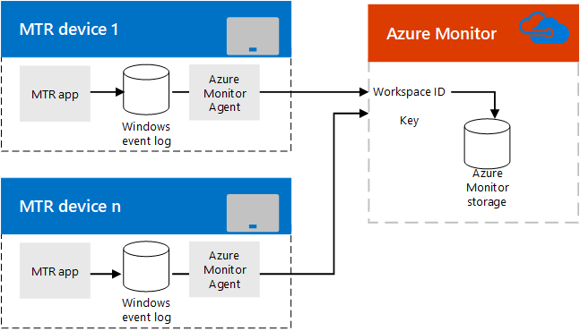

# Plan Microsoft Teams Rooms monitoring with Azure Monitor
 
 This article discusses planning considerations for using Azure Monitor to administer Microsoft Teams Rooms devices in your Microsoft Teams or Skype for Business implementation.

> [!NOTE]
> You can also [set up health monitoring of Teams Rooms](../alerts/device-health-status.md) using Teams admin center.

[Azure Monitor](/azure/azure-monitor/overview) is a collection of monitoring services that were designed in the cloud from the start. Rather than deploying and managing on-premise resources, Azure Monitor components are entirely hosted in Azure. Configuration is minimal, and you can be up and running in a matter of minutes. With some customization work, it can aid in monitoring Microsoft Teams Rooms by providing notifications of system health or faults for individual room systems, and it can scale up to managing thousands of Microsoft Teams Rooms.
  
This article provides a discussion of the requirements, design/architecture, and implementation best practices needed to implement Azure Monitor based monitoring of Microsoft Teams Rooms. It also provides links to detailed articles on implementing Azure Monitor for Microsoft Teams Rooms and critical reference information for ongoing monitoring of Microsoft Teams Rooms rooms.
  
## Functional overview

  
The Microsoft Teams Rooms app writes events to the Windows Event Log. A Microsoft Monitoring agent, once installed, passes the information to the Azure Monitor service.
  
Once properly configured, Log Analytics parses the JSON payload embedded in the event descriptions to describe how  Microsoft Teams Rooms is functioning and what faults are detected.
  
An administrator using Azure Monitor can get notifications of Microsoft Teams Rooms that are offline or are experiencing app, connectivity, or hardware failures as well as knowing if a system needs to be restarted. Each system status is updated frequently, so these notifications are close to real-time updates.
  
## Azure Monitor requirements

You must have a valid Azure subscription for Azure Monitor to use Log Analytics features. See [Get started with a Log Analytics workspace](/azure/azure-monitor/learn/quick-create-workspace) to create a subscription for your organization.
  
You should familiarize yourself on how to use the Log Analytics View Designer. See [Views in Log Analytics](/azure/azure-monitor/platform/view-designer) for those details.
  
### Related Tasks

1. Once subscribed to Azure Monitor Log Analytics, create custom fields (as described in [Map custom fields](azure-monitor-deploy.md#Custom_fields)) needed to parse the information that will be sent from Microsoft Teams Rooms. This includes understanding the JSON schema documented in [Understand the log entries](azure-monitor-manage.md#understand-the-log-entries).
    
2. Develop a Microsoft Teams Rooms management view in Log Analytics. You can [Create a Microsoft Teams Rooms dashboard manually](azure-monitor-deploy.md#create-a-microsoft-teams-rooms-dashboard-manually).
    
## Individual Microsoft Teams Rooms requirements

Microsoft Teams Rooms is an app running on a compute device in kiosk mode. As with any Windows app, the Microsoft Teams Rooms app writes events like startup and hardware faults to the Windows Event Log. Adding a Microsoft Monitor agent on Microsoft Teams Rooms allows these events to be collected. (See [Connect Windows computers to the Log Analytics service in Azure](/azure/azure-monitor/platform/agent-windows) for details.)
  
## Ongoing management

While using Azure Monitor to monitor your Microsoft Teams Rooms, you'll need to understand the information contained in the event logs used by Azure Monitor. See [Understand the log entries](azure-monitor-manage.md#understand-the-log-entries) for details on these health messages.
  
### Related Tasks

- Understand the Alerts generated by Microsoft Teams Rooms and how to resolve them (see the section titled [Understand the log entries](azure-monitor-manage.md#understand-the-log-entries))
    
## See also

[Deploy Microsoft Teams Rooms management with Azure Monitor](azure-monitor-deploy.md)
  
[Manage Microsoft Teams Rooms devices with Azure Monitor](azure-monitor-manage.md)
