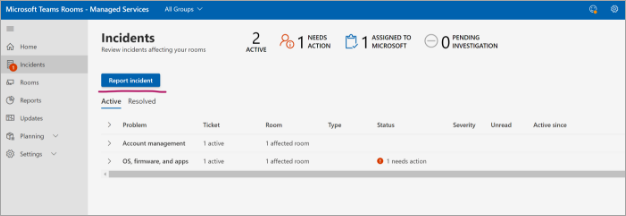
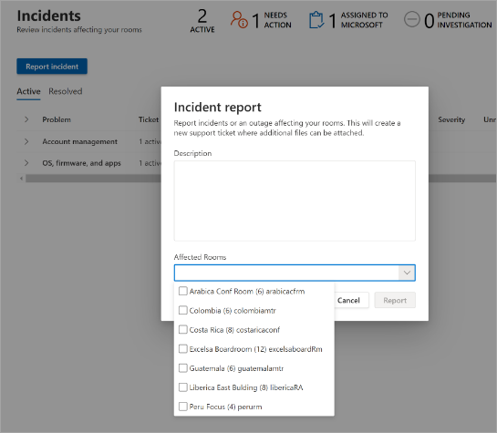
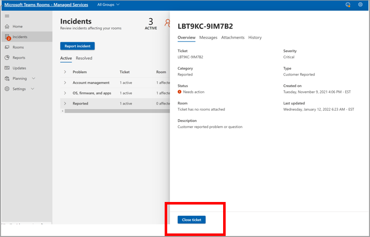
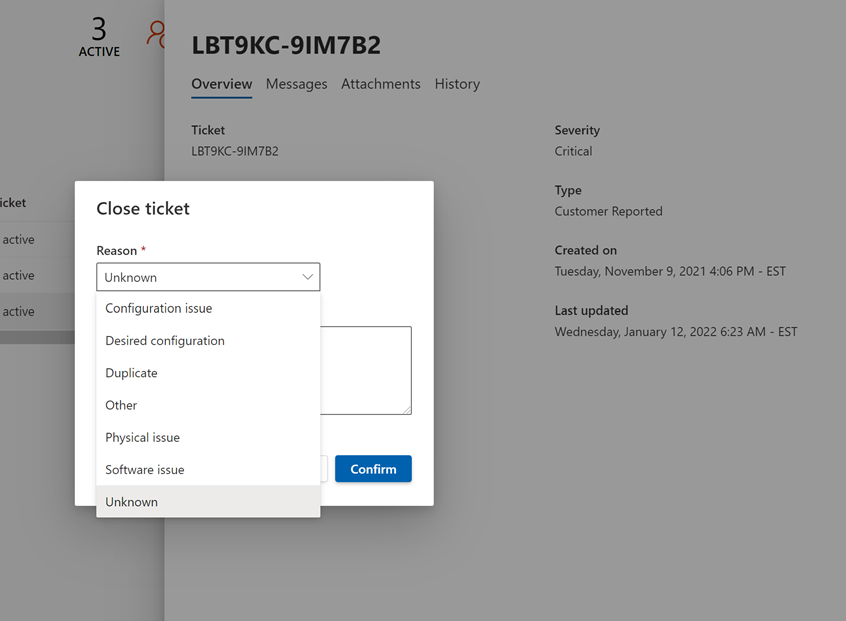
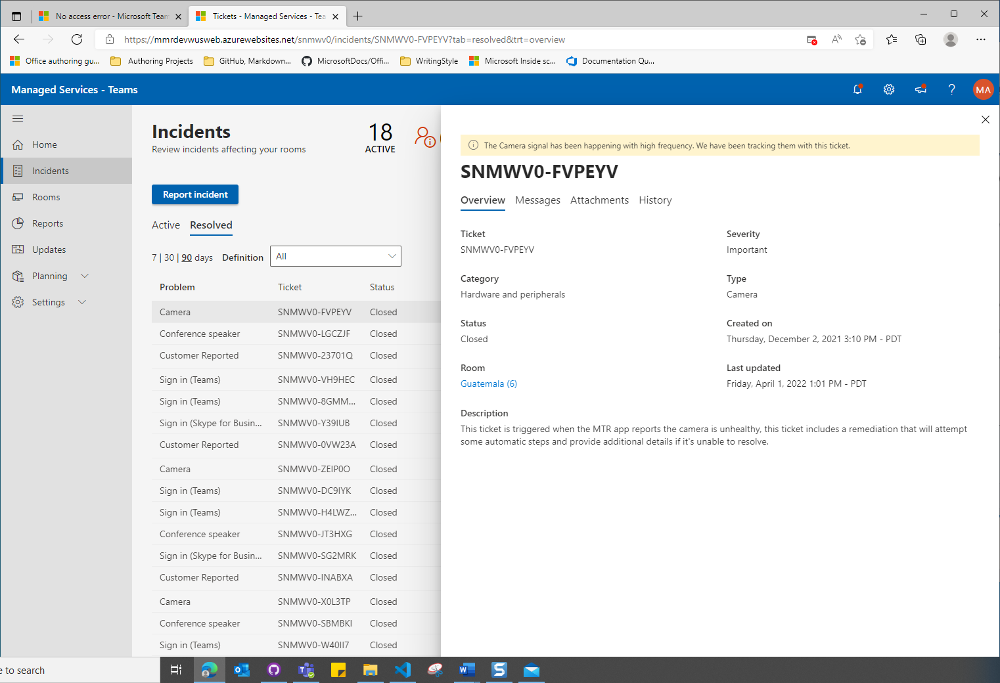

---
title: Microsoft Teams Rooms Customer-reported incidents
author: donnah007
ms.author: v-donnahill
ms.date: 5/27/2022
manager: serdars
ms.reviewer: dstrome 
ms.topic: article
ms.tgt.pltfrm: cloud
ms.service: msteams
audience: Admin
ms.collection: 
  - M365-collaboration
  - m365initiative-meetings
appliesto: 
  - Microsoft Teams
ms.localizationpriority: medium
search.appverid: MET150
description: Partners/Customers can manually close incidents and ensure accurate reporting of Room health in MTRP.
---

# Customer-reported incident tickets

For any type of incident that Microsoft did not flag, or for questions about the service/features, customers or partners on behalf of customers can use the Report Incident feature to alert Microsoft to investigate the problem or answer the question.

In the Description field, describe as best as possible the issue that you need help with from Microsoft. You can add one or more rooms.

Customer-reported incidents (CRIs) are considered critical tickets, which means that the Teams Rooms Service Operations Center triage these tickets first. See the Service Description SLA for Customer-reported incidents [here](microsoft-teams-rooms-premium.md). When a room is (or rooms are) selected as part of the CRI, each room will be marked as **Unhealthy** until the CRI is closed.

## Closing Customer-reported incident tickets

Customer-reported Incidents can be closed by either the customer, partners managing rooms on behalf of customers or by Microsoft’s Service Operations Center engineers.

**To close an incident**

1. Select **Close ticket**.

   

1. Choose a reason for closure by selecting a category from the list.

   Once you've confirmed the reason for closure, the ticket is closed and moved to **Resolved**.

   

The ticket's Details Overview section displays that the ticket was closed by the Managed Rooms Service (Microsoft) or the name of the customer/partner.  

 

**Can anyone close tickets?**

Only Customer-reported incidents can be closed by a user or Microsoft’s Managed Rooms Service Operations center. Customers who have assigned a Partner to manage their rooms with Ticket Management permissions will have the ability to close Customer-reported Incidents.

**Can I restrict who can close tickets?**

Not at this time. All users who have Ticket Management permissions can close a CRI.

**Do I get notified when a Customer-reported Incident ticket closes?**

Not at this time.