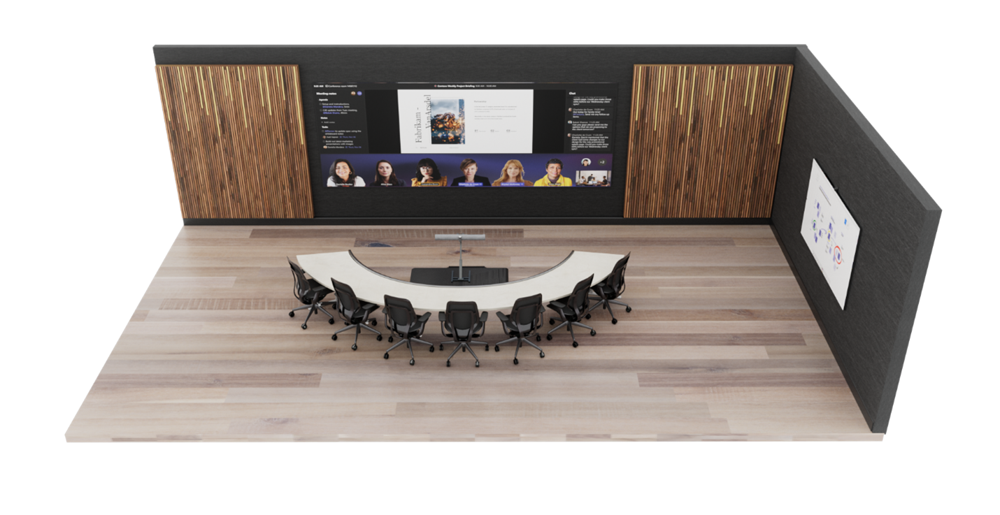

# Medium-sized meeting room: Enhanced meeting room

This article explores how Microsoft is transforming standard conference rooms into "enhanced meeting rooms" that bring the best of the new Teams front row experience. Use this article for room design and technology guidance, recommended products, retrofitting tips, and Microsoft Corporate Facilities reference specifications.

## Microsoft’s vision for the future of meeting rooms

The future of work will be fluid, dynamic, and powered by the cloud. Microsoft enables meeting experiences that allow people to be there, from anywhere, at any time. These meetings are hybrid, which means you can join them seamlessly. Meetings enhanced with Microsoft devices are inclusive; every voice is heard, and everyone is clearly represented.

Microsoft sees a future where meetings are immersive and spaces are designed around people. Our dynamic meeting views keep everyone connected to the content and each other: Formal presentations are paired with collaborative chats. Digital canvases unleash group creativity. Everyone can connect face to face wherever they are.

The vision for the future of meetings is grounded in a simple belief: meetings should offer so much more than just a one-time transaction. Meetings will be designed for everyone, whether they’re in the room or across the world.

## What is an enhanced meeting room?

In Microsoft’s hybrid workplace, the next generation of room standards are informed by the needs of both remote and in-room participants. An enhanced meeting room is a Microsoft Teams Room designed to deliver an *elevated* hybrid meeting experience, fostering more natural and immersive connections while enabling everyone in the meeting to feel included, represented, and productive. An enhanced meeting room follows a set of principles made real through a combination of Teams Rooms software and hardware capabilities and room configuration guidance.

The concept for the enhanced meeting room is designed around two key goals that are supported by a set of experience principles.

**Goal 1: Everyone in the meeting feels included, represented, and productive.**

Design principles:

-   Remote participants can establish a genuine presence in the room

-   In-room participants can retain their individual identity in the meeting

-   All meeting participants can engage in boundaryless collaboration.

**Goal 2: Connections feel natural and immersive.**

Design principles:

-   Experiences are scaled for human connection, enabling interactions that feel like everyone is in the same room.

An enhanced meeting room experience is all those components and ideas put together with no single feature defining the experience. The individual features and concepts found in our enhanced meeting rooms may also be deployed on their own.

Examples of specific feature deployment:

-   Take advantage of our new front row front-of-room display experience in all types of meeting spaces where there is a Microsoft Teams Room solution that supports it.

-   Implement curved tables and front-facing layouts with traditional Microsoft Teams Room experiences to promote better human connection in the room while maintaining continuity of experience across all meeting spaces.

## When should you deploy enhanced meeting rooms?

Enhanced meeting rooms are not meant to be a replacement for all other meeting spaces inside your organization, but rather to act as a supplement to existing meeting spaces that utilize Microsoft Teams. They should be deployed strategically within your organization to the spaces and locations where face-to-face interactions with remote meeting participants will be most valued.

Microsoft Teams Rooms will continue to deliver people-centric hybrid meeting experiences made available through software updates. However, there are hardware technologies and room configuration guidance that play a key role in optimizing some of the enhanced experiences. It’s the combination of these components that comprise an enhanced Teams Room. When evaluating how many Microsoft Teams Rooms you want to evolve to an enhanced meeting room, consider the following:

-   What hardware upgrades and/or investments would need to be made.

-   Most conference rooms are designed to maximize valuable square footage with a close relationship between room dimension and room capacity. An enhanced meeting room prioritizes the meeting experience above maximizing square footage. Not every organization can prioritize this way for every meeting space, as it could reduce the number of meeting rooms they can have.

### Understanding this space 

*Balancing hybrid flexibility with inclusion*

At Microsoft, our flexible work guidelines prioritize giving employees choice and flexibility about where to work and when. This fundamental shift in policy has made us rethink the evolution of our meeting spaces and technology.

Our research has shown that remote meetings during the pandemic have had many benefits—particularly around increased feelings of equity and inclusion. As we think about returning in a hybrid setting, with remote and in-person collaboration happening simultaneously, we sought to create meeting spaces that better support our flexible work policies while maintaining a level playing field for all participants through room design and technology.

Let’s start with a standard medium-sized conference room that would traditionally seat about 8-12 people.

From:

*Optimizing for in-person collaboration primarily with remote secondary audio-video (AV) as a supplement to the experience*

To:

*Optimizing for in-person and remote collaboration equally with AV as a driver for the experience*

### What is this space used for?

This space is dedicated to the most immersive Teams meeting experience for a small group of people in the physical room.

Just like a typical Microsoft Teams Room, meeting participants are able to meet remotely and locally to work together seamlessly while both presenting and co-creating content.

### How is this space laid out?

The enhanced meeting room layout is designed for maximum visibility and engagement with remote participants and content.

The layout features a curved table for in-person eye contact and orientation to remote participants with all chairs facing the display so participants are able to follow along.

### How does the audio work? 

Using audio solutions certified for Microsoft Teams Rooms, people are able to hear and be heard clearly.

In the future, Teams Rooms will support audio systems that utilize a concept called spatial audio. With spatial audio, sound emanates from the direction of the person speaking. For example, if a person located on the right side of the meeting gallery speaks, the audio will come from the speaker located closest to that location. This kind of immersive audio experience helps meetings more closely resemble an in-person conversation.

### How does the camera work?

An ultrawide-angle camera is positioned at the front of the room below the displays to capture everyone in the space.

The ultrawide-angel camera features intelligent tracking of meeting participants so they can be represented individually in a large view instead of as faces within a large image of the entire room.

### How do the front-of-room displays work? 

This room is optimized for the Microsoft Teams Rooms layout called front row and is displayed through a specialized short-throw high-resolution projector, creating an immersive front-of-room experience designed specifically for Teams meetings. 

### What is front row?

To give people in the room a greater sense of connection to remote participants and support collaboration before, during, and after meetings, Microsoft introduced a new content layout for Microsoft Teams Rooms called front row. Visually, this new layout moves the video gallery to the bottom of the screen and is fixed at a specific ratio to keep faces lifelike in size. With this layout, in-room participants can see remote colleagues face to face across a horizontal plane—similar to if they were in the same room.

Meeting content is surrounded by contextual fluid components like the agenda, tasks, and notes, which can be updated in real time, helping participants stay engaged and productive. Additionally, the meeting chat is brought clearly into view so that when joining a Teams meeting from a Teams Room, you can easily see and engage in the conversation in real time. In an enhanced meeting room, this content is displayed on a wide-aspect-ratio screen to maximize the size of meeting content and the number of participants that can be viewed simultaneously.

This layout will be supported across both single- and dual-display configurations and will be made available through a Teams Rooms software update. While the front row layout is especially impactful in an enhanced meeting room, front row can be used in any Teams Room running on Windows, regardless of the furniture and hardware configuration.

### How do you co-create content?

In Microsoft Teams Rooms, users can take advantage of traditional, analog whiteboarding by using the intelligent capture feature. For a modernized experience where all participants can draw and ink together, Microsoft Whiteboard can be accessed using a touchscreen front-of-room display, companion devices like a PC, phone, or tablet, and through Microsoft Surface Hub.

 

## Enhanced meeting room design guidance

This section is intended to cover building an enhanced meeting room from scratch. For retrofitting an existing room guidance, see [Retrofit an existing room](#retrofit-an-existing-room).

### Room layout 

#### Room size

25 ft x 14 ft

#### Room capacity 

This enhanced meeting room is optimized for between 6 - 8 people. 

#### Room furniture

This room features a curved table with participants seated on one side, allowing in-room participants to retain visibility of each other and be positioned face to face with remote participants.

This room features a standard meeting room table with a height of 30 in or 76 cm.

#### Equipment mounting

Selecting a location for hardware is typically driven by the selection of Teams Room-certified hardware used within a given meeting space.

For the initial deployments of enhanced meeting rooms within our Microsoft facilities, we have chosen to mount the Microsoft Teams Rooms compute and touch console at the table, with an integrated camera and soundbar device (with discrete left- and right-channel audio for spatial audio) mounted on specialized furniture, located below the displayed image as well as between the front-of-room projection and the table. It’s important to keep the console within reach of participants without impeding their use of the table for personal devices and/or documents. For the display, a short-throw high-resolution projector is used.

Most participants will choose to share content within this type of meeting room by joining the Teams meeting via a personal device. However, in-room local video presentation should also be made available at the table in an easily accessible manner for those who are unable to join the meeting call.

#### Touch console placement

The Microsoft Teams Rooms touch console should be mounted in the center of the table within easy reach of meeting participants without blocking usage of the table for personal devices or documents.

#### Local video presentation

Though many participants may choose to share content within this type of meeting room by joining the Teams meeting via a personal device to the Teams call, in-room local video presentation should also be made available at the table in an easily accessible manner.

## Infrastructure 

### Infrastructure power

At a minimum, electrical power connections should be provided at both the table (for end users) and at the equipment mounting location. If co-create devices are used in the space, electrical power connections may also be required at their location(s).

### Infrastructure data

Networking connections should be provided at both the table (for end users) and at the equipment mounting location (for the main network for the Teams Rooms solution). If co-create devices are used in the space, network connections will also be required that connect to the main network for the Teams Rooms solution.

### Acoustic wall treatments

At least two walls in a room of this type should be acoustically treated to prevent echo and ambient noise issues during meetings.

### Window treatments

Light from windows in a room of this type may negatively affect the lighting and introduce glare and shadows to both the camera image and the front-of-room display. Any space featuring windows should also feature window treatments that allow for external light to be blocked during meetings.

### Floor treatments

The floor in a room of this type should be carpeted or otherwise acoustically treated to prevent echo and ambient noise issues during meetings.

### Lighting 

Overhead lights should be provided to illuminate the space evenly, with meeting room participants not appearing to be washed out or sitting in a dark space. Efforts to minimize direct lighting on front-of-room displays, co-create devices, or other reflective surfaces within the space should be taken to avoid introducing glare.

## Technology guidance 

### Microsoft Teams Rooms solution

Enhanced meeting rooms for Microsoft Teams require the use of Microsoft Teams Rooms on Microsoft Windows.

### Cameras

#### Camera options

A room of this type requires the use of an intelligent, ultrawide-angle front-of-room camera that is appropriately rated for the width and depth of space.

#### Camera placement

The camera should be placed at the front of the room below the front-of-room projection but above the top of the table to capture all the meeting room participants at as close to eye level as possible.

### Microphones

#### Microphone options

Front-of-room microphone arrays and tabletop and overhead microphones will work for this type of space.

#### Microphone placement

Microphone arrays need to be positioned to provide coverage for all meeting room participants within the certified range of the device.

### Speakers

#### Speaker options

Front-of-room speaker arrays and overhead speakers will work for this type of space.

Note: Spatial audio is not yet available and may require specific audio devices.

#### Speaker placement

Speakers need to be positioned to provide coverage for all meeting room participants within the certified range of the device or devices used.

### Front-of-room display

#### Display type

A room of this type requires the use of an ultrawide aspect ratio, high-resolution front-of-room display that is appropriately sized for the width and depth of space to ensure maximum visibility and clarity.

Example display types include:

-   Laser projectors

-   LED video walls

-   Specialty LCD or OLED flat panel displays

#### Display functions

Enhanced meeting rooms, as with all other Microsoft Teams Rooms solutions, require the use of displays that can accommodate the following features for proper operation:

-   Sleep and Quick Wake Up from sleep based on HDMI sync.

    -   For projectors, automatic warm-up and cooldown periods must be supported without required user intervention.

-   Displays must support the appropriate EDID and resolutions required by the Microsoft Teams Rooms design.

#### Display placement

An enhanced meeting room requires that the display is placed in front of all the in-room meeting participants, directly opposite the table.

The horizontal center line of the display must be centered on the same center line as the table.

The vertical center line of the display must be no more than +/- 15 degrees offset from the eye line of a typical in-room meeting participant seated at the table.

#### Display count

An enhanced meeting room requires that the display is either a single wide-aspect ratio display or a blended combination of displays that can achieve the effect of being a single display when seen by in-room meeting participants.

### Co-create options

#### Microsoft Whiteboard

All Teams Rooms are able take advantage of Microsoft Whiteboard through an interactive collaboration device such as a Microsoft Surface Hub, a touchscreen front-of-room display, and through companion devices like a PC, phone, or tablet.

#### Traditional whiteboard 

All Teams Rooms on Windows can leverage traditional whiteboards in a Teams meeting by using the intelligent capture feature and a secondary content camera.

## Recommended products for this space

### Microsoft Teams Room console and compute

-   A Windows-based Microsoft Teams Rooms solution.

As shown:

[Logitech TAP for the touch console paired with a Lenovo Compute device.](https://www.microsoft.com/en-us/microsoft-teams/across-devices/devices/product/logitech-tap-room-systems-with-thinksmart-edition-tiny/523)

Other options:

-   [Lenovo ThinkSmart Core + Controller](https://www.microsoft.com/en-us/microsoft-teams/across-devices/devices/product/lenovo-thinksmart-core-controller/948)

-   [Crestron Flex customizable conference system](https://www.microsoft.com/en-us/microsoft-teams/across-devices/devices/product/crestron-flex-customizable-conference-system/849)

-   [Crestron Flex customizable conference system Advanced](https://www.microsoft.com/en-us/microsoft-teams/across-devices/devices/product/crestron-flex-customizable-conference-system/849)

-   [Poly G10-T](https://www.microsoft.com/en-us/microsoft-teams/across-devices/devices/product/poly-g10-t/564)

### Camera

-   An ultrawide camera with intelligent framing.

As shown:

[Jabra Panacast 50](https://www.microsoft.com/en-us/microsoft-teams/across-devices/devices/product/jabra-panacast-50-series/922)

Other options:

-   [Jabra PanaCast](https://www.microsoft.com/en-us/microsoft-teams/across-devices/devices/product/jabra-panacast/353)

-   [Yealink UVC30](https://www.microsoft.com/en-us/microsoft-teams/across-devices/devices/product/yealink-uvc30-room/409)

-   [Yealink UVC40](https://www.microsoft.com/en-us/microsoft-teams/across-devices/devices/product/yealink-uvc40/648)

-   [Bose Videobar VB1](https://www.microsoft.com/en-us/microsoft-teams/across-devices/devices/product/bose-videobar-vb1/809)

-   [Poly Studio](https://www.microsoft.com/en-us/microsoft-teams/across-devices/devices/product/poly-studio/206)

-   Poly Studio E70

### Microphone

-   A certified microphone solution that will clearly capture all the in-room meeting participants.

As shown:

[Jabra Panacast 50](https://www.microsoft.com/en-us/microsoft-teams/across-devices/devices/product/jabra-panacast-50-series/922)

Other options:

-   [Yealink UVC40](https://www.microsoft.com/en-us/microsoft-teams/across-devices/devices/product/yealink-uvc40/648)

-   [Bose Videobar VB1](https://www.microsoft.com/en-us/microsoft-teams/across-devices/devices/product/bose-videobar-vb1/809)

-   [Poly Studio](https://www.microsoft.com/en-us/microsoft-teams/across-devices/devices/product/poly-studio/206)

-   [Lenovo ThinkSmart Bar](https://www.microsoft.com/en-us/microsoft-teams/across-devices/devices/product/lenovo-thinksmart-bar/949)

-   [Lenovo ThinkSmart Bar XL](https://www.microsoft.com/en-us/microsoft-teams/across-devices/devices/product/lenovo-thinksmart-bar/949)

-   [Biamp Devio conference room hub with Parle Ceiling mic](https://www.microsoft.com/en-us/microsoft-teams/across-devices/devices/product/biamp-devio-conference-room-hubs/920)

-   [Biamp Devio conference room hub with Parle table mic](https://www.microsoft.com/en-us/microsoft-teams/across-devices/devices/product/biamp-devio-conference-room-hubs/920)

-   [Shure MXA710-4FT wall-mount audio system](https://www.microsoft.com/en-us/microsoft-teams/across-devices/devices/product/shure-mxa710-audio-systems/967)

-   [Nureva HDL300 audio conferencing system](https://www.microsoft.com/en-us/microsoft-teams/across-devices/devices/product/nureva-hdl300-audio-conferencing-system/739)

-   [QSC Meeting room audio: in--ceiling speakers](https://www.microsoft.com/en-us/microsoft-teams/across-devices/devices/product/qsc-meeting-room-audio-in-ceiling-speakers/700)

-   [QSC Directional audio - ceiling audio](https://www.microsoft.com/en-us/microsoft-teams/across-devices/devices/product/qsc-directional-audio/704)

-   [QSC Meeting room audio: pendant speakers](https://www.microsoft.com/en-us/microsoft-teams/across-devices/devices/product/qsc-meeting-room-audio-pendant-speakers/711)

-   [Biamp audio with Parlé ceiling mic](https://www.microsoft.com/en-us/microsoft-teams/across-devices/devices/product/biamp-complete-room-audio-with-parle-ceiling-mic/613)

-   [Biamp audio with Parlé tabletop mics](https://www.microsoft.com/en-us/microsoft-teams/across-devices/devices/product/biamp-complete-room-audio-with-parle-ceiling-mic/613)

-   [Bose DS4 ceiling audio solution](https://www.microsoft.com/en-us/microsoft-teams/across-devices/devices/product/bose-ds4-ceiling-audio-solution/694)

-   [Bose ES1 ceiling audio solution](https://www.microsoft.com/en-us/microsoft-teams/across-devices/devices/product/bose-es1-ceiling-audio-solution/506)

-   [Shure Microflex Advance MXA910 + IntelliMix P300](https://www.microsoft.com/en-us/microsoft-teams/across-devices/devices/product/shure-microflex-advance-mxa910-intellimix-p300/429)

-   [Biamp Tesira DSP & Sennheiser TeamConnect Ceiling 2](https://www.microsoft.com/en-us/microsoft-teams/across-devices/devices/product/biamp-tesira-dsp-sennheiser-teamconnect-ceiling-2/359)

### Speakers

-   A certified speaker solution that will provide clear and intelligible audio to all the in-room meeting participants.

As shown:

[Jabra Panacast 50](https://www.microsoft.com/en-us/microsoft-teams/across-devices/devices/product/jabra-panacast-50-series/922)

Other options:

-   [Yealink UVC40](https://www.microsoft.com/en-us/microsoft-teams/across-devices/devices/product/yealink-uvc40/648)

-   [Bose Videobar VB1](https://www.microsoft.com/en-us/microsoft-teams/across-devices/devices/product/bose-videobar-vb1/809)

-   [Poly Studio](https://www.microsoft.com/en-us/microsoft-teams/across-devices/devices/product/poly-studio/206)

-   [Lenovo ThinkSmart Bar](https://www.microsoft.com/en-us/microsoft-teams/across-devices/devices/product/lenovo-thinksmart-bar/949)

-   [Lenovo ThinkSmart Bar XL](https://www.microsoft.com/en-us/microsoft-teams/across-devices/devices/product/lenovo-thinksmart-bar/949)

-   [Biamp Devio conference room hub with Parle Ceiling mic](https://www.microsoft.com/en-us/microsoft-teams/across-devices/devices/product/biamp-devio-conference-room-hubs/920)

-   [Biamp Devio conference room hub with Parle table mic](https://www.microsoft.com/en-us/microsoft-teams/across-devices/devices/product/biamp-devio-conference-room-hubs/920)

-   [Shure MXA710-4FT wall-mount audio system](https://www.microsoft.com/en-us/microsoft-teams/across-devices/devices/product/shure-mxa710-audio-systems/967)

-   [Nureva HDL300 audio conferencing system](https://www.microsoft.com/en-us/microsoft-teams/across-devices/devices/product/nureva-hdl300-audio-conferencing-system/739)

-   [QSC Meeting room audio: in--ceiling speakers](https://www.microsoft.com/en-us/microsoft-teams/across-devices/devices/product/qsc-meeting-room-audio-in-ceiling-speakers/700)

-   [QSC Directional audio - ceiling audio](https://www.microsoft.com/en-us/microsoft-teams/across-devices/devices/product/qsc-directional-audio/704)

-   [QSC Meeting room audio: pendant speakers](https://www.microsoft.com/en-us/microsoft-teams/across-devices/devices/product/qsc-meeting-room-audio-pendant-speakers/711)

-   [Biamp audio with Parlé ceiling mic](https://www.microsoft.com/en-us/microsoft-teams/across-devices/devices/product/biamp-complete-room-audio-with-parle-ceiling-mic/613)

-   [Biamp audio with Parlé tabletop mics](https://www.microsoft.com/en-us/microsoft-teams/across-devices/devices/product/biamp-complete-room-audio-with-parle-ceiling-mic/613)

-   [Bose DS4 ceiling audio solution](https://www.microsoft.com/en-us/microsoft-teams/across-devices/devices/product/bose-ds4-ceiling-audio-solution/694)

-   [Bose ES1 ceiling audio solution](https://www.microsoft.com/en-us/microsoft-teams/across-devices/devices/product/bose-es1-ceiling-audio-solution/506)

-   [Shure Microflex Advance MXA910 + IntelliMix P300](https://www.microsoft.com/en-us/microsoft-teams/across-devices/devices/product/shure-microflex-advance-mxa910-intellimix-p300/429)

-   [Biamp Tesira DSP & Sennheiser TeamConnect Ceiling 2](https://www.microsoft.com/en-us/microsoft-teams/across-devices/devices/product/biamp-tesira-dsp-sennheiser-teamconnect-ceiling-2/359)

### Displays

-   A short-throw, high-resolution laser projector with automatic wake on sync and cooldown during sleep function.

As shown:

Epson EpiqVision™ Ultra LS500

Other options:

For the ideal scenario other display options (alternate projectors, LED walls, and flat panel displays) should be able to create a table spanning image, support a 4k image, and a 21:9 aspect ratio.

### Co-create options

-   An analog whiteboard with a content camera OR

-   A compatible interactive touch display.

As shown:

[Logitech Scribe](https://www.microsoft.com/en-us/microsoft-teams/across-devices/devices/product/logitech-scribe/966)

Other options:

Content cameras:

-   [Yealink UVC30 content camera](https://www.microsoft.com/en-us/microsoft-teams/across-devices/devices/product/yealink-uvc30-content-camera/647)

-   [Huddly Canvas](https://www.microsoft.com/en-us/microsoft-teams/across-devices/devices/product/huddly-canvas/568)

-   [Logitech BRIO Content Camera Kit](https://www.microsoft.com/en-us/microsoft-teams/across-devices/devices/product/logitech-brio-content-camera-kit/349)

Interactive touch devices:

[Microsoft Surface Hub 2S](https://www.microsoft.com/en-us/microsoft-teams/across-devices/devices/product/microsoft-surface-hub-2s/822?)

## Retrofit an existing room 

Microsoft expects that enhanced meeting rooms will be a highly desirable room layout for some of your meeting spaces.

### Select the right space

Where possible, choose a conference room that already meets the physical/design requirements listed above. This will minimize any intervention required.

In addition, look for the following considerations for ideal room selection:

-   A long wall without obstruction, including doors

-   Lighting that is easy to blank out at the long, unobstructed wall

-   Limited exterior windows (or adequate window treatments/blackout shades)

-   A floor core that is easily accessible toward the center of the room

If you are planning to add enhanced meeting rooms to your existing spaces, see the following helpful reference that was followed for a Microsoft corporate meeting room:
#### Step 1 

#### Step 2

#### Step 3

#### Step 4

#### Step 5

#### Step 6

#### Step 7

## Microsoft Corporate Facilities reference specifications

The following reference specifications are used by the Microsoft Corporate Facilities Team when building an enhanced meeting room. They’re shared here to act as a reference against which to compare your deployments.

### Design considerations 

> X Standard (Requirement)
>
> O Guideline (Recommended)

#### Adjacencies

-   Considered a “landmark” to aid in way finding and circulation.

-   X Preference is for this to be an interior room, not a room with proximity to windows. In a controlled video environment, Microsoft suggests placing this room in a location where managing natural daylight is not required.

-   If at an exterior wall, black-out shades are to be provided.

### Furniture/millwork

-   X Provide task chairs with a curved conference table.

    -   X ♿ Work and meeting surfaces must be dispersed in accordance with applicable codes.

-   X ♿ Provide grommets and access to power within 24" (61 cm) of the edge of the table.

-   X Provide millwork waste credenza with separate compartments for recycling, trash, and compost per local Recology options.

### Programming size

|  Area | Capacity  | Dimensions  |
|---|---|---|
|  X 350 ft² (32.5 m²) max” | X 7 in room  | X 25’-4” x 14'-0" (7.7m x 4.3m)   |
|   |  X Virtual participants per Microsoft Teams software capabilities |   |

### Finishes and openings

Openings:

-   X ♿ Provide a clear floor space on each side of all swing doors.

-   X Glass lite in door and glass relite or partition wall at entry.

    -   O Glass film.

    -   X Do not specify writable film.

-   X ♿ Where the meeting room is public facing, or where prescribed, accessible meeting rooms should be equipped with an assisted door opener.

*Windows:*

-   X Provide room darkening window treatment when rooms contain exterior windows.

**Walls:**

-   O Saturated paint colors are acceptable in moderation, as are neutrals.

-   X Provide fabric wrapped panels to achieve NRC ratings per elevations.

*Front wall:*

-   X Surface mounted projector screen (Dalite) on acoustic panels.

-   X Provide level 4 finish (or regional equivalent) with eggshell PT-2 (lighter color) on the sides of the panels.

*Rear wall:*

-   X Provide soft color finish (medium gray with blue tint) for better camera recognition on the back wall.

-   X Level 4 finish (or regional equivalent) with eggshell PT-1 (darker color).

*Side walls:*

-   X Level 4 finish (or regional equivalent) with eggshell PT-1 (darker color).

-   X Writable surface with pen tray (per elevations).

-   X ♿ Provide appropriate clearance around writable walls.

-   **Note:** Separate writable surfaces from fabric panels to avoid staining. Provide an extruded aluminum rail with a full-length wall mount bracket, and two end caps at the writable wall.

**Ceiling:**

-   O 2'-0" (61cm x 61cm) acoustic ceiling tile \*

**Floor:**

-   O Carpet tile \*

**Base:**

-   O 2.5"H (6cm) coved resilient base

-   O Avoid specifying a light-colored base that will show scuffs and stains.

**Corner wall and protection:**

-   X Stainless steel corer guards at high traffic corners (outside)

### Acoustics

**Acoustically sensitive:**

-   X Yes

**% One Wall with NRC 0.80 sound absorptive wall treatment:**

-   X 50-100% of wall area on at least 2 walls

-   X Entire ceiling with NRC 0.90

**Mid-Frequency Reverberation Time Goal (sec):**

-   X 0.5

**Room Average Noise Reduction Coefficient (NRCavg):**

-   X 0.40

**Acceptable Noise Criteria (NC) range:**

-   X 25-30

**Acceptable dBA range:**

-   X 30-35

**Recommended notes:**

-   X Consider upgrading all walls to STC 50, with an STC 50 rated door

### Audio-visual

**Display:**

-   X High-definition projector, minimum 16:9 aspect ratio

-   X One screen per room, install at front wall for projected image

-   X Provide minimum 1" conduit each for AV/data from table to projection wall

**Camera:**

-   X Install on the projection wall

**Occupancy sensor:**

-   X Ceiling mounted People Counting sensor

**Conference hallway display (CHD):**

-   X Touch panel mounted on outside wall of room at +48" above finished floor (A.F.F.)

**Collaboration system:**

-   X Data sharing via Microsoft Teams Room solution

**Recommended notes:**

-   X Provide cables at the tabletop to connect laptops and other sources to display

### Lighting

**Dimming:**

-   X Yes (Provide continuous dimming from 100% to 1% light output)

**Manual lighting control:**

-   X Raise / Lower per lighting control zone

-   X Preset 3 button

-   (All on, All off, and Presentation mode)

**Automatic lighting control:**

-   X Vacancy

**Color temperature (Kelvin):**

-   X 3000

**CRI:**

-   X 90 and above

**Lighting density:**

-   X \<0.65 w/ft2 (7 w/m2)

**Recommended notes:**

-   X Provide dedicated supplemental lighting at writable surfaces

-   O For glare minimization, perimeter wall wash strategies should avoid doorways, glass walls, or glass clerestories

### Illumination

-   X FACES: 30 fc / 300 average horizontal at faces 48" (122 cm) A.F.F. with a.5:1 avg:min uniformity and 40 fc / 400 average vertical at faces 36" to 60" (91 cm to 152 cm) A.F.F. with 1.5:1 avg:min uniformity

-   X TABLES: 30 fc / 300 average horizontal at tables 30" (76 cm) A.F.F. with 1.5:1 avg:min uniformity

-   X WALLS (40% matte reflectance): 40 fc / 400 average vertical at 30" to 78" (76 cm to 198 cm) A.F.F. with 1.5: 1 avg:min uniformity X WALLS (50% matte reflectance): 30 fc / 300 average vertical at 30" to 78" (76 cm to 198 cm) A.F.F. with 1.5: 1 avg:min uniformity X WALLS (60% matte reflectance): 20 fc / 200 average vertical at 30" to 78" (76 cm to 198 cm) A.F.F. with 1.5: 1 avg:min uniformity X Front-screen projection display surface: 5 fc / 50 max vertical with 2:1 max:avg uniformity

-   X Video display or monitor surface: 20 fc / 200 max vertical with 2:1 max:avg uniformity

-   X Writable surface: Vertical illumination 150 lux (14 fc) on the front of writable surface during basic/general meeting functions.

\*\* Advanced camera and display technologies may have lower target illumination level requirements and should be followed instead to increase visual comfort of occupants subject to long durations of activity

### Electrical

**General area design receptacle load (Watts/SF):**

-   X 2.5

**Specific use case design receptacle load (Watts):**

-   O N/A

**Specific receptacle requirements:**

-   X Equivalent of double-duplex receptacle at the center of the table.

-   X No back-to-back outlets within 24” (61 cm) of each other.

-   X Provide multiple combination USB/receptacle to accessible power at counters and fixed seating, at least one per user in the space.

**Connected electrical equipment load:**

-   X Provide 1 circuit for AV rack and 1 circuit for all additional devices (table, projectors, cameras)

**Floor connections:**

-   X Floor-box/poke-thru as required per furniture layout.

**20A circuit quantity provisions:**

-   X Maximum of 2 circuits per room.

**Standby power:**

-   O None

**UPS power:**

-   O None

### Mechanical

**Diversified misc. mechanical loads (Watts):**

-   X 1,225

**Heating setpoint:**

-   X 70°F (21°C)

**Cooling setpoint:**

-   X 75°F (24°C)

**Relative humidity:**

-   X No active humidity control. Expected range is 30-60%.

**Air class:**

-   X 1

**Zoning:**

-   X Dedicated

**Operating hours:**

-   X scheduled

**Redundancy:**

-   X None

|Connection type   |Notes   |
|---|---|
|Single network – NTP clock   |(1) port. Visible by room occupants   |
|Single conf. hallway display CHD   |(1) port. Outside of room   |
|Triple corp   |(3) ports. AV router/hub; UC codec; IP communications/telephone   |
|Floor poke-thru and floor box   |(3) to (8) ports. Locate in floor box/poke-thru(s)   |