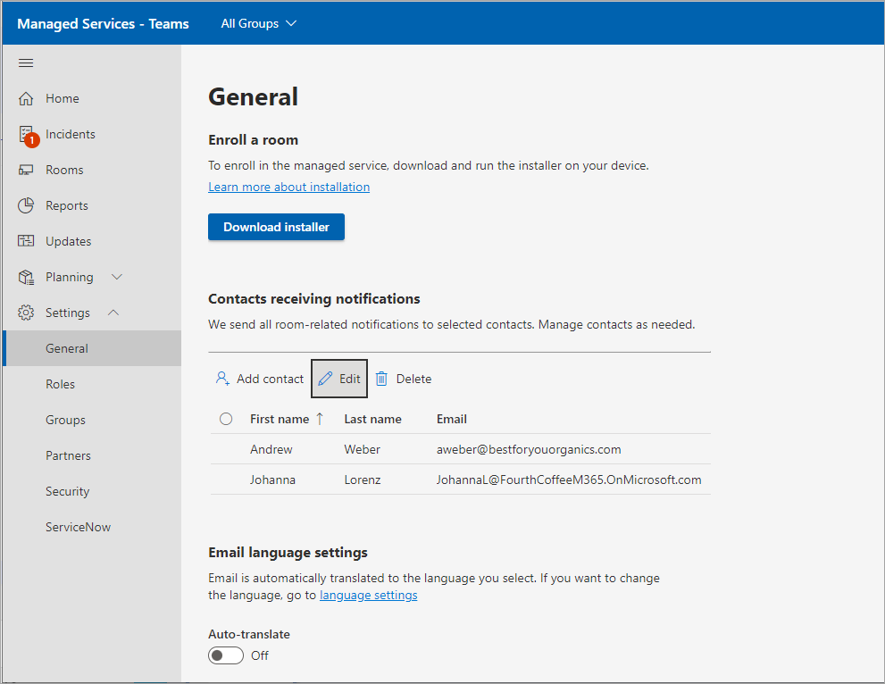

# Enroll device into Pro Management

Deployment requires onboarding Microsoft Teams Rooms devices to the Microsoft Teams Rooms Pro Management portal. The monitoring service agent is for use with certified Microsoft Teams Room (MTR) systems and peripherals.

## Prerequisites

Follow these procedures to set up your hardware before attempting the enrollment process:

### Adding proxy settings (optional)

1. Log in as administrator by following [Performing operations as the Admin user of the MTR device](#performing-operations-as-the-admin-user-of-the-mtr-device).
1. In the Windows ***Search*** field (bottom-left section of the screen), enter **cmd** (either long press the screen or right select, and choose ***Run as administrator***).
1. Run the following command (double quotes at end of command are important):

   - If using single ***proxy server***: `bitsadmin /Util /SetIEProxy LOCALSYSTEM MANUAL_PROXY <proxyserver>:<port> ""`

     *Example:*

     ```DOS
     bitsadmin /Util /SetIEProxy LOCALSYSTEM MANUAL_PROXY contosoproxy.corp.net:8080 ""
     ```

   - If using a ***pac*** file: `bitsadmin /Util /SetIEProxy LOCALSYSTEM AUTOSCRIPT <pac file url>`

     *Example:*

     ```DOS
     bitsadmin /Util /SetIEProxy LOCALSYSTEM AUTOSCRIPT `http://contosoproxy.corp.net/proxy.pac`
     ```

### Enabling TPM settings

> [!NOTE]
> TPM must be enabled to enroll in Pro Management.

If TPM on an Intel NUC device is disabled, enable TPM on these devices as follows:

1. Plug in the keyboard to a NUC device.
1. Restart device.
1. To display the BIOS screen, rapidly press **F2**.
1. Select **Advanced**.
1. Select **Security**.
1. On the right-hand side beneath Security Features, enable **Intel Platform Trust Technology**.
1. To save your settings, press **F10**.
1. In the confirmation box, select **Yes**.

## Performing operations as the Admin user of the MTR device

Some configuration/installation procedures require you to log in to the device as Administrator.

To log in to the device as Administrator (local administrator):

1. Ensure you hang up any ongoing calls and return to the home screen.
1. In the Microsoft Teams Room user interface, select  **More**,  then select **Settings**, where you're prompted for the local Administrator password on the device (the default password is ***sfb***).
1. Select **Settings**, then select  **Windows Settings**  to access Windows as local administrator.

1. From the list of users displayed in the Windows login screen, select  **Administrator** (or the respective local administrator of your device).

> [!NOTE]
> If the computer is *domain joined*, choose **Other User**, then use **.\admin**, or the user name of the local administrator configured in the device as the user name.

To return to the Microsoft Teams Rooms app after performing the necessary administrative tasks:

1. From the Windows ***Start menu***, sign out from the Admin account.
1. Return to Microsoft Teams Rooms by selecting the user account icon on the far left side of the screen and then selecting **Skype**.

> [!NOTE]
> If the Skype user is not listed, select Other User and enter ***.\skype*** as the user name, and sign in.

## URLs Required for Communication

 > [!NOTE]
 > All network traffic between the MTR devices agent and the Microsoft Teams Rooms Pro Management portal is SSL over port 443*.*  See [Office 365 URLs and IP address ranges - Microsoft 365 Enterprise | Microsoft Docs](/microsoft-365/enterprise/urls-and-ip-address-ranges?view=o365-worldwide&preserve-view=true).

The following hosts must be allowed if you have **traffic allowlist** enabled within your enterprise environment:

agent.rooms.microsoft.com<br>
global.azure-devices-provisioning.net<br>
gj3ftstorage.blob.core.windows.net<br>
mmrstgnoamiot.azure-devices.net<br>
mmrstgnoamstor.blob.core.windows.net<br>
mmrprodapaciot.azure-devices.net<br>
mmrprodapacstor.blob.core.windows.net<br>
mmrprodemeaiot.azure-devices.net<br>
mmrprodemeastor.blob.core.windows.net<br>
mmrprodnoamiot.azure-devices.net<br>
mmrprodnoamstor.blob.core.windows.net

## Enrollment process

The Enrollment process involves these steps:

1. On the left navigation bar of the Microsoft Teams Rooms Pro Management portal [http://portal.rooms.microsoft.com](https://portal.rooms.microsoft.com/), expand **Settings** and select **General**.
1. Under *Enroll a room*, select **Download installer**  to download the monitoring agent software.
1. **Optional:** Set up proxy settings for the agent; see [Adding proxy settings (optional)](#adding-proxy-settings-optional).
1. Install the agent installer (downloaded in step 2) on MTR units, either by running the MSI locally on an MTR device or via your normal means of publishing MSI applications en masse to devices within your environment (Group-Policy etc.)
1. The room appears in the portal within 5-10 minutes. If it does not, contact managedroomsupport@microsoft.com.

   

> [!NOTE]
> If you need to install the agent without the Teams App on the MTR being able to login to Teams, you can use our enrollment key as an optional process. Go to  '?'  (Help) on the top right corner of the portal, then select 'Download key (optional)'. When installing the agent, place the ‘Self-Enrollment key' (previously downloaded from the portal) on the **C:\Rigel** directory of the device.

## Installation

After downloading the installer from Microsoft (either from the portal or by using the AKA.ms URL provided above), unzip its contents to access the file **ManagedRoomsInstaller.msi**.

There are two modes of installation: 1) individual local machine install and 2) mass deploy mode (usually via Intune of similar method). We recommend individual install for non-domain joined machines or for machines that you have no way of running MSI installers remotely.

Due to the many varied ways in which customers can run MSI applications in mass deployment mode this document walks through only installation in individual mode as well in bulk on Intune-enrolled devices.

### Individual device installation

1. Log in to the device as administrator. Ensure the *Performing operations as the Admin user of the device* steps are followed.

1. Copy the file **ManagedRoomsInstaller.msi** to the MTR device.

   On running the ***ManagedRoomsInstaller.msi*** is a License Agreement screen.

1. After reading the agreement, check ***I accept the terms in the License Agreement*** and press **Install**.

    This begins the Microsoft Teams Rooms Pro monitoring software install. A prompt for elevation (run as administrator) is displayed.

1. Select **Yes**.

    The installation will continue. During the installation procedure, a console window opens and begins the final stage of the Microsoft Teams Rooms Pro monitoring software installation.

    > [!NOTE]
    > Do not close the window. Once the installation is complete, the wizard displays a "Finish" button.

### Intune-enrolled device bulk deployment

The following components are pre-requisites for successful installation: 

- **Intune enrollment**: Teams Rooms on Windows devices must be already enrolled in Intune.
  For more information about how to enroll Teams Rooms on Windows devices in Intune, see [Enrolling Microsoft Teams Rooms on Windows devices with Microsoft Endpoint Manager - Microsoft Tech Community](https://techcommunity.microsoft.com/t5/intune-customer-success/enrolling-microsoft-teams-rooms-on-windows-devices-with/ba-p/3246986)
- **Azure AD group with all Teams Rooms on Windows devices as members** – a group created in Azure AD that includes all Teams Rooms on Windows devices that should be part of the Microsoft Teams Rooms Premium service. This group will be used for targeting the deployment of the MTRP agent.
  
> [!NOTE]
> You may consider using Dynamic groups in Azure AD for this purpose, more information at [Enrolling Microsoft Teams Rooms on Windows devices with Microsoft Endpoint Manager - Microsoft Tech Community](https://techcommunity.microsoft.com/t5/intune-customer-success/enrolling-microsoft-teams-rooms-on-windows-devices-with/ba-p/3246986)
- **Download MTRP agent** **installer** – Download the Agent’s zip file from <https://aka.ms/serviceportalagentmsi> and extract the contents of the zip (ManagedRoomsInstaller.msi) to a local temporary folder.

**To install using Intune**

1. Sign in to the [Microsoft Endpoint Manager admin center](https://go.microsoft.com/fwlink/?linkid=2109431).
1. Select **Apps** > **All apps** > **Add**.
1. In the **Select app type** pane, under **Other** app types, select **Line-of-business app**.
1. Click **Select**. The **Add app** steps are displayed. 
1. In the **Add app** pane, click **Select app package file**.
   1. In the **App package file** pane, select  **Browse**. Then, select the **ManagedRoomsInstaller.msi** file downloaded previously (refer to the pre-requisites section).
   1. When you're finished, select **OK** on the **App package file** pane to add the app.
1. In the **App information** page, perform the following changes:
   1. Publisher: enter **Microsoft Corporation**.
   1. Ignore app version: select **Yes**.

      > [!NOTE]
      > The MTRP agent is self updating; hence, you should explicitly ignore the app version (any baseline version can update automatically).

   1. (Optional) Category: Select **Computer Management**.
   
1. Click **Next** to display the **Assignments** page.
   1. Under the **Required** section, click **+ add group** to target a group of devices for installation of the agent.
   1. In the **Select group** pane, type the group name in the Search box (refer to pre-requisites above) and click on the desired **group** and click **Select**.
      For more information, see [Add groups to organize users and devices](https://go.microsoft.com/fwlink/?linkid=2202166) and [Assign apps to groups with Microsoft Intune](https://go.microsoft.com/fwlink/?linkid=2202270).
1. Click **Next** to display the **Review + create** page.
1. Review the values and settings you entered for the app. When you are done, click **Create** to add the app to Intune.

Once the process is completed, your devices will start installing the MTRP agent after a few minutes.

> [!NOTE]
> Following installation, the MTRP agent may take up to eight hours to execute a self-update to the latest version and become listed in the MTRP portal.
To expedite the automatic enrollment in the MTRP portal, consider restarting the MTR device following the agent deployment.

## Completing enrollment

When the installation is complete, wait 5-10 minutes, then refresh the portal to view the device in the list, reported as *Onboarding* state.

In *Onboarding* state, the status of the room is displayed and updated but it won't raise any alerts or create investigation tickets.

Choose the room and select **Enroll**  to start receiving incident alerts, investigation tickets, or to report an incident.

For any questions or issues, please open a customer-reported incident in the portal, or contact managedroomsupport@microsoft.com.

### Unenrolling and uninstalling monitoring software

To unenroll the device, remove the monitoring agent from the MTR device as follows:

1. On the device being monitored, log in the device as administrator. Be sure to follow the steps in *Performing operations as the Admin user of the device*.
1. Download reset script from [aka.ms/MTRPDeviceOffBoarding](https://aka.ms/MTRPDeviceOffBoarding).
1. Extract the script somewhere on the device and copy the path.
1. Open PowerShell as administrator: In the Windows ***Search*** field (bottom-left section of the screen), enter ‘Powershell' and right-click ***Windows PowerShell***.
1. Select *"Run as Administrator"* and accept UAC prompt.
1. Enter *Set-ExecutionPolicy –ExecutionPolicy RemoteSigned* , then press **Y** on next prompt.
1. Paste or type the full path to the unzipped offboarding script into the PowerShell window and press **Enter**.

   Example:

   ```powershell
   C:\Users\admin\Downloads\MTRP\_Device\_Offboarding\MTRP\_Device\_Offboarding.ps1
   ```

   This command resets the device to user standard MTR updates and removes the MTRP monitoring agent and files.

1. From the left-hand menu in the Microsoft Teams Rooms Pro Management portal, select **Rooms**.
1. In the list of rooms provided, choose the room you want to unenroll and select **Unenroll** to stop getting incident alerts or investigation tickets, or to report an incident for the room.

## Troubleshooting table

> [!NOTE]
> All Microsoft Teams Rooms Pro monitoring errors are logged on a specific Event Log file named **Microsoft Managed Rooms**.

***Application runtime log file location*** =

C:\Windows\ServiceProfiles\LocalService\AppData\Local\ServicePortalAgent\ app-x.x.x\ServicePortalAgent\ServicePortal\_Verbose\_LogFile.log, where **x.x.x** is the app version number.

|Symptom|Recommended Procedure|
|---|---|
|You receive an error message stating: </p><p> ***ERROR: Please run this application with*** <br> ***elevated privileges***|Run the application with escalated privileges and try again.|
|||
|You receive an error message stating: </p><p> ***TPM data cannot be found***|Ensure that your device has TPM (Trusted Platform Module) turned on in its BIOS. This is usually found in the security settings of the device BIOS.|
|||
|You receive an error message: </p><p> ***ERROR: Local user account named 'Admin' or 'Skype' not found***|Ensure that the user accounts exist on the certified Microsoft Teams Room systems device.|
|||
|You receive any error state messages that are not covered above.|Please provide a copy of your installation log to your Microsoft Teams System support agent.|
