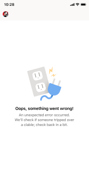

---
title: Mobile App extension
author: donnah007 
ms.author: v-donnahill
manager: serdars
ms.date: 05/11/2022
ms.reviewer: dstrome
ms.topic: article
ms.tgt.pltfrm: cloud
ms.service: msteams
audience: Admin
ms.collection: 
  - M365-collaboration
  - m365initiative-meetings
appliesto: 
  - Microsoft Teams
ms.localizationpriority: medium
search.appverid: MET150
description: Mobile application extension for Teams Rooms
f1keywords: Microsoft Teams Rooms Managed Service mobile app extension
---
# Teams Rooms mobile client application features

Are you an admin who’s usually on the go? Even if you aren’t, there may be times when you need to manage Microsoft 365 from your phone or tablet. Check out the free MTMS mobile app app, the perfect companion to the web-based Microsoft 365 admin center. You can download the app from the ][Apple App Store](), and from the [Google Play Store]().

The admin app has a lot of capabilities which will enable you to manage Microsoft 365 from your mobile or tablet device, when you can’t get to a computer. Here's a list of a few of the tasks you can do from the app:

- Receive push notifications for new incidents.
- Tap the notification to open and view incident details immediately.
- List all active and resolved incidents including read and unread status on messages.
- View the basic incident details with ticket information, including messages.
- View ticket attachments and files.
- Sign out from a user panel (notifications/messages are disabled if signed out).
- Acknowledge incident (mark as read).
- Read, post, and reply to messages on a ticket.
- Toggle to Dark Mode.
- Capability to add an attachment (take and upload pictures).
- Report on an incident (create a ticket).
If you're an admin and you're responsible for more than one Microsoft 365 organization, you can sign in to multiple organizations and quickly switch between them. The app supports dark theme and is available in 39 languages.

[!Important]

If you're having issues using the Admin mobile app on iOS or Android, email us at feedback365@microsoft.com to let us know.
Watch: Install the admin mobile app

To get the MTMS mobile app, search for Teams Rooms Manged Services in the app store for your device and install it.
Sign in with your global admin email address, and view the dashboard to see service health, monitor user licenses, and see messages and service requests.
## Before you begin

You must be an administrator in a Microsoft 365 organization to use the admin mobile app.
Download the admin mobile app
Apple App Store
Google Play Store.
## Frequently asked questions
Below are answers to frequently asked questions.

**What do I need to do to be able to use the app?**

To use the app you need to have admin permissions and a valid subscription to one of the following:

<!--Microsoft 365 subscriptions
Microsoft 365 Apps for Enterprise
Microsoft 365 Apps for Business
Microsoft 365 Business Premium
Microsoft 365 Business Standard
Microsoft 365 Business Basic
Microsoft 365 E3/E5
Office 365: E1, E3/E5
Exchange Online plan
OneDrive for business plan-->

**Can I use the app with my Microsoft 365 Family subscription?**

No, the app doesn’t work with Microsoft 365 Family or Microsoft 365 Personal subscriptions.
Will the app work if my organization has directory synchronization enabled?
Yes, but with reduced functionality. You'll be able to sign in and view service information, but most of the user management functions will be read-only. You won't be able to add, edit, or delete users. However, you'll be able to assign licenses to users in your organization and get notifications.
**What languages are supported by the app?**

The app supports all 39 languages that the web-based Microsoft 365 admin center supports. To change the language, from the left navigation menu in the admin center, go to Settings > Language or select the Language icon in Quick Links section of the admin mobile app home page.

**How can I share the Service Incidents and Messages with the rest of my organization?**

If you select a specific service incident or a message, the share option will be in the top right corner.
**Can I use this app with multiple accounts or tenants?**

Yes, you can setup multiple accounts or organizations.

**I’m unable to login or my app is acting funny. What can I do to troubleshoot or fix the issue?**

You can try some common mobile app troubleshooting steps:
- Close and reopen the app.
- Uninstall and reinstall the app. Ensure that you are on the latest version of the app.
- If you have Microsoft Authenticator or Company portal app installed on your device, try reinstalling it or updating to the latest version. If that doesn't work, you can email us at feedback365@microsoft.com to let us know.

**What do I do if my question isn't answered?**

Email ???@microsoft.com to report an issue with the app. Or you can give feedback at the bottom of this article.

## Next steps

Once you've downloaded the admin mobile, you can add users to get you started.

The mobile client offers both reporting and managing incidents capabilities within your organization.

## Viewing incidents

- Receive push notifications for new incidents.
- Tap the notification to open and view incident details immediately.
- List all active and resolved incidents including read and unread status on messages.
- View the basic incident details with ticket information, including messages.
- View ticket attachments and files.
- Sign out from a user panel (notifications/messages are disabled if signed out).

## Managing tickets

- Acknowledge incident (mark as read).
- Read, post, and reply to messages on a ticket.
- Toggle to Dark Mode.
- Capability to add an attachment (take and upload pictures).
- Report on an incident (create a ticket).

**To use the Teams Rooms mobile app**

1. Download the app from either  to either the [Apple App Store]() or the [Google Play Store]()
1. Ensure that you have a valid subscription to a Microsoft 365 subscrioption.
1. Use your admin credentials that you use to access the Teams Rooms desktop app.

<!--  

-->
### Incidents Page

### Incidents loading

### Ticket details

### Ticket messages

### Ticket attachments

### Unexpected error

### Contact an admin

### No active incidents

### User menu

### Report an incident
-->