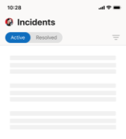

---
title: Mobile App extension
author: donnah007 
ms.author: v-donnahill
manager: serdars
ms.date: 05/11/2022
ms.reviewer: dstrome
ms.topic: article
ms.tgt.pltfrm: cloud
ms.service: msteams
audience: Admin
ms.collection: 
  - MTMR-collaboration
  - MTMRinitiative-meetings
appliesto: 
  - Microsoft Teams
ms.localizationpriority: medium
search.appverid: MET150
description: Mobile application extension for Teams Rooms
f1keywords: Microsoft Teams Rooms Managed Service mobile app extension
---
# Teams Rooms mobile client application features

There may be times when you need to manage Teams Rooms Managed Services (MTMS) from your mobile device. The mobile app has many capabilities you can manage from your mobile or tablet device.
## Before you begin

You must be an administrator in a Microsoft 365 organization to use the Teams Rooms mobile app.
Download the Teams Rooms mobile app from the ][Apple App Store](https://apps.apple.com/app/apple-store/id761397963?pt=80423&ct=docsaboutadminapp&mt=8), and from the [Google Play Store](https://play.google.com/store/apps/222).

**To get the MTMS mobile app**

1. Search for Teams Rooms Manged Services in the app store for your device and install it.
2. Sign in with your global admin email address, and view the dashboard to see service health, monitor user licenses, and see messages and service requests.
## Viewing incidents

- Receive push notifications for new incidents.
- Tap the notification to open and view incident details immediately.
- List all active and resolved incidents including read and unread status on messages.
- View the basic incident details with ticket information, including messages.
- View ticket attachments and files.
- Sign out from a user panel (notifications/messages are disabled if signed out).
- 
### Incidents Page

### Incidents loading

## Managing tickets

- Acknowledge incident (mark as read).
- Read, post, and reply to messages on a ticket.
- Toggle to Dark Mode.
- Capability to add an attachment (take and upload pictures).
- Report on an incident (create a ticket).

### Ticket messages

### Ticket attachments

### Ticket details

### User menu

### Report an incident
-->
## Other Features
### View messages

### Review Rooms Problems

### Managed Security with Microsoft Defender

### Track active investigations

### Communication with experts

## Frequently asked questions
Below are answers to frequently asked questions.

**What do I need to do to be able to use the app?**

To use the app you need to have admin permissions and a valid Microsoft 365 subscription.

**What languages are supported by the app?**

**How can I share the Incidents and Messages with the rest of my organization?**

**Can I use this app with multiple accounts or tenants?**

**I’m unable to login or my app is acting funny. What can I do to troubleshoot or fix the issue?**

You can try some common mobile app troubleshooting steps:
- Close and reopen the app.
- Uninstall and reinstall the app.Ensure that you are on the latest version of the app.
- If you have Microsoft Authenticator or Company portal app installed on your device, try reinstalling it or updating to the latest version. If that doesn't work, you can email us at feedback365@microsoft.com to let us know.

**What do I do if my question isn't answered?**

## Next steps

The mobile client offers both creating tickets and managing incidents capabilities within your organization.

**To use the Teams Rooms mobile app**

1. Download the app from either  to either the [Apple App Store]() or the [Google Play Store]()
1. Ensure that you have a valid Microsoft 365 subscription.
1. Use your work credentials that you use to access the Teams Rooms desktop app.

