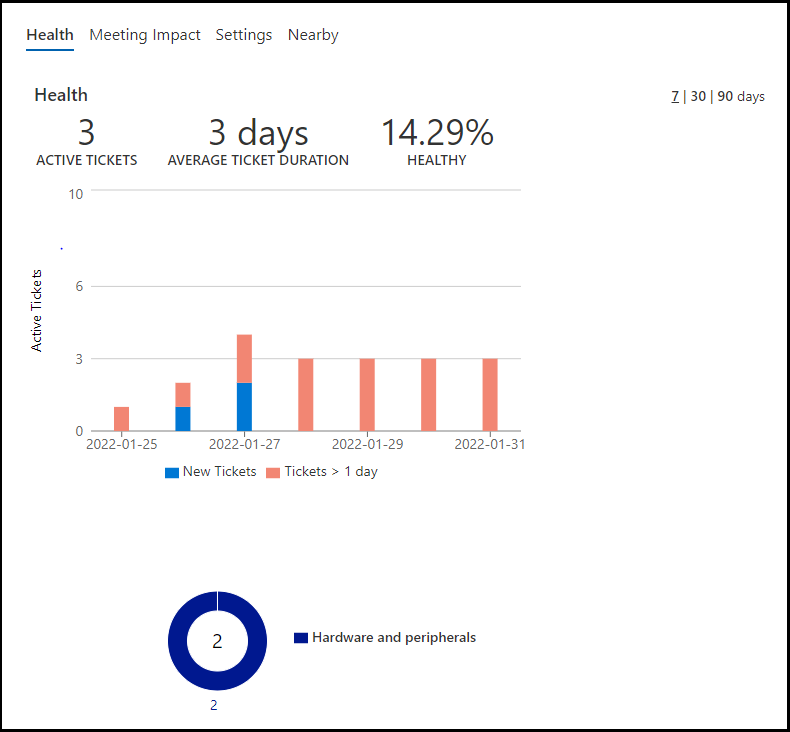
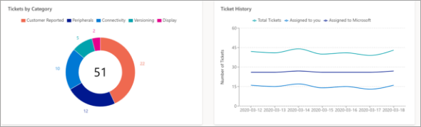

# Health and Usage reports

The reporting node contains data for the health and usage of your Microsoft Managed Rooms. The overview surfaces tenant-wide health trends of your rooms. In the health tab of reports, all rooms are listed with their corresponding health score and number of meetings impacted by a ticket. Room usage based on the calendar information is visible under the “Usage” tab.

## Health

Navigate to the health report for all rooms by going to Reports, then click on the “Health” tab.

The health score is a metric designed to surface rooms that are most likely to cause end-user frustration. A room can either be healthy or unhealthy for a given day. It is considered unhealthy if a ticket or many tickets impacted the room for more than 20 total minutes during non-maintenance hours (5AM -9PM machine local time). For example, if a ticket is opened at 5:00AM but closed at 5:15AM, the room is still considered healthy. But, if a second ticket occurred from 09:00AM to 9:10AM, the room would then be considered unhealthy for the day. Similarly, if a ticket occurred from 5:00AM to 5:21AM, it is considered unhealthy for the day.

> [!NOTE]
> Health for the day is aggregated once a day at 12:00 AM UTC time. For customers near the international date line, health aggregation may occur near the middle of the workday.

> [!NOTE]
> Rooms that are onboarding are hidden for the list of rooms in the Health tab and do not count towards the average health of the tenant.

Clicking on a room listed in this view will display more details. 

The bar graph displays the number of tickets on each day. Tickets opened on that respective day are shown in blue, while orange represents on-going tickets opened prior to the respective day. Clicking on a day on the graph will filter the pie-chart and table to the relevant tickets. To reverse the filter, navigate with the breadcrumbs or click on the graph.

Categorization of tickets are represented in the donut chart. Interacting with this will filter the timeline graph and table. To reverse the filter, navigate with the breadcrumbs or click on the graph.

## Navigating reports

<!--The overview section provides graphical representations of important aspects of meeting room management. The charts will change depending on the time span selected or group selected. To change the time span, click the drop-down menu.

-->

To change the group, select **All Groups** the group selection in the banner.

[A close up of a logo description automatically generated](../media/health-and-usage-005.png)
### Tickets by category

This donut shows you the total tickets raised for the selected timespan and group (default: 7 days, all groups). Tickets are represented in their major categories: Audio, Display, Peripherals, Connectivity, Versioning and Customer reported.

A flyout for the detailed view for tickets of that category will be shown if it is clicked. 

In the flyout, filter the list of tickets by the subcategory by clicking on the respective part of the donut.

To navigate back, either click on the donut or click on the breadcrumb at the top left.

To navigate to a specific ticket in this list view, click on the link under the “Support ticket column”

### Ticket history

The ticket history graph shows a comparison of incidents assigned to you or Microsoft over the specified time period.

> [!NOTE]
> If a ticket changes owner in a day, whoever owns the assignment for the majority of that day will have the ticket counted towards them. Ex. If you assign the ticket to Microsoft early in the day, the ticket counts towards “Assigned to Microsoft” for the day.`

### Health history

This graph shows the average health (definition in Health section) for all the rooms in the tenant as well as the average health for all MMR customers on a day-to-day basis. It is possible to look at the average health for up to 90 days.

5 most reliable, 5 least reliable

There are two tables that show the most reliable and least reliable rooms based on health. For the full list view, go to the Health tab, then sort the list by the Health column.

Usage

Navigate to the usage report for all rooms by going to the Reports, then clicking on the “Usage” tab.

The headlines provide a few insights:

- Total rooms in your tenant
- How many do not have any booked meetings, either offline or online
- Percentage of utilization of rooms across the tenant
- Total number of booked meetings through exchange
- Percentage of booked meetings that included a Skype or Teams link
Usage is calculated at the end of each day at midnight (00:00) local time of the meeting room device.

Utilization is calculated based on the total booked meeting time for that day divided by 8 hours.

The circles are filled in quarter intervals only, with the following thresholds:

- Less than 15% -> Empty
- Between 15% and 40% -> ¼ fill
- Between 40% and 60% -> ½ fill
- Between 60% and 80% -> ¾ fill
- Over 80% -> Whole

### Usage details of a room
 
Clicking on a room in the list view will prompt a flyout with more in-depth information. Under the Utilization tab of the flyout is a graph showing hours of usage of the last five business days. For each day there are two bars: blue – representing booked meeting time – and purple – for scheduled time of Teams/Skype enabled meetings. At the bottom, the average meeting bookings and duration for the past 5 business days is calculated.

The “Nearby” tab displays up to five other rooms that are located within 100m, approximately. This view facilitates comparisons to rooms in the same building. It is important to note that the distance measurement is horizontal and based on location data from the device in the room. Vertical distance is not accounted for in this metric.

The settings tab displays the metadata of the room such as the hardware information, device settings, BIOS information, app settings and location.