---
title: Health and Usage Reports
author: donnah007 
ms.author: v-donnahill
manager: serdars
ms.date: 04/07/2022
ms.reviewer:  
ms.topic: article
ms.tgt.pltfrm: cloud
ms.service: msteams
audience: Admin
ms.collection: 
  - M365-collaboration
  - m365initiative-meetings
appliesto: 
  - Microsoft Teams
ms.localizationpriority: medium
search.appverid: MET150
description: Reporting node data for health and usage of reports
f1keywords: 
---
# Health and Usage Reports

The reporting node contains data for the health and usage of your Microsoft Managed Rooms and service insights. The **Overview** surfaces tenant-wide health trends of your rooms. The **Health** tab displays a list of rooms with their corresponding health data. Room usage based on  calendar information and call quality data is visible under the **Usage** tab.

## Navigating reports

<!--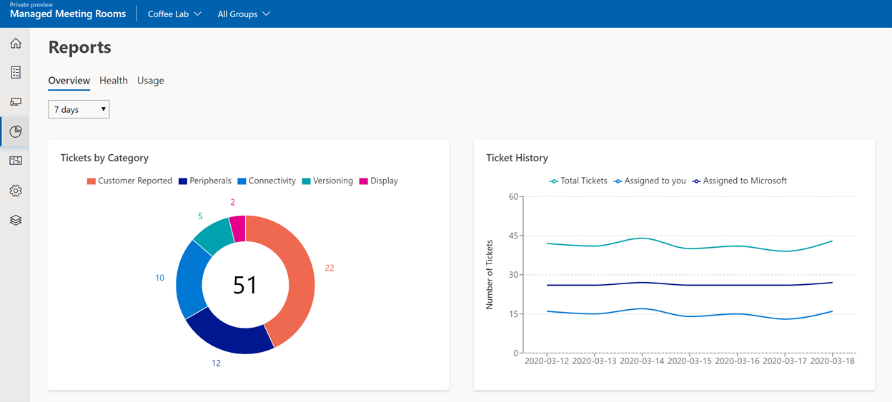-->

The overview section provides graphical representations of important aspects of meeting room management. The charts will change depending on the time span selected or group selected. To change the time span, click the drop-down menu.

<!--!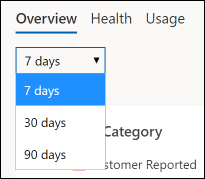-->

To change the group, click the group selection drop-down menu in the banner.

<!--!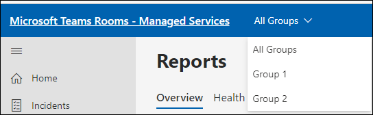-->
### Tickets by category

The donut displays the total tickets raised for the selected time span and group (default is seven days, all groups). Tickets are represented in their major categories: Audio, Display, Peripherals, Connectivity, Versioning, and Customer reported.

<!--!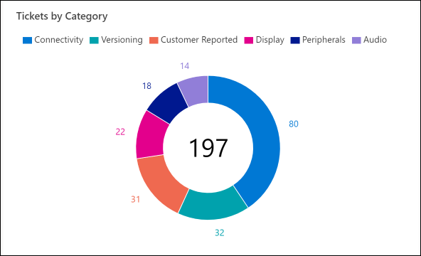-->

A flyout for the detailed view for tickets of that category is displayed when selected.

<!--!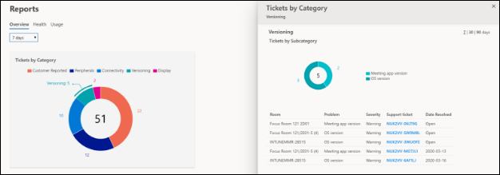-->

In the flyout, it is possible to filter the list of tickets by the subcategory by selecting the respective part of the donut. 

<!--!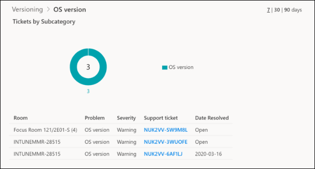-->

To navigate back, either click on the donut or click on the breadcrumb at the top left.

To navigate to a specific ticket in this list view, click on the link under the **Support ticket colum**.

### Ticket history

The ticket history graph shows a comparison of incidents assigned to you or Microsoft over the specified time period.

> [!NOTE]
> If a ticket changes owner in a day, whoever owns the assignment for the majority of that day will have the ticket counted towards them. For example, if you assign the ticket to Microsoft early in the day, the ticket counts towards **Assigned to Microsoft** for the day.

<!--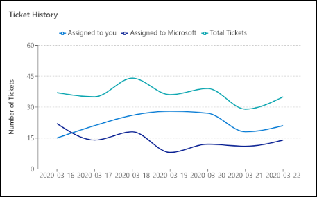-->

### Health history

This graph shows the average health (definition in Health section) for all the rooms in the tenant as well as the average health for all MMR customers on a day-to-day basis. You can view the average health for up to 90 days.

<!--!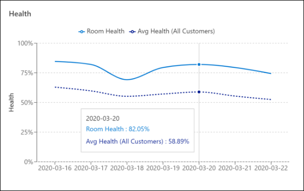-->

### Most reliable/least reliable rooms

Two tables show the most reliable and least reliable rooms based on health. For the full list view, select Health, then sort the list by the Health column.

### Rooms history

Provides a historical view of rooms enrolled in the service and provides a comparative view of rooms that were healthy or unmonitored in the same time period.

## Health

To navigate to the Health report for all rooms, select Reports, then select  **Health**.

<!--!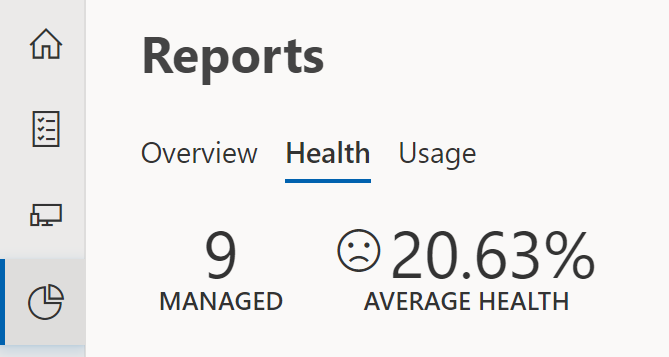-->

The health score is a metric designed to surface rooms that are most likely to cause end-user frustration. A room can either be healthy or unhealthy for a given day. It is considered unhealthy if a ticket or many tickets impacted the room for more than 20 total minutes during non-maintenance hours (5AM -9PM machine local time). For example, if a ticket is opened at 5:00AM but closed at 5:15AM, the room is still considered healthy. But, if a second ticket occurred from 09:00AM to 9:10AM, the room would then be considered unhealthy for the day. Similarly, if a ticket occurred from 5:00AM to 5:21AM, it is considered unhealthy for the day.

> [!NOTE]
> Health for the day is aggregated once a day at 12:00 AM UTC time. For customers near the international date line, health aggregation may occur near the middle of the workday.

> [!NOTE]
> Rooms that are onboarding are hidden for the list of rooms in the Health tab and do not count towards the average health of the tenant.

Clicking on a room listed in this view displays more details.

The bar graph displays the number of tickets on each day. Tickets opened on that respective day appear in blue. Tickets opened prior to the respective day appear in orange. Clicking on a day on the graph filters the pie chart and table to the relevant tickets. To reverse the filter, navigate with the breadcrumbs or click on the graph.

Categorization of tickets are represented in the donut chart. Interacting with this filters the timeline graph and table. To reverse the filter, navigate with the breadcrumbs or click on the graph.

<!--!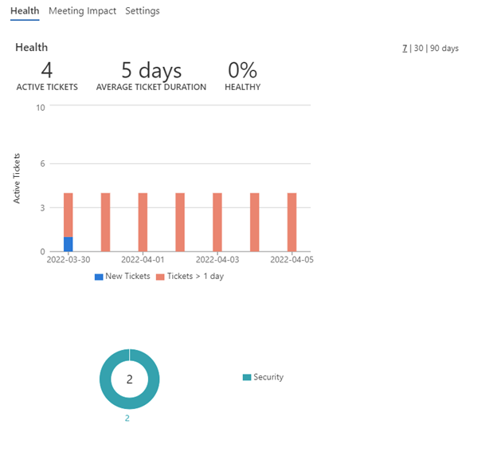-->

The meeting impact view shows scheduled meetings during which a ticket with a severity of "Important" or "Critical" was open. The purpose of this view is to provide an approximation of meetings where participants could have experienced issues.

The meeting impact view shows scheduled meetings during which a ticket with a severity of "Important" or "Critical" was open. The purpose of this view is to provide an approximation of meetings where participants could have experienced issues.

<!--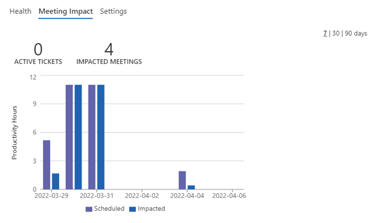-->

The Settings tab displays the metadata of the room such as the hardware information, device settings, BIOS information, app settings and location.

## Usage

To view the Usage report for all rooms, select **Reports->Usage**.

<!--!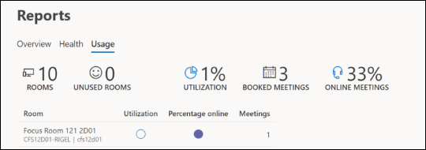-->

The headlines provide a few insights:

- Total rooms in your tenant
- How many do not have any booked meetings, either offline or online
- Percentage of utilization of rooms across the tenant
- Total number of booked meetings through exchange
- Percentage of booked meetings that included a Skype or Teams link
- Total calls with room participation
- Aggregate call performance score from all calls classified with "Good" quality to all calls. 

Below the headline metrics is a table of rooms with corresponding metrics. Select a room to view more usage details. The metrics in the table are described in the following table.

|Column|Description|
|---|---|
|Utilization|Percentage of time the room was booked during business hours in the selected period. Ex. Time period set to 7 days. 80% utilization over the means the room was booked for 32/40 hours|
|Booked online|Of the booked meetings, the percentage of which were enabled with Teams. Ex. 10 meetings were booked. Of that, 8 had a Teams link. Booked Online = 80%|
|Scheduled meetings|Absolute number of meetings scheduled in the room|
|Total calls|Absolute number of calls with the room as a participant.|
Call performance|Percentage of calls with a "Good" rating. Each call is evaluated and receives a Good, Poor, Unknown rating. This metric is calculated from Good calls/Total calls|

Usage is calculated at the end of each day at midnight (00:00) local time of the meeting room device. Utilization is calculated based on the total booked meeting time for that day divided by 8 hours.

## Usage details of a room

Clicking on a room in the list view prompts a flyout with more in-depth information. Under the Utilization tab of the flyout is a graph showing hours of usage of the last five business days. For each day there are two bars: blue represents booked meeting time; purple represents scheduled time of Teams/Skype enabled meetings. At the bottom, the average meeting bookings and duration for the past five business days are calculated.

<!--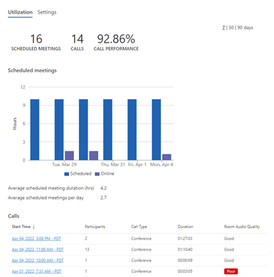-->

The **Calls** table shows meetings in which the room participated in a Teams call. The Room Audio Quality is evaluated for only the room, not all participants. To view call quality for all participants of a specific call, select a call by clicking on the Start Time.

<!--!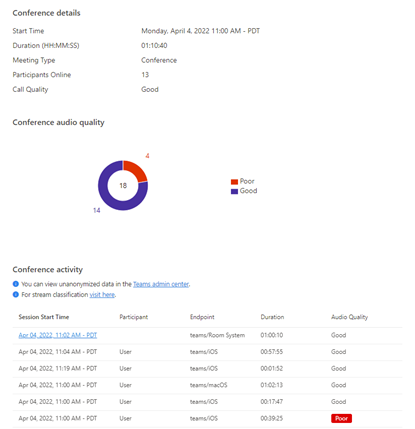-->

To view stream details for the room, click the Session Start Time.
