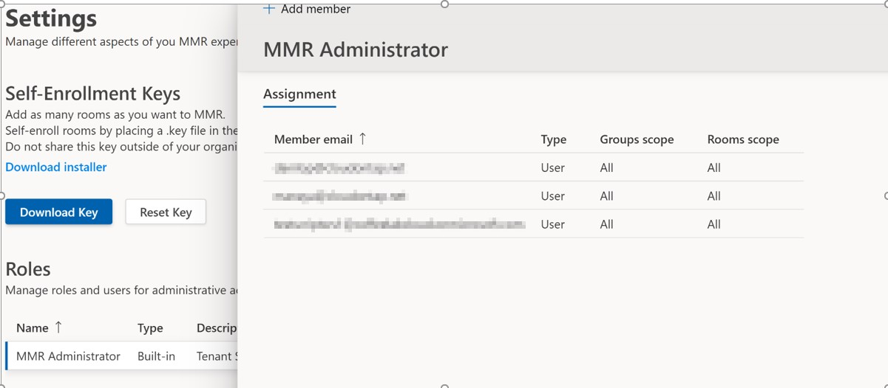
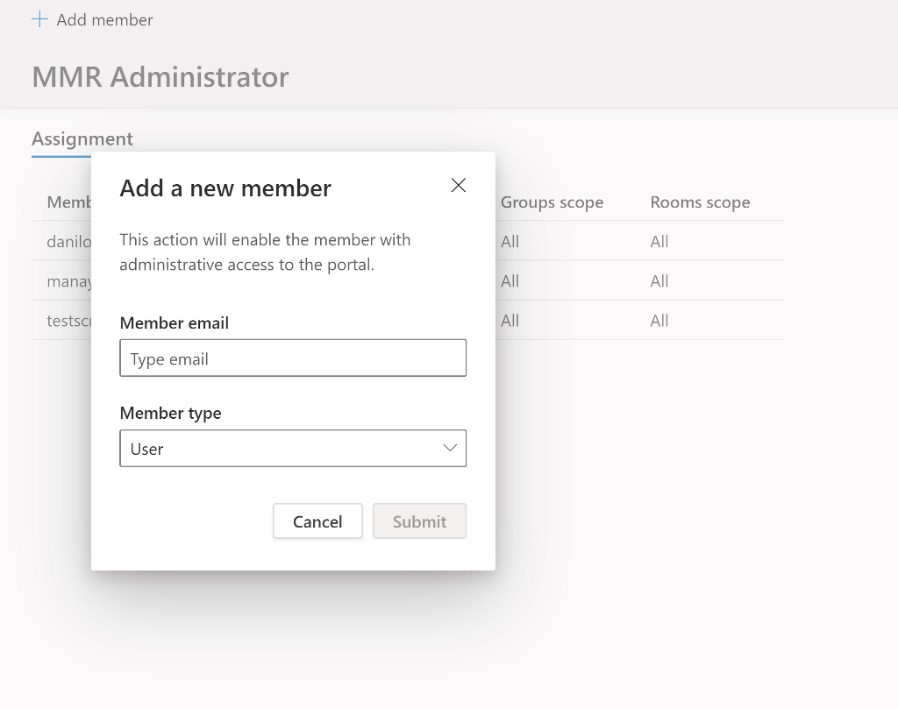

# Microsoft Teams Rooms Managed Services 

## Overview 
The Microsoft Teams Rooms Managed Service (“managed services”) is a cloud-based IT management and monitoring service that keeps Microsoft Teams Rooms devices and their peripherals up to date and proactively monitored, supporting an environment optimized for a great user experience.  

There are three key aspects of the service:  

- Intelligent operations  

Software and machine learning that automates updates, problem detection, problem resolution for Microsoft Teams Rooms.  

- Dedicated experts  

A team of experts who provide 24x7 service operations, tiered support, and incident resolution assistance.  

- Enhanced insights  

Rich analytics, reporting and proven learnings at scale across many customers.  

This document provides help on the managed services portal and other features.  
## Terminology 
This is quick review of the frequently used terms in the portal. We would love to have feedback if any of these terms do not make sense. 

|Term |Meaning |
| :- | :- |
|**Monitoring Software** |Refers to the monitoring agent that is deployed in each of the Microsoft Teams Room devices. |
|**App** |App refers to the Microsoft Teams Room system app (regardless of whether it uses Skype for Business or Microsoft Teams as the collaboration service. |
|**Room/Device** |This refers to the certified Microsoft Teams Room system device. |
|**Unmonitored** |The Microsoft monitoring software deployed as part of managed services is not able to connect to the cloud services. We are not receiving telemetry about the device. |
|
**Healthy /** 

**Unhealthy** 
|If we detect abnormalities in device / peripheral, it will be shown as unhealthy. |
|**Suppressed** |If a device is known to be in maintenance, and its alerts should be ignored, then the device can be suppressed deliberately.  |
|**Onboarding** |The state of a room device while it is getting setup added but is not ready as a regularly supported room.  |
|**Incident** |This conveys an issue affecting meeting experiences of your end users that needs action. |
|**Misconfigured** |This conveys that the configuration detected does not seem correct / commonly used. |
|**Support Ticket** |This is an internal Microsoft tracking identifier with which we track all communications / actions regarding an incident. |

## Role Based Access Control 
Role-based access control (RBAC) in the Microsoft Teams Rooms managed service helps you manage user access to room resource data in your organization. By assigning roles to your service portal users, you can limit what they can see and change. Each role has a set of permissions that determine what users with that role can access and change within your organization. 

To create, edit, or assign roles, your account must have one of the following permissions: 

- Global Administrator through Azure Active Directory (Azure AD) 
- Managed Service Administrator through the Microsoft Teams Rooms managed service portal. 

# Adding MMR Admin Roles
<!-- This section needs to be updated. -->

The following procedure is supplemental to [Microsoft Teams Rooms Managed Service](microsoft-teams-rooms-premium.md) and [Microsoft Teams Rooms Portal](managed-meeting-rooms-portal-guide.md). 

1. Log in with your tenant user account to service portal. 
1. Navigate to the settings panel. 
1. You will see a new component for adding MMR Administrator role for MMR users for your tenant.  

 

4. Clicking on the "MMR Administrator" text takes you to the following experience.  

 

5. You can click on "Add Member" link the experience to add the email address of the users you want to add to this role. You must do this one user at a time.  

 

