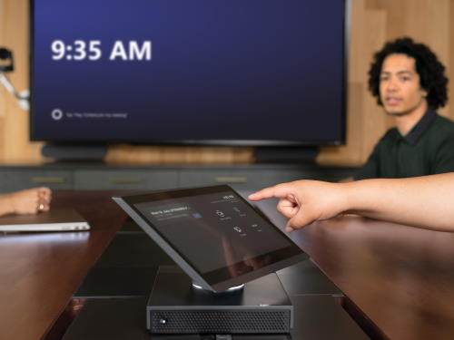

# Plan Microsoft Teams Rooms

This article introduces an end-to-end approach to planning, delivering, and operating Microsoft Teams Rooms as part of your overall meeting and conference room strategy.

You'll find planning information below covering the recommended approach and key decisions that you need to make, with links to supporting technical information. We recommend that you review the Plan, Deploy, and Manage sections even if you're already fully deployed.

## Overview of Microsoft Teams Rooms

Microsoft Teams Rooms provides a complete meeting experience that brings HD video, audio, and content sharing to meetings of all sizes, from small huddle areas to large conference rooms.

[Microsoft Teams Rooms help](https://support.office.com/article/Skype-Room-Systems-version-2-help-e667f40e-5aab-40c1-bd68-611fe0002ba2) is a great resource to find out more about Microsoft Teams Rooms and how it can add value as part of your deployment.

## Microsoft Teams Rooms components

Microsoft Teams Rooms includes the following key components to deliver a great user experience:

- Touchscreen console
- Compute module
- Microsoft Teams Rooms application
- Peripheral devices (camera, microphone, speaker)
- External screens (maximum of two)
- HDMI input

Check out the certified Teams Rooms systems and peripherals in [Teams Rooms certified systems and peripherals](certified-hardware.md).

## Teams Rooms licensing

Each meeting room device, such as a Teams Rooms console, Surface Hub, and Teams panel, needs a Teams Rooms license. Teams provides two licenses for Teams Rooms: Microsoft Teams Rooms Pro and Microsoft Teams Rooms Basic.

Microsoft Teams Rooms Pro is great for organizations that have 25 or more meeting room devices or who want the most comprehensive meeting and device management experiences. Hybrid Teams meetings become more immersive with features like Front row, Content camera, AI-powered noise suppression, and other features available with Microsoft Teams Rooms Pro. Teams Rooms admins can centrally manage all their certified Teams Rooms devices from the Teams admin center from configuring conditional access policies to analyzing rich telemetry about device health and meeting quality.

Microsoft Teams Rooms Basic is available for organizations that only have a few meeting room devices and who only need basic meeting and management functionality. Microsoft Teams Rooms Basic lets you join meetings, share content and live video, join Zoom and Webex meetings with Direct Guest Join, and perform basic device inventory and monitoring in the Teams admin center.

Before you can use a meeting room device, you need to assign a license to it. For more information, see [Microsoft Teams Rooms licenses](rooms-licensing.md).

[!INCLUDE [mtr-user-licensing](../includes/mtr-user-licensing.md)]

| &nbsp;   |  &nbsp;   |
|-----------|------------|
|  Decision points|<ul><li>Will you deploy Microsoft Teams Rooms in your organization? </li><li>How will you procure your Microsoft Teams Rooms systems?</li></ul> |
|  Next steps | <ul><li>Identify who will undertake the key activities throughout your deployment.</li><li>Review the meeting rooms you have (and plan to set up) to understand where you want to deploy Microsoft Teams Rooms and the peripheral devices that would be appropriate for the room size.</li></ul> |
| | |

## Identify who will undertake the key activities throughout your deployment

Use the approach illustrated below to guide you through your deployment, and customize the sample outputs provided as needed for your organization.

Begin with understanding what conference rooms you have and envisioning what would work best for you in the future, then move through selecting and procuring the equipment you need, readying your sites, configuring and deploying your service, managing change and user adoption, and developing operations and maintenance procedures.

:::image type="content" alt-text="Begin with understanding what you have and envisioning what would work best for you, then move through selecting and procuring the equipment you need, readying your sites, configuring and deploying your service, managing change and user adoption, and developing operations and maintenance procedures." source="../media/room-systems-image2.png" lightbox="../media/room-systems-image2.png":::

You might need to coordinate these activities across several teams. We provide a high-level view of the main activities that you should cover, and also suggestions for the teams who are typically involved in deploying and managing conference room systems, to help you decide who you need to work with.

| Task                       | Who might undertake the task           | Assigned to | Links to this content |
|----------------------------|----------------------------------------|-------------|-----------------------|
| Inventory rooms            | Facilities / AV team / IT Project Team |             | [Room inventory and capability planning](#room-inventory-and-capability-planning) |
| Plan capabilities          | IT Project Team                        |             | [Room inventory and capability planning](#room-inventory-and-capability-planning) |
| Device selection           | IT Project Team / AV Team              |             | [Device selection](#device-selection) |
| Procurement                | IT Project Team / AV Team              |             | [Procurement](#procurement) |
| Site readiness             | Facilities / AV team / IT Project Team |             | [Site readiness](rooms-deploy.md#ordering-equipment-and-site-readiness-for-a-teams-rooms-deployment) |
| Network readiness          | IT Project Team                        |             | [Network readiness](rooms-deploy.md#preparing-your-corporate-network-for-teams-rooms) |
| Resource accounts          | IT Project Team                        |             | [Creating resource accounts](rooms-deploy.md#creating-resource-accounts-for-your-microsoft-teams-rooms) |
| Deployment                 | Facilities / AV team / IT Project Team |             | [Deployment checklist](console.md) |
| Adoption                   | Facilities / AV team / IT Project Team |             | [Adoption](#plan-for-adoption-and-change-management) |
| Maintenance and operations | AV team / IT Project Team              |             | [Management overview](rooms-manage.md) |

## Room inventory and capability planning

The first step is to inventory your organization's existing meeting spaces and conference rooms to understand their environment, room size, layout, and purpose. You can then identify the capabilities you want each room to have such as intelligent cameras, whiteboarding, content camera, etc.

After you create an inventory of the equipment and capabilities in each existing room, your requirements for that room feed into your device selection planning to create a rich conferencing solution. The modalities (audio, video) needed for each room—in addition to room size and purpose—all play an important role in deciding which solution is most appropriate for each room.

As part of your discovery, it's key to consider room acoustics and layout. For example, check that the chairs in the room won't block the camera view. Verify that the room doesn't have excessive echo or noisy air conditioning, and that it does have sufficient power for the screens and Microsoft Teams Rooms. There are many factors to consider that your audio-visual (AV) team or partner will be able to advise on.

| &nbsp;   | &nbsp;    |
|-----------|------------|
|  Next steps|<ul><li>Review the rooms in scope, and define Microsoft Teams Rooms configurations for them.</li></ul>|

_Sample meeting/conference room inventory_

| Site      | Room name | Room type | Number of people | In scope? | Current room capabilities           | Future room capabilities |
|-----------|-----------|-----------|------------------|-----------|-------------------------------------|--------------------------|
| London HQ | Curie     | Medium    | 6&ndash;12       | Yes       | Speakerphone                        | 1 screen, audio and video plus presentation PSTN Access |
| Sydney HQ | Hill      | Large     | 12&ndash;16      | Yes       | Legacy AV unit, 1 screen and camera | 2 screens, audio and video plus presentation PSTN Access |

## Device selection

Evaluate which Microsoft Teams Rooms solution is the most suitable for each room based on the future capabilities you want for the room. Decide which AV peripheral devices are the best fit, depending on room size and layout.

For guidance for the type of system and peripheral devices by room type and size, see [Teams Rooms devices by space](https://www.microsoft.com/microsoft-teams/across-devices/spaces) and select your room size. For a list of certified Teams Rooms systems and peripherals, see [Teams Rooms certified systems and peripherals](certified-hardware.md).

Based on the vendor you prefer, use the information provided in the requirements article to define your Microsoft Teams Rooms and supported peripheral device configuration per room type, and use this as a template for your deployment.

> [!TIP]
> Some room types might not be applicable for your deployment.

| &nbsp; | &nbsp; |
|---|---|
|   Decision points | <ul><li>From your inventory, which types of rooms are in scope for your deployment?</li><li>Which systems will you deploy for each room type?</li></ul> |
|  Next steps | <ul><li>Start to gather key operational material for your chosen systems, and engage your procurement team.</li></ul> |

_Sample Microsoft Teams Rooms deployment template for your organization_

| Room type/size     | Number of people | Microsoft Teams Rooms system | Peripheral devices | Display(s)      |
|--------------------|------------------|------------------------------|--------------------|-----------------|
| Focus 10' by 9'    | 2&ndash;4        |                              |                    |                 |
| Small 16' by 16'   | 4&ndash;6        |                              |                    |                 |
| Medium 18' by 20'  | 6&ndash;12       |                              |                    |                 |
| Large 15' by 32'   | 12&ndash;16      |                              |                    |                 |

> [!TIP]
> Now is a great time to start gathering information about the Microsoft Teams Rooms solution you've chosen.

## Procurement

You can procure your chosen system as a bundle or an integrated solution via device partners.

You can acquire Microsoft Teams Rooms from a number of partners who are listed in [Teams Rooms certified systems and peripherals](certified-hardware.md). Please visit the partners' websites to learn more about these solutions and procurement options.

Depending on your deployment scale and approach, you might decide to have the Microsoft Teams Rooms and supported peripheral devices shipped to a central location for initial configuration and assignment. This might be a good approach for a staged rollout across many sites. Or, you might choose to ship the bundles directly to your sites.

| &nbsp; | &nbsp; |
|---|---|
|   Decision points|<ul><li>Will you ship the components directly to a site or to a staging facility?</li><li>Who will manage the staging facility (if you decide to use one)?</li></ul> |
|  Next steps|<ul><li>Plan for operations.</li><li>Plan for adoption and change management.</li></ul> |

## Plan for operations

Your organization must execute monitoring, administration, and management tasks on an ongoing basis, and it's key to agree who will undertake these tasks early in your deployment.

Many organizations have an AV team or partner who manages their conference rooms and devices. Or you can have Microsoft help manage Teams Rooms by leveraging Microsoft Teams Rooms Pro. Decide who will manage the Microsoft Teams Rooms devices going forward to monitor performance as well as deploy software updates and hotfixes.

Consider which helpdesk queue you'll route Microsoft Teams Rooms-related calls to, and provide an FAQ to the helpdesk team so they can better understand how to use Microsoft Teams Rooms and the key troubleshooting steps they can take. A good starting point for this FAQ is the [user help](https://support.microsoft.com/office/microsoft-teams-rooms-help-e667f40e-5aab-40c1-bd68-611fe0002ba2) and [Known issues](known-issues.md).

> [!NOTE]
> Microsoft Teams Rooms sign in to Microsoft Teams and allows joining meetings hosted by Microsoft Teams services. Microsoft Teams rooms may also connect to third party meeting services anonymously as guest, depending on your configuration of the device.
>
> Skype for Business Server 2019, Skype for Business Server 2015 or earlier platforms like Lync Server 2013 aren't supported by Microsoft Teams Rooms. Microsoft Teams Rooms is not supported in Microsoft 365 or Office 365 operated by 21Vianet, or DoD environments.
>
> If you have an on-prem Exchange server, Microsoft Teams Rooms requirements for connecting to Exchange can be found here: [https://learn.microsoft.com/en-us/microsoftteams/exchange-teams-interact](/microsoftteams/exchange-teams-interact)

| &nbsp; | &nbsp; |
|---|---|
|   Decision points|<ul><li>Decide who will manage Microsoft Teams Rooms.</li><li>Decide which helpdesk queue to route Microsoft Teams Rooms-related calls to.</li></ul> |
|  Next steps |<ul><li>Prepare to host accounts.</li></ul> |

## Plan for adoption and change management

Microsoft Teams Rooms systems introduce new capabilities to your users. It's important that you recognize that this will be a change for your users, and you should ensure your internal marketing campaign identifies the benefits the new system will have for your users and the key talking points leads can use to discuss with their teams.

Consider scheduling show-and-tell events and poster drops at each site to inform your users of the new capabilities. You might also create in-room "quick start guides." Consider finding a meetings champion at each site who can help others get up to speed and start using the devices.

