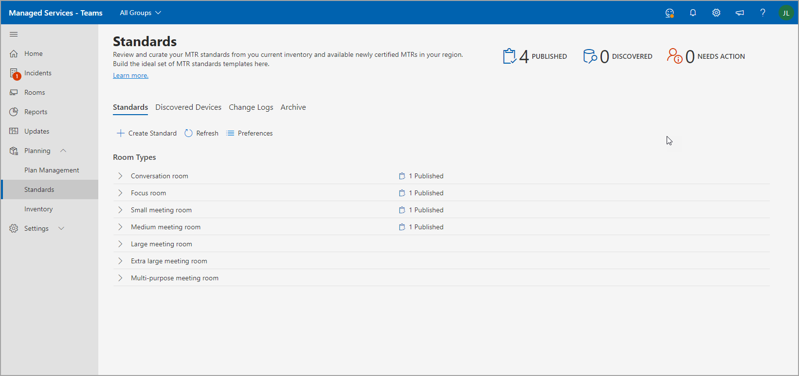
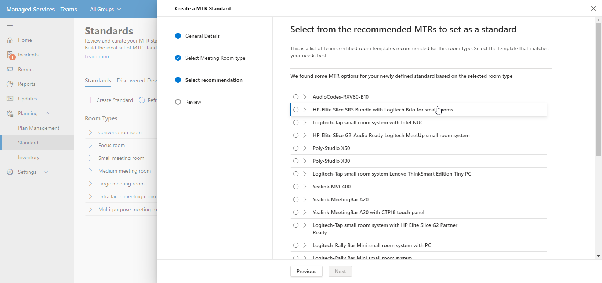
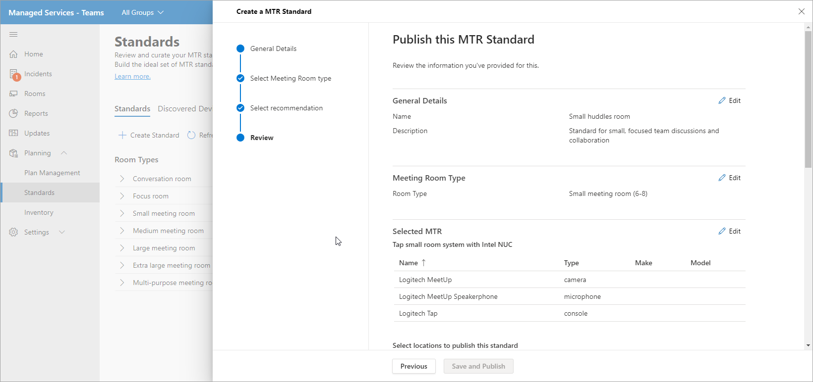
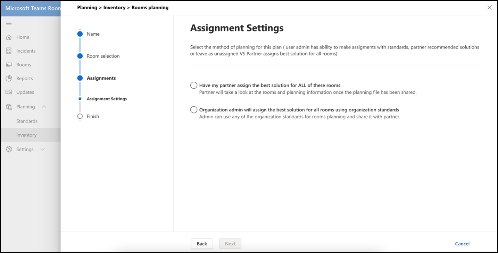
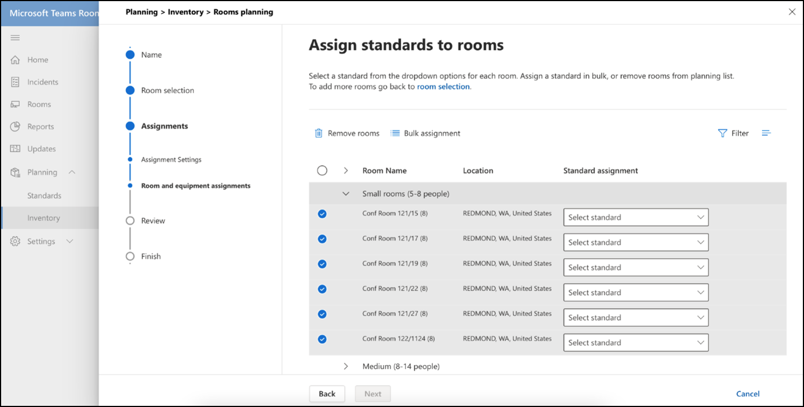
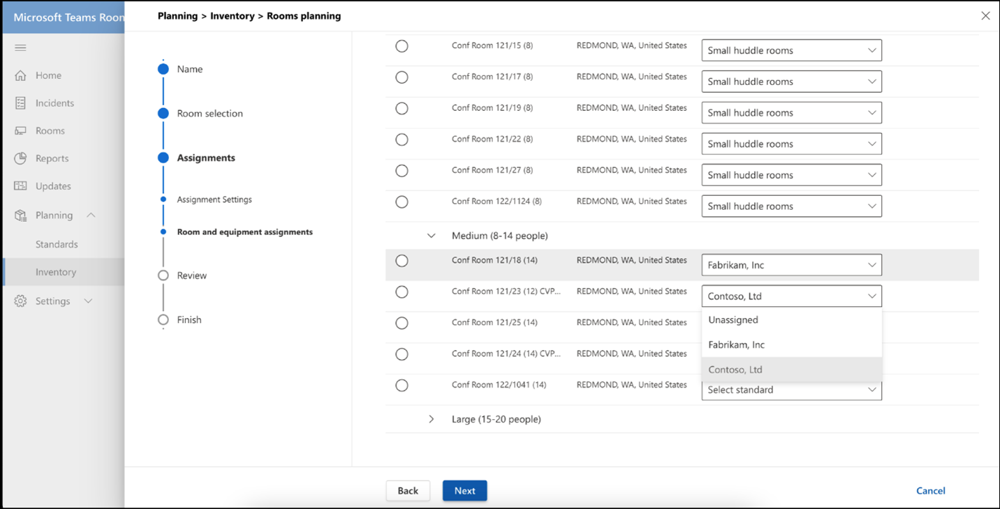
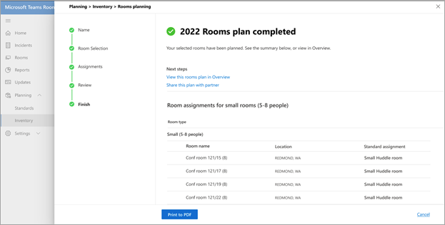
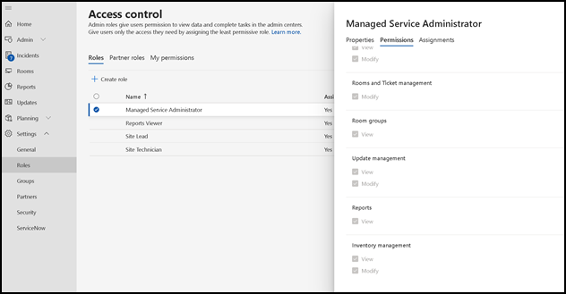

# Standards and Room planner

Using smart recommendations from your environment, you can build and curate standards. You can then publish your standards to a region, site, building, or a specific meeting room to share planned rooms with partners to track room deployments.

## View meeting room types

On this page, you can view room or meeting space types within your organization. A quick break down of how many standards you have for meeting rooms, how many new devices were discovered and number of devices that require an action to be taken.

This page also has a command bar from where you can launch the  **Create a standard** workflow or navigate to Discovered Devices, Change logs, and Archive.

### Create Standards

Use the **Create Standard** workflow to create a standard.

**To launch the workflow**

1. Select **Create a MTR Standard**, then provide general details such as name and description for the standard.

   

1. Select your meeting room type for this standard.

   

1. Select from the recommended Teams certified room templates in your inventory of hardware. The list varies depending on the room type selected in the previous step.

   

1. Review the MTR Standard information.

   

1. Publish your standards to a region, site, building, or a specific meeting room.

   

Once published, the standards are used for planning purposes.

### Discovered Devices

Within Standards, select **Discovered Devices** to view all nonstandard discovered devices within your organization.

You can take action to review and create standards from these discovered devices in your inventory.

## Room planning

Plan rooms with standards for meetings expansion using the **Room planner** wizard.

To launch the room planner with guided experience:

1. From the left-hand navigation, Select Inventory, then choose **Plan Rooms**.

   

1. Add rooms to the planner from your location directory.

   

1. Set your standards assignment preferences as follows:

   - If you have a planning partner on record, you can select **Have my partner assign the best solution for all of these rooms**. This option makes it so the partner selects the best locally found solution for their customer.

   - If you plan meetings expansion in-house, select **Organization admin will assign the best solution for all rooms using organization standards**. The standards are automatically assigned from what has been approved and published by the organization in the Standards view.

1. Select **Organization admin will assign the best solution...**

   

You can bulk assign standards to multiple rooms.

1. Check multiple rooms beneath **Room Name**.

   

   

If you have more than one standard available for a location, region or site, select a standard from the **Standard Assignment** list to assign to a meeting room displayed beneath **Room name**.

Review the standard assignments and finish the plan. You can print the plan to PDF to share with partners.

## Access control

The room planner wizard is by default enabled for the Managed Service Administrator role. For Customer and all other built-in roles, set the permissions for Inventory management under **Permissions** tab.

