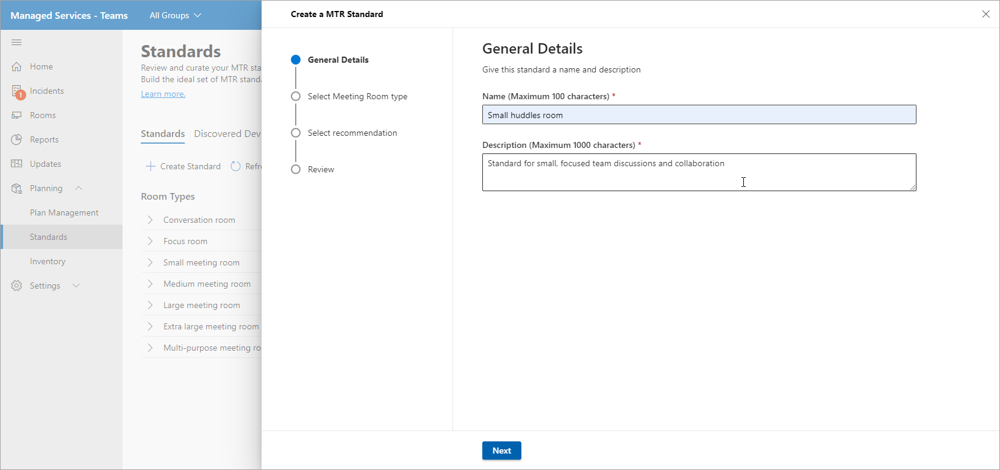
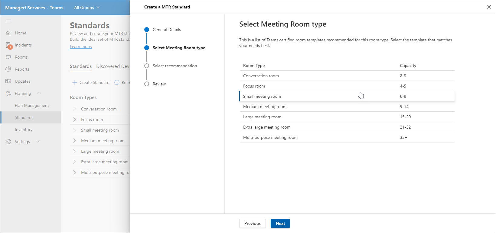
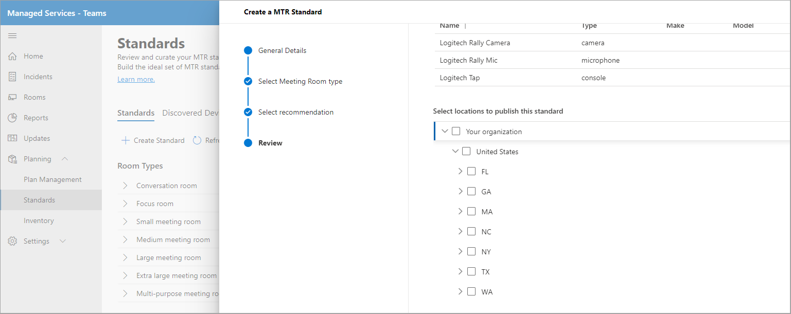

# Standards and Room planner
Using smart recommendations from your environment, you can build and curate standards. You can then publish your standards to a region, site, building, or a specific meeting room to share planned rooms with partners to track room deployments.

### View meeting room types

On this page, you can view room or meeting space types within your organization. A quick break down of how many standards you have for meeting rooms, how many new devices were discovered and number of devices that require an action to be taken.

This page also has a command bar from where you can launch the “create standard” workflow or navigate to Discovered Devices, Change logs & Archive.

### Create Standard
Clicking on ‘Create Standard’ will launch the “Create a standard” workflow. Provide general details such as name and description for the standard.

Select your meeting room type for this standard

![Graphical user interface, text, application description]../media/standards-and-room-planner-003.png)

Select your choice of meeting room device from the recommended Teams certified devices in your inventory of hardware.

Review the MTR Standard information

Publish your standards to a region, site, building or a specific meeting room.

Once finished the standard is created successfully and published to the site, region, building or meeting room. Now these standards are to be used for planning purposes.

### Discovered Devices tab
You can view all nonstandard discovered devices within your organization.

You can take action to review and create standards from these discovered devices in your inventory.

## Room Planner wizard

Plan with standards for meetings expansion.

Select *Plan Rooms* to launch the room planner with guided experience.

Add rooms to the planner from your location directory.

Two options to set your standards assignment preferences.

- If you have a planning partner on record, you can select “Have my partner assign the best solution for all of these rooms”.  - This option makes it so the partner selects the best locally found solution for their customer.

- If you plan meetings expansion in-house, select "‘Organization admin will assign the best solution for all rooms using organization standards”. The standards are automatically assigned from what has been approved and published by the organization in the Standards view.

-click Organization admin will assign the best solution....

You can bulk assign standards to multiple rooms

If you have more than one standard available for a location, region or site, you can use the drop down to select a standard you choose to assign for a meeting room.

Review the standard assignments and finish the plan. You can print the plan to PDF to share with partners. 

## Access control

The room planner wizard is by default enabled for the Managed Service Administrator role. For Customer and all other built-in roles, set the permissions for Inventory management under “Permissions” tab.

