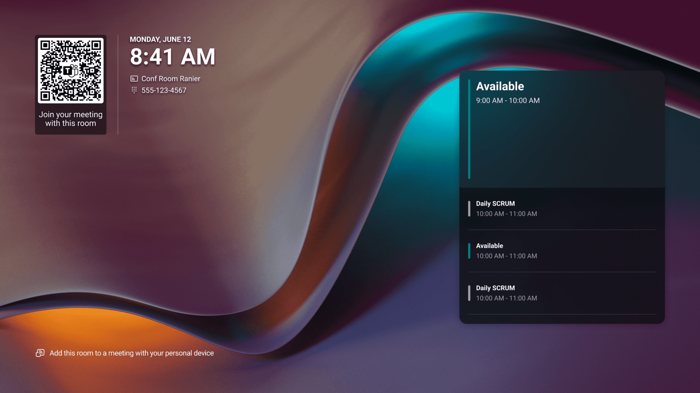
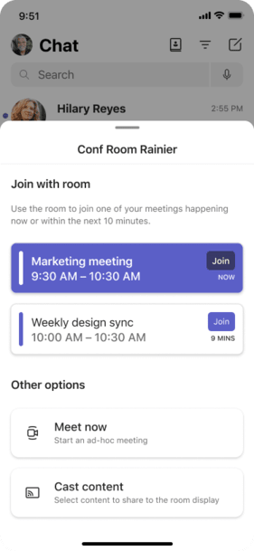

# Overview of QR codes on Teams Rooms (Windows and Android) to join meetings

Both **Teams Rooms on Windows** and **Teams Rooms on Android** support a convenient way for room users to bring their meetings to the room by simply scanning a QR code on the Teams Rooms home screen to join meetings, making it easier for people to use meeting rooms ad-hoc. This serves as an alternative to proximity-based technologies like Bluetooth and streamlines the user experience by reducing the steps for users to join a meeting with the room system. This feature is available in all Teams Rooms licenses. 

A QR code is displayed by default on the Teams Room home screen. To ensure security, the QR code is refreshed every minute. You can hide the room QR code from the home screen by disabling the feature through [settings](#device-configuration-for-teams-rooms).



Once a user scans the QR code with their mobile camera, they can select an action on their mobile device that they would like to perform with the room system. The user can choose from either:

- Joining an ongoing meeting on their mobile calendar or any meeting that begins within 10 minutes, 
- Starting an ad-hoc meeting, or 
- Casting content from their mobile device to the front of room display. 

Cross-tenant meetings are also supported when the Teams external access organization settings and user policies in the Teams admin center allow it. For more information, see [Organization settings and user policies for external access](/microsoftteams/trusted-organizations-external-meetings-chat?tabs=organization-settings&branch=main).

If the user doesn't have the Teams iOS or Android mobile app, they will be directed to download it after scanning the QR code. 



> [!NOTE]
> Only calendar events with an online Teams meeting link (happening now or scheduled to start within 10 minutes) is expected to appear under **Join with room**.

After the user selects an action on their mobile device, by default, the room system automatically accepts the meeting nudge and joins the meeting without additional user action. The user then enters the full meeting experience on Teams Rooms and the room companion mode experience on Teams mobile. You can disable the room auto-accept functionality for any QR code meeting join through [settings](#device-configuration-for-teams-rooms).  

> [!NOTE]
> For security reasons, if the user takes more than two minutes to select an action on mobile after scanning the QR code, the room auto-accept functionality will be disabled regardless of the setting value, and the user must manually accept the call on the room console or touch display.

## Device configuration for Teams Rooms

To change the configuration of the device, you can use XML configuration file for Teams Rooms on Windows, device settings for Teams Rooms on Android, or the Teams admin center for both Teams Rooms platforms:
- You can disable the room QR code. When the feature is disabled, the QR code isn't visible on the Teams Rooms home screen.
- You can disable the room auto-accept functionality for any QR code meeting join scenario. When auto-accept for QR code is disabled, users must manually select **Accept** on the room console or touch board for the room system to join the meeting.

### XML configuration file for Teams Rooms on Windows

Like most Teams Rooms on Windows features, you can update the QR code settings of your device with the Teams Rooms XML configuration file. The XML configuration file lets you remotely deploy configuration changes to one or more Teams Rooms on Windows devices in your organization. For more information, see [Manage a Microsoft Teams Rooms console settings remotely with an XML configuration file](/microsoftteams/rooms/xml-config-file).

To hide the QR code from your Teams Rooms on Windows home screen, you can add the following to your XML configuration profile:

```xml
<RoomQRcodeEnabled>false</RoomQRcodeEnabled>
```

To disable room auto-accept for QR code meeting joins on your Teams Rooms on Windows, you can add the following to your XML configuration profile:

```xml
<QRCodeAutoAcceptProximateMeetingInvitations>false</QRCodeAutoAcceptProximateMeetingInvitations>
```

### Device settings for Teams Rooms on Android

Like most Teams Rooms on Android features, you can update the QR code settings of your device directly on the device settings:

1. To hide the QR code from your Teams Rooms on Android home screen through on device settings, go to **Settings** > **Device settings** > **Teams Admin Settings** > **General** > turn off **Show room** **QR code.**

1. To disable room auto-accept for QR code meeting joins on your Teams Rooms on Android through on device settings, go to **Settings** > **Device settings** > **Teams Admin Settings** > **General** > **Show room** **QR code** > turn off **Automatically accept proximity-based meeting invitations.**

### Teams admin center controls for Teams Rooms 

You can also remotely change the configuration of your Teams Rooms devices through the Teams admin center: 
- For Teams Rooms on Windows, go to **Teams devices** > **Teams Rooms on Windows** > select device(s) > **Edit settings** > **Device** > **Show room QR code** > **Automatically accept proximity based meeting invitations**.
- For Teams Rooms on Android, go to **Teams devices** > **Teams Rooms on Android** > select **Configuration profiles** > **Add** or **Edit** > **Device settings** > **Show room QR code** > **Automatically accept proximity based meeting invitations**.

## Requirements for Teams Rooms and Teams mobile

To enable your users to join meetings using QR codes:

1. Your Teams Rooms devices must be running on the following app version:

   1. Teams Rooms on Windows - version 5.0.111.0 or later
      
   1. Teams Rooms on Android - version 1449/1.0.96.2024042506 or later  
      
1. Your users' mobile devices must have the following app version installed:

   1. iOS - version 6.7.0 or later 
      
   1. Android - version 1416/1.0.0.2024071301 or later
      
> [!IMPORTANT]
> Although there are many QR code scanner apps available, we recommend using the built-in camera app or code scanner app that are natively available on all iOS and Android devices. 
> If your users are using an Android device with both work and personal profiles enabled, both the Teams app and the camera app and/or the code scanner app must be listed under the same profile. Otherwise, if they are in separate profiles, the camera app and/or the code scanner app isn't able to correctly scan and transfer the information over to the Teams app. 
> For more information about adding the Teams app and camera app and/or code scanner app to a work profile, see [Manage Android Enterprise system apps in Microsoft Intune](/mem/intune/apps/apps-ae-system).

> [!WARNING]
> If your Teams Rooms on Windows devices have existing custom backgrounds, your custom backgrounds may be impacted with this new element on the home screen. You can find the latest home screen templates and updated custom background design guidelines at [Set up and manage Teams Rooms on Windows custom backgrounds.](/microsoftteams/rooms/custom-backgrounds?tabs=Enhanced) 
