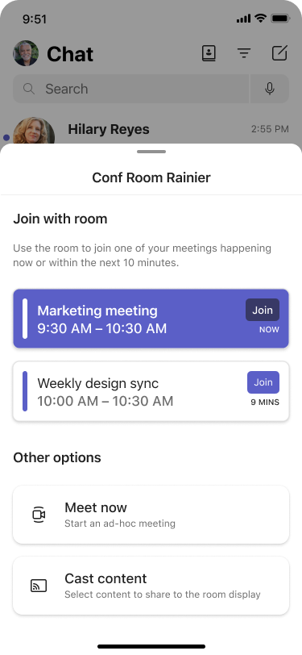

# Overview of QR codes on Microsoft Teams Rooms 

Teams Rooms on Windows and Teams Rooms on Android support a convenient way to join meetings from a Teams Rooms by simply scanning a QR code on the home screen, making it easier for people to use meeting rooms ad-hoc. This serves as an alternative to proximity-based technologies like Bluetooth and streamlines the user experience by reducing the steps for users to join a meeting with the room system. This feature is available in Teams Rooms on Windows version 5.0 and Teams Rooms on Android version 2.2. 

A QR code is displayed by default on the Teams Room home screen. To ensure security, the QR code is refreshed every minute. You can enable or disable this feature through settings. When this feature is disabled, the QR code will not be shown on the home screen..png)

Once a user scans the QR code with their mobile camera, they can select an action on their mobile device that they would like to perform with the room system. The user can choose from either joining any ongoing meeting on their mobile calendar or any meeting that begins within 10 minutes, starting an ad-hoc meeting, or casting content from their mobile device to the front of room display. Cross-tenant meetings are also supported when the External access organization settings and user policies in the Teams admin center allow it. If the user does not have the Teams mobile app, they will be directed to download it after scanning the QR code. 

> [!NOTE]
> Only calendar events with an online Teams meeting (happening now or scheduled to start within 10 minutes) will appear under **Join with room**. 


After the user selects an action on their mobile device, by default, the room system automatically accepts the meeting nudge and joins the meeting without additional user action. The user then enters the full meeting experience on Teams Rooms and the room companion mode experience on Teams mobile. You can disable the room auto-accept functionality for any QR code meeting join through settings. [You can put anything here it's display text only](#updating-teams-room-device-configuration).

> [!NOTE]
> For security reasons, if the user takes more than two minutes to select an action on mobile after scanning the QR code, the room auto-accept functionality will be disabled regardless of the setting value, and the user must manually accept the call on the room console or touch display. 
## Updating Teams Rooms device configuration

To change the configuration of the device, 

IT admins can control the QR code feature using XML settings for Teams Rooms on Windows, device settings for Teams Rooms on Android, and the Teams admin center for both Teams Rooms platforms. 

This feature is enabled by default. You can disable the feature. When the feature is disabled, the QR code will not be visible on the home screen. To disable the QR code feature in an XML setting, add the following to your XML configuration profile:


```
<
```

IT admins can also disable the room auto-accept functionality for any QR code join in general using an XML setting or the Teams admin center. When auto-accept is disabled, users will have to manually tap "Accept" on the room system's touch console or touch board for the room to enter the meeting. To disable room auto-accept in an XML setting, add the following to your XML configuration profile:


```
<

```

## Requirements

1. Your Teams Rooms devices must be running on the following app versions:

   1. Teams Rooms on Windows - 5.0 app or later
   
   1. Teams Rooms on Android - 2.2 app or later  
   
1. Your users must have the following app versions installed:

   1. iOS - 6.7.0 or later 
   
   1. Android - 1416/1.0.0.20241XXXX or later
   
> [!IMPORTANT]
> If users are using an Android mobile device and have Android work profiles enabled, both the Teams app and the camera must be listed under the same profile. When they are in separate profiles, the camera app isn't able to correctly scan and transfer the information over to the Teams app.
If you don't have the ability to remove profiles or add the camera app or Teams app to the same profile, you will need to contact your organization's admin. You can see how to **[Add the Teams app and camera app to a work profile](/editor/MicrosoftDocs/OfficeDocs-SkypeForBusiness-pr/Teams%2Fdevices%2Freserving-rooms-with-a-qr-code.md/main/5c19d6b0-bd86-c908-4bbb-5c6bd187bff0/?branch=main)**.

Although there are many QR code scanner apps available, we recommend using the built-in camera apps that are available on all iOS and Android devices. However, if users are using an Android device, it may not work if the device has both work and personal profiles enabled. If this is the case, and the Teams app is in the work profile, you need to add the camera app to the work profile as well.

To add the camera app to the work profile:
1. In the **Intune Admin Center**, go to **Apps** > **Android** and select **Add**.
1. Select **Android enterprise system app**.
1. Put in the type of Android device and then paste the OS camera package name.
1. Assign that package to the users or groups.
## 

