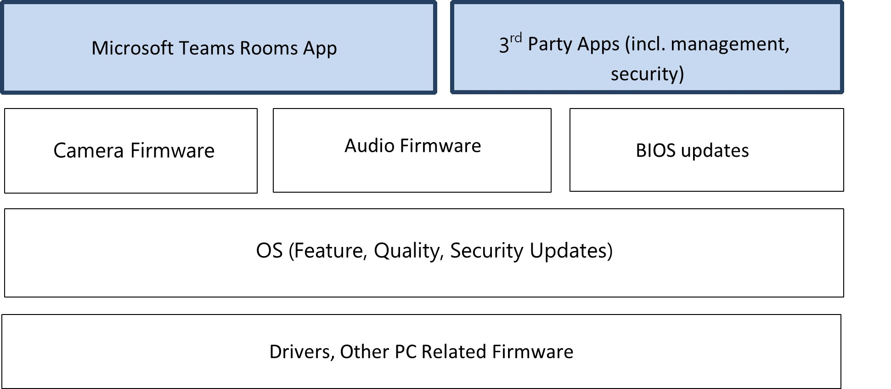

# Managing Room software stack  
In every room, different parts of the software stack all work together to deliver the experience. At a high level, they can be summarized as follows: 

To ensure a positive meeting experience every day in every room, it is important to **standardize every piece of software** running on each of the rooms and roll out fixes in the rooms depending on the configuration. It is also common to see customers set up their own validation process to gain confidence over any pending fixes by verifying that it really fixes an issue they might be experiencing or preview features to make the organization ready for the change.  

Managed Services for Microsoft Teams Rooms handles all the above so that you do not have to worry about getting an update or troubleshooting issues with an update. In this section, we will describe how managed software updates work.  

## Managing to a good state 
Our main goal is to keep rooms running and available for your organization. Managed Services experts are constantly working on your behalf to curate, validate and deploy updates to your production rooms. In certain cases, it may mean that we prioritize room health over new features and releases to be validated before they are rolled out.

Most importantly, it means that you do not have to worry about investing time to learn the details of these updates and validate them yourself. If there are issues with any specific update and any specific room, we will work with you to troubleshoot and resolve them.  

The process of rolling out updates, therefore, can be broken down into the following:

- Managed Services team will proactively identify updates, validate them, and then promote them for release to your environment.
- Updates delivered to your rooms will be ordered to avoid conflicts and interactions then scheduled to avoid regular operating hours.
- The ring system provides you the ability to stay aware of updates being applied to your rooms without you doing any of the legwork.
- Managed Services will monitor updates and automatically alert its room operations center to follow up on issues and work with you to resolve them.
