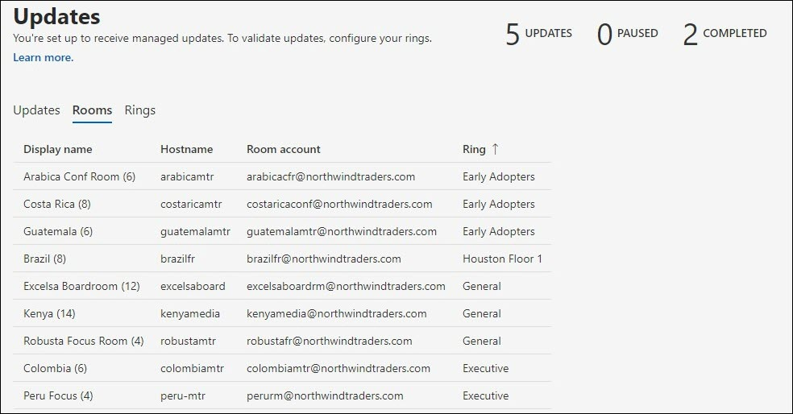

# Update management 
A modern meeting room is equipped with a Microsoft Teams Rooms device and other peripherals such as a camera, microphone, or speaker, and potentially more devices to create an inclusive and effective meeting experience. Equipment from different kinds of OEMs provides the exact organizational experience desired; however, they must be maintained with software and firmware on an ongoing basis.  

Managed Services for Microsoft Teams Rooms provides the assurance that each room in your organization will be maintained at recommended levels to deliver a room that is always ready and works properly. Microsoft's goal is to reduce complexity and legwork for your operational staff with intelligence and automation. Troubleshooting or diagnostics is performed as quickly as possible. 

## Transitioning a device to managed services 
Room devices onboarding to Managed Services usually have a change management history and practice that is different from our guidance.  

- To  benefit from Managed Services, you must transition change management for all updates under Managed Services portfolio.
- Multiple sources of change management  impact incident SLAs as there is a discovery and remediation that will restart anew if an incident happens in the room.
- Microsoft has implemented controls and checks to implement policies that may differ from one organization to another, and the ability to intervene in exceptional situations.
- Eventually, the room devices will be updated to common standards, except for exceptions due to issues with a specific hardware installation.  

## Transitioning devices: Basic readiness checks 
Most unexpected failures arise from changes in the base image with uncertain history of change management. 

Following simple readiness checks is recommended:  

- **Base Image**: The base image must be from the specific OEM. If the device has been rebuilt in the past and shows unexpected failures or behaviors on common tasks, the base image must be restored. We can provide assistance but cannot remotely rebuild the room device, so you will need a local site technician.  
- **Base OS, Edition:** The base OS and edition must match the requirements of Microsoft Teams Rooms devices. If this is not so, it must be corrected as part of onboarding. Microsoft Teams Rooms requires the Windows 10 IoT Enterprise or Windows 10 Enterprise SKUs under Semi-Annual Channel servicing options. Consult the official [MTR guidance](rooms-lifecycle-support.md#windows-10-release-support) for more information.

## Readiness checks

There are a few pre-requisites for receiving managed services updates: 

|Software |Guidance |
|:- |:- |
|Logitech Sync Services  |Should be installed and running on the Logitech meeting room devices. Required Sync services will be installed automatically from Windows Updates unless blocked. The full Sync package can also be installed. |
|Windows OS updates |Should be kept enabled and not redirected to WSUS, nor blocked from a networking perspective. Neither GPO nor MDM policies should be used to manage OS updates. |
|Microsoft Store updates   |Should be turned off. Managed Services will turn off Store updates if found on. |
|Anti-Virus Software |If you are running AV software on these devices, you should ensure that AV has exclusions in place for Teams and Skype dlls. See here for more details. |
|Additional Software |Additional software such as third-party remote desktop viewing, etc. should be reviewed with Managed Services to rule out side-effects. |
|Additional Change Management|Can interfere with covered updates, and` should not be introduced. |

## Managed updates – How it works 
There are two primary ways how updates are managed:  

- **Automatically managed**: Updates are installed in your room device based on Managed Services assessment. No intervention is required for the updates managed in our portfolio.
- **Ring validated**: Set up a ring system to preview updates on specific devices so that you can monitor them without the associated leg work. Ring setup provides an additional layer of due diligence before broad rollouts.  

### Automatically managed

If you choose to be automatically managed, then no action is needed for the updates on your part. However, you should review the current portfolio of updates supported by Managed Services. The portfolio is constantly getting new additions, and it is our priority to cover the most frequent and impactful updates to ensure your room stability. Check the current list (under the “Update Management” section of this doc) to plan any additional change management needed for your organization.  

**Recommendation:** Do not install updates that are covered by Managed Services on any managed device on your own. If you encounter any issues, please report an incident in the portal.

### Ring validation

When choosing ring validation, review the following sections on how rings work in Managed Services and the options available to customize it for your organization. Even with ring validation, Managed Services attempts to ensure that rooms are not past due on recommended updates. Depending on the situation, a room might receive “catch up” updates to ensure it complies with managed service recommendations.  

 Check for announcements on the portal home page and within the Managed Services documentation as new types of software and firmware become available in the portfolio. Because Managed Services experts are reviewing update versions daily across our portfolio of devices, they address specific issues and target updates based on need.  

### Scheduling 
Managed updates are scheduled for rooms based on the equipment in the room and if they are not meeting Managed Services standards for applicable software and firmware. 

- To help our customers meet change management requirements, update deployment start on **Wednesdays** in the staging ring. If a critical update is required, we will bypass this schedule and release the update as soon as it’s available. 

- Updates are sequenced based on the need in a particular room. 
- If you have setup rings to validate the updates, the update will progress through the ring order. 
- A new update can supersede an update that is queued up if we determine that room stability is improved based on your situation.  
- Updates are typically applied during our nightly maintenance window – which is room local time **12:00am – 5:00am** to avoid any kind of interruptions. 

## Microsoft Teams Rooms app update lifecycle policy 
The MTR engineering team’s support policy states that all support ends after the twelve (12) month lifecycle for a version has expired or if more than two updates have been released since then. Then, customers must update to a supported version. Please reference [Microsoft Teams Rooms app version support - Microsoft Teams | Microsoft Docs](rooms-lifecycle-support.md) for detailed service description.

To maintain a uniform standard across all our managed rooms and to allow us to efficiently identify trending issues, we will support and deploy the two latest Major or Minor Releases (N, N-1) of the MTR App software as per the Support and Subscription Services Terms and Conditions. We will automatically bring non-compliant rooms up to date, bypassing update rings as necessary. 

The N-1 policy also applies to third-party software.  

## Update Management experience walk-through  
To view updates, log in to the managed services portal and navigate to the Updates page.

The Updates pane displays a high-level overview of update management for your rooms with the following tabs:

- **Updates**: Software or firmware updates that Managed Services is orchestrating through your organization.  
- **Rooms**: The Rooms tab provides a view of rooms and rings to which each room belongs.
- **Rings**: The Rings tab shows the rings of rooms for your organization.

### Updates  

This view shows the relevant updates for your tenant and their respective status. To view past updates that are no longer active, select the **Include past updates** toggle to ON.  

Any update can be in one of the following states:

| Status | Description |
|:- |:- |
| Scheduled | An update is scheduled for the rooms in a given ring. Please keep in mind that an update will only show Scheduled after the progression hits the ring the room is in. For example, if a new update is in the Staging ring, it would only show Scheduled for rooms in the Staging ring.  
 Other rings will have a “Not required” status until the update progresses to that ring.
 |
| In progress | An update is in progress, and individual rings show status. This state shows the overall ring status, and therefore if an update applies to a single room in the Staging ring in your tenant, the update will have an “In Progress” state until the Executive ring is reached. |
| Completed with failures | An update has completed progression through all your configured rings and failed in at least one room. |
| Completed | An update has completed progression through all your configured rings and successfully installed on all applicable rooms.|
| Deprecated | An update has been deactivated. Further deployment is halted. This is typical because the update has been superseded by a new version. |
| Paused | An update is in a paused state. |
| Not Required | The update is either not yet evaluated for the room or does not apply to the room. |

### Rooms  

The Rooms tab shows all the rooms in your tenant and to which ring they belong.  

To configure which ring a room should belong to:  

1. Click on the room to bring up the detailed view.  
1. Under **Ring**, click **Change**.  
1. Select the Ring to which the room should belong.  
1. Click **Assign**.  

The detailed room view displays the relevant updates and their status under the **Updates** node.  

### Rings  

Rings are used to reduce the risk of issues derived from the deployment of the feature updates. This is done by gradually deploying the update to the entire site. Each ring should have a list of Microsoft Teams Room rooms and a corresponding rollout schedule. Defining rings is generally a one-time event (or at least infrequent), but IT should revisit these groups from time to time to ensure that the sequencing is still correct.  

The **Rings** tab lists  all the rings in your tenant. There are three preconfigured rings:  

- **Staging**: Assign rooms to the Staging ring, which is your testbed. All new updates will roll out here first. Generally, you will want to ensure that your staging ring represents rooms with the diversity of device types in your environment. If there are certain types of rooms with an uncommon configuration or a history of seeing issues, please consider representing them in Staging.

- **General**: By default, all rooms are placed in this ring. Most of the room devices being used across the enterprise fall into this category. 

- **Executive**: This group should include your most high-profile rooms where you want to minimize disruption proactively. A good example is a large conference room used for executive meetings or large team meetings. 

### Specifying rollout timeline

Updates cannot exceed 60 days to complete across all rings.  

|Parameter |Explanation |
|:- |:- |
|Deferment Period|Once an update starts with the first ring, the deferment period is the delay in days before the update is initiated on this ring.|
|Rollout duration|
Once the update commences on this ring, this is the time to deploy in this ring. For example, if the duration is 5 days, it will deploy over 5 days to the rooms in this ring once the update starts on this ring.|
|Test Period|The number of days to test/validate the update in a ring once applied to the ring. The test period starts after the rollout is completed, and once complete, the update moves to the next ring.|
|Completion Time|The “Completion time” column indicates the total number of days (rollout duration + test period) for this ring to complete.|
|Total Time|At the bottom is the “Total” row that indicates how long an update will take to complete from the first to the last ring.|

### Creating Custom Rings

1. Navigate to the **Rings** tab.  
1. Click **Add ring**.  
1. Specify the order in which this ring will receive the update, where 1 is first, and 9 is last.  
1. Give this ring a name.  
1. Provide a description if desired.  
1. Specify the number of days the update will roll out in this ring.  
1. Specify the test period.  
1. Click **Submit**.  

> [!NOTE]
> The “Days set by other rings” is the total number of days an update will take to complete across all rings. The “Remaining days” indicates the maximum days for *this* ring to complete. The sum of “Rollout duration in days” and “Test period in days” cannot exceed this amount.  

**Edit a ring**

1. Navigate to the **Rings** tab.
1. Click on the ring to delete.  
1. Click **Edit ring**.  
1. Edit the number of days of rollout and testing, as necessary.

**Delete a ring**

1. Navigate to the **Rings** tab.  
1. Click on the ring to delete.  
1. Click **Delete ring**.  

> [!NOTE]
> The default rings cannot be deleted.  

**Move rooms**

Moving rooms from one ring to another is possible in two ways:

1. Navigate to the **Rings** tab.  
1. Click on the ring that you want to move rooms from  
1. Click **Move rooms**.  
1. Select the rooms that you want to move in the **List of Rooms**.  
1. Choose the Target ring, which the selected rooms will move to in the dropdown.  
1. Click **Move rooms**.  

**Or**

1. Open the room details for the room you wish to move (either through Incidents, Rooms, or Updates -> Rooms).
1. Click the **Updates** tab.  
1. Under **Assigned Ring**, click **Change**.
1. From the dropdown, select the new ring.  
1. Click **Assign**.

## Managed updates: Visibility and control

Managed services orchestrate updates throughout your organization. However, you have the visibility and control to intervene if needed. Here are the ways: 

- In the event of an update failure, a ticket is automatically generated with the Microsoft Managed Service Operations team. The Operations team will take steps to remediate the failure and engage you if necessary.  
- If you see an update causing issues, you can pause the update with the **Pause** button. Hitting the Pause button will create a ticket for the operations center to investigate. Please be sure to provide details while pausing an update to help expedite incident response.  
- If you see an update has failed in a room and you have corrected a plausible reason such as network disconnect, you can retry the update with **Retry all failed** button.  
- There may be urgent situations when you may decide to make an update available earlier. In this case, you can use the **Force updates** button. When using the Force Update option, you have the choice to force the update immediately or when next the room is available.  

> [!NOTE]
> **We do not recommend “Force Updates”** as a general update management strategy. If you push an update that is still in our validation pass, you might encounter issues we already know about. In such cases, incident resolution for such rooms will be on a best-effort basis.  

- Further, to ensure good change management practices, we will log every force update internally in the service. In the future, we expect to make that visible to you as well.
