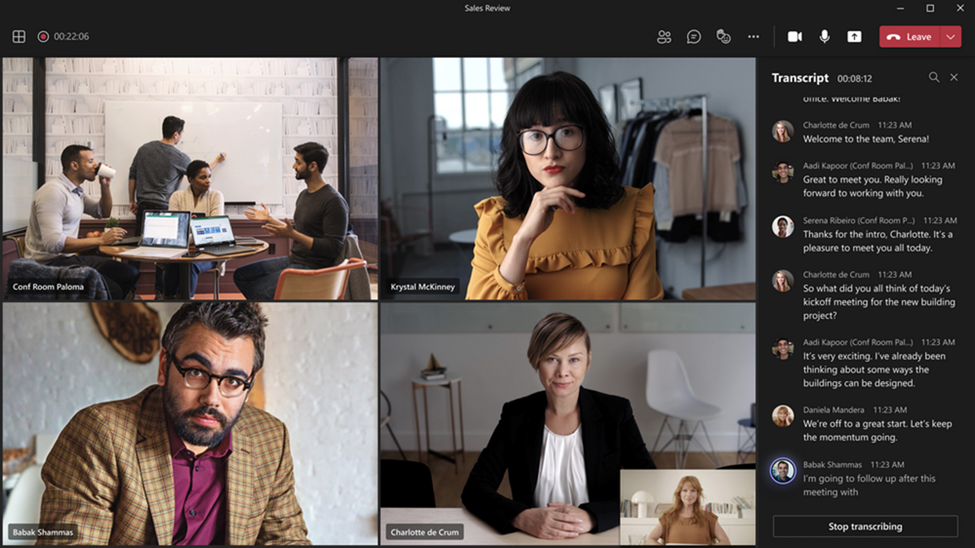

## Manage voice recognition technology controls for an Intelligent Speaker

This article provides guidance on how tenant admins can enable Teams Rooms for voice recognition and live transcription. As a tenant admin, you have the ability to adjust the extent to which your organization utilizes voice recognition and Intelligent Speakers capabilities.

 

## Optimizing Transcription Precision with Intelligent Speakers

By activating Intelligent Speaker for your Microsoft Teams Rooms, the meeting transcript will be able to not only distinguish between different speakers in the room, but also identify them and attribute them to the correct person. This enables critical use cases for Copilot as well as intelligent recap.

Speaker recognition is currently enabled by intelligent speakers certified for Teams. Certified intelligent speakers are designed with multiple microphones to provide high-quality audio, maximizing accuracy in recognition and transcription and boasting an industry-leading reduction of what is referred to as “word error rate.”

That said, we get it – intelligent speaker [certified Hardware](https://techcommunity.microsoft.com/t5/microsoft-teams-blog/microsoft-teams-rooms-and-devices-microsoft-ignite-2023/ba-p/3975581) are not yet in every Teams Room. That is why we extend to existing hardware. While we're delighted to extend the capability of speaker recognition to more rooms, it's important to note that the quality may not match that of an intelligent speaker certified device. So, it's essential to evaluate the advantages of incorporating an intelligent speaker, particularly in crucial spaces where attaining the highest quality transcription and attribution is vital.

 

## Maintain your identity in meetings optimized for Copilot and meeting recap

The most essential input for Copilot in Teams is the identity of each speaker. Copilot needs a meeting transcript, with attribution for every speaker, to deliver meeting summaries, insights, and action items. In a hybrid meeting, without speaker recognition, the video and audio feed for people in the room would be attributed to the space (e.g., Conference Room 1), not the individuals speaking, making it difficult to query individuals’ contributions, summarize everyone’s perspectives, and tackle those to-do items.

Teams Rooms devices use advanced technology called speaker recognition to analyze the distinct vocal characteristics of each speaker, such as pitch, tone, and speaking style, to create a voiceprint for each participant, akin to a fingerprint for their voice.

With speaker recognition, [Teams Rooms](https://www.microsoft.com/en-us/microsoft-teams/microsoft-teams-rooms"https://www.microsoft.com/en-us/microsoft-teams/microsoft-teams-rooms") can identify speakers during live transcription in shared meeting rooms, ensuring clear and precise voice capture for every participant. This allows you to effortlessly track who said what during the meeting through intelligent meeting recap and Copilot.

To enable speaker recognition for your employees, you can set up a voice profile in minutes using the Teams Desktop app. Each person gets a unique voice signature, stored securely in your organization's tenant in Microsoft Cloud to assure that every contribution is accurately captured in every meeting, enabling Copilot and intelligent meeting recap – and helping you drive your work forward.



## Requirements and recommendations:

- Teams Rooms on Windows

- To ensure best precision for the transcript, we suggest limiting the number of in person attendees to a maximum of 10 people.

- People to be identified in the room, need to be enrolled with their voice profile and have been invited to the scheduled meeting.

- The current limitation for people invited with voice profile is currently 20

- To support high-quality audio and video during meetings, we recommend that the meeting room has an upload speed of at least 7 Mbps.

> [!NOTE]
> We are extending intelligent speaker to work with all certified microphones, and you can try this out as part of our Public Preview program for Teams Rooms with version 5.0.111.0 or later.
# 

> [!NOTE]
> Intelligent Speaker is available in all countries and regions. See [Supported locales](#supported-locales) for a list of the locales currently supported for biometric enrollment and in-meeting transcription.
> ## Enable an Intelligent Speaker user recognition

Voice profile data can be used in any meeting with an Intelligent Speaker. See [Teams meetings policies](/microsoftteams/rooms/voice-and-face-recognition) and the [PowerShell meeting cmdlets](/microsoftteams/teams-powershell-overview) for information on the meeting settings.


```powershell

Set-CsTeamsMeetingPolicy -Identity PolicyName -roomAttributeUserOverride Attribute -AllowTranscription $true
```

> [!NOTE]
> If your voice profile isn't available under the *Recognition* tab in Settings and you aren't being attributed in transcriptions, re-enroll your Voice Profile.

The following are the required policies to set an Intelligent Speaker and user recognition.

|Policy|Description|Values and Behavior|
|-|-|-|
|enrollUserOverride|Use to set voice profile capture, or enrollment, in Teams settings for a tenant. |**Disabled**<br><ul><li> Users who have never enrolled can't view, enroll, or re-enroll.<li>The entry point to the enrollment flow will be hidden.<li>If users select a link to the enrollment page, they'll see a message that states this feature isn't enabled for their organization.  <li>Users who have enrolled can view and remove their voice profile in the Teams settings. Once they remove their voice profile, they won't be able to view, access, or complete the enrollment flow.</li></ul><br>**Enabled**<br><ul><li> Users can view, access, and complete the enrollment flow.<li>The entry point will show on Teams settings page under the **Recognition** tab.</li></ul>|
|roomAttributeUserOverride|Control the voice-based user identification in meeting rooms. This setting is required for Teams Rooms accounts.| **Off**<br><ul><li>The Teams Rooms device won't send audio stream-saving bandwidth from the room. <li>Meeting room users won't be attributed or distinguished, and their voice signatures won't be retrieved or used at all.<li>Meeting room users are unknown.</li></ul> <br>**Attribute**<br><ul><li>Rooms users will be attributed based on their enrollment status.<li>Users who are enrolled are shown with their name in the transcription.  <li>Users who aren't enrolled show as Speaker \<n>.<li>The Teams Rooms device will send seven audio streams from the room.</ul> <br>**Distinguish**<br> <ul><li>Rooms users will be distinguished and separated as speaker 1, speaker 2, ....speaker \<n> in the transcription.</li><li>Irrespective of enrollment status of the user, their name will not show in the transcription.</li><li>The Teams Rooms device will send seven audio streams from the room.</li></ul>
|AllowTranscription|Required for user and Teams rooms accounts.|**True** and **False**|
||||

In the Teams admin center, set the **Transcription** policy. Settings are **Off** by default.

> [!NOTE]
> After a policy is assigned, they can take up to 48 hours to take effect. To get the policy to take effect sooner, accounts must be signed out and signed back in.## Supported locales

The following enrollment and in-meeting transcription locales are supported in all countries and regions.

### In-meeting transcription locales

Once an end-user enrolls, their voice can be recognized during meetings and identified in the transcription when the meeting is set to one of the following locales:

| Language | Country/Region | Culture ID |
|:-----|:-----|:-----|
|Chinese (Simplified)  |China  |zh-CN  |
|English  |Australia |en-AU  |
|English  |Canada  |en-CA |
|English  |India  |en-IN  |
|English  |New Zealand  |en-NZ  |
|English  |United Kingdom  |en-GB  |
|English  |United States  |en-US  |
|French  |Canada  |fr-CA  |
|French  |France  |fr-FR  |
|German  |Germany  |de-DE  |
|Italian  |Italy  | it-IT |
|Japanese  |Japan  |ja-JP  |
|Korean  |Korea  |ko-KR  |
|Portuguese  |Brazil  |pt-BR  |
|Spanish  |Mexico  |es-MX  |
|Spanish  |Spain  |es-ES  |

## Frequently asked questions (FAQ)

Please review the [face and voice enrollment](/microsoftteams/rooms/voice-and-face-recognition) document if you have more questions regarding voice profile data usage and storage

## Related topics

[Support article: Use Intelligent Speakers to Identify in-room participants](https://support.microsoft.com/office/use-teams-intelligent-speakers-to-identify-in-room-participants-in-meeting-transcription-a075d6c0-30b3-44b9-b218-556a87fadc00)
