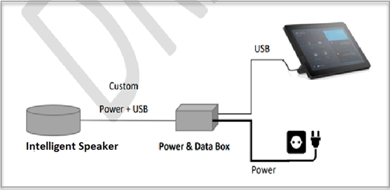

# Manage voice recognition controls for Intelligent Speakers

Intelligent Speakers use biometric information to recognize who said what in live transcription. When a Microsoft Teams Rooms for Windows meeting room is equipped with Intelligent Speakers, live transcription can be used during the meeting. This article explains, as a tenant admin, how you can control how the biometric data can be used for voice recognition to generate live transcription. You can control to what degree the organization is using voice recognition and the following features:

- Edit the speakers in transcripts.
- Change the speaker of a single utterance in the transcript or change the speaker in all the utterances in the transcript (but not on future transcripts).
- Change the speaker label for the people who are listed in the meeting.
- Remove the identification of a single utterance or all utterances identified as that speaker on every transcript.

## Use Intelligent Speakers in Teams Rooms

Intelligent Speakers are intelligent peripherals for Microsoft Teams Rooms. They'll bring speaker attributed transcription for participants in the meeting room. Intelligent Speakers include a special seven-microphone array and Microsoft Office graph. The speakers use biometric information to identify voices of up to 10 people in meeting rooms. The speakers help you see who said what during and after the meeting.

### Intelligent Speakers requirements

The following items are Intelligent Speaker requirements:

- The customer tenant must be located in the U.S.(North America).
- Rooms have regular meetings with multiple (2-10) people present in person.
- Rooms has an upload link of minimum 7 Mbps.

## Set up the Intelligent Speaker

Yealink Rockfall connects directly using USB to the Teams Rooms console. For best results, we recommend that you use Yealink Rock fall with the Yealink console.

Rockfall should be placed at least 8 inches (20 cm) away from walls and large objects, such as laptops. If the Rockfall USB cable isn't long enough for your setup, use cable extenders.

1. Sign in to the console as administrator.
2. Set the Teams device settings to match the Rockfall microphone and speaker.
3. Ensure you have the correct Microphone and Speaker settings.

The diagram shows how the Intelligent Speaker is connected to the device.

   

> [!Note]
> EPOS and Yealink devices should have "EPOS" or "Yealink" prefix and contain "UAC2_RENDER" in the speaker name and "UAC2_TEAMS" in the microphone name. If you don't find these microphone and speaker names in the dropdown menu, restart the Rockfall device. For best results, Rockfall should be placed at least 8 inches away from walls and large objects, such as laptops.

### Enable intelligent speaker and user attribution

Use the following required policies to set speaker and user attribution.

- `enrollUserOverride`: To control user biometric (voice) enrollment using the Teams desktop client (Windows). This isn't required to be set for mobile accounts. Allowed values are `Enabled` and `Disabled`.
- `roomAttributeUserOverride`: To control the voice-based user identification in meeting rooms. Required for MTR accounts. Allowed values are `Off`, `attribute`, which means room participants will be distinguished and identified based on enrolled voices (if enrolled).
- `enabletranscription`: Required for user and Teams rooms accounts. Allowed values are `true` and `false`.

## Biometric policies

There are two major policies used with biometric data:

- Capture, which controls the capture of the biometric data through the enrollment flow.
- Usage, which controls how the biometric data will be used in meeting rooms.

Biometric data can be used in any meeting with Intelligent Speakers. See [Teams meetings policies](../meeting-policies-in-teams.md) and the [PowerShell meeting cmdlets](https://docs.microsoft.com/powershell/module/skype/set-csteamsmeetingpolicy?view=skype-ps) for information on the meeting settings.

### Use biometric data settings

Turn on or off biometric capture, or enrollment, in Teams settings through the admin policy `EnrollUserOverride`. An admin can enable or disable the enrollment feature for a tenant. One policy will cover voice enrollment. This policy works independently from the usage policy to give admins flexibility to roll out this feature. The flexibility includes:

- Turn on biometric capture.
- Enroll users.
- Turn on usage.

When the settings are enabled:

- Users can view, access, and complete the enrollment flow.
- The entry point will show on Teams settings page under the **Recognition** tab.  

Settings are disabled by default. When the settings are disabled:

- Users who have never enrolled can't view, enroll, or re-enroll.
- The entry point to enrollment flow will be hidden.
- If users select a link to enrollment page, they'll see a message that this feature isn't enabled for their organization.  
- Users who have already enrolled will be able to view and remove their biometric data in the Teams settings. Once they remove their biometric data, they won't be able to view, access, or complete the enrollment flow.  

### Set biometric usage

Turn on or off biometric usage for attribution and diarization. Speaker diarization is the process of partitioning an input audio stream into homogeneous segments according to the speaker identity. Use `RoomAttributeUserOverride` in Rooms to set biometric usage. An admin can control if users in a conference room will be attributed, diarized (distinguished), or neither. This policy controls use of both voice and face for transcription attribution purposes. This setting is **off** by default, so it won't use a user's attribute or distinguish features.

- Rooms won't send audio stream-saving bandwidths from the room.  
- Rooms users won't be attributed or diarized, and their voice signatures won't be retrieved or used at all.
- Rooms users are unknown.  

The attribute feature captures the following details:

- Rooms users will be attributed based on their enrollment status.
- Users who are enrolled, are shown with their name in the transcription.  
- Users who aren't enrolled show as Speaker n.
- Rooms will send seven audio streams from the room.

(coming in the future) The distinguish feature acts captures the following details only for people who are invited:

- Rooms users will be diarized but not named (Speaker n). No user identity is shown for in-room attendees.
- Rooms will send seven audio streams from the room.

Biometric information of the user is created when the policy is set to distinguish or a non-meeting invitee walks in during the meeting and dismissed at the end of the meeting.

## Frequently asked questions (FAQ)

**Where biometric data is stored?**

Biometric data is stored in Office 365 cloud with user content.

**How long biometric data is stored after employee left the company?**

Biometric data is considered user content and is treated as such per Office 365 data retention policy described in the [Data retention overview](https://docs.microsoft.com/compliance/assurance/assurance-data-retention-deletion-and-destruction-overview).

**Is biometric data used across Microsoft services?**

Scenario 1: User enrolls in company tenant then uses Microsoft consumer service (Xbox, Teams for Life, Office 365 Personal) and their voice recognized by consumer service.
Scenario 2:  Users enroll in their company tenant and their voice recognized and attributed in the meeting hosted by another company.

No, biometric data is only used for the purpose for which the user has provided consent. Therefore, Microsoft isn't intending to use biometric data across different non-Teams services at this point.

**Is Rockfall General Data Protection Regulation (GDPR) compliant?**

Yes, audio data collected from user can be exported by tenant admin using Teams admin center.

**What is retention timeline/policy?**

General retention policy is stated in the [Data retention overview](https://docs.microsoft.com/compliance/assurance/assurance-data-retention-deletion-and-destruction-overview). In addition, biometric data will be deleted after three years if the data isn't used in any meetings for existing employees.
