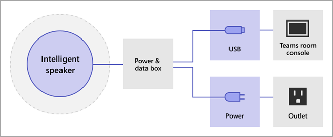

# Manage voice recognition technology controls for an Intelligent Speaker

An Intelligent Speaker uses voice profile information to recognize who said what in live transcription. When a Microsoft Teams Rooms for Windows meeting room is equipped with an Intelligent Speaker, live transcription can be used during the meeting. This article explains how you, a tenant admin, control the voice profiling that's used for voice recognition to generate live transcription. You can control to what degree the organization is using voice recognition and the following features:

- Edit the speaker's name in transcripts.
- Change the speaker of a single utterance in the transcript or change the speaker in all the utterances in the transcript (but not on future transcripts).
- Change the speaker identification for the people who are listed in the meeting.
- Remove the identification of one or more utterances identified as that speaker, on every transcript.

### Review Intelligent Speaker requirements

An Intelligent Speaker includes a special seven-microphone array. The speaker uses voice profile information to identify voices of up to 10 people in meeting rooms. 

The following items are Intelligent Speaker requirements:

- The customer tenant must be located in the U.S.(North America).1 
- The meeting room should have a maximum of 10 people present in person.
- The meeting room has an upload link of minimum 7 Mbps.

 1 An Intelligent Speaker and associated biometric storage and usage will only be available in EN-US language and for US (NA-US region) tenants. Both conditions must be true for a tenant user to enroll and use an Intelligent Speaker for attributed transcription.

## Set up an Intelligent Speaker

An Intelligent Speaker connects directly using USB to the Teams Rooms console. For best results, we recommend that you use the same brand Intelligent Speaker with the same brand console.

> [!NOTE]
> A Yealink Intelligent Speaker **must** be used with a Yealink console.

> [!NOTE]
> We don't support an Intelligent Speaker connected to Logitech Surface Pro Microsoft Teams Rooms. There is a known issue that Teams Rooms can't recognize the Intelligent Speaker through the dock.

An Intelligent Speaker should be placed at least 8 inches (20 cm) away from walls and large objects, such as laptops. If the Intelligent Speaker USB cable isn't long enough for your setup, use cable extenders.

1. Sign in to the console as administrator.
2. Set the Teams device settings to match the Intelligent Speaker microphone and speaker.
   You can also do this through the TAC portal instead of at the room console.

The diagram shows how the Intelligent Speaker is connected to the device.

   

[cindy will get a second diagram]The diagram shows how a Yealink Intelligent Speaker is connected to a Yealink device.
*add diagram*

> [!Note]
> EPOS and Yealink devices should have "EPOS" or "Yealink" prefix and contain "UAC2_RENDER" in the speaker name and "UAC2_TEAMS" in the microphone name. If you don't find these microphone and speaker names in the dropdown menu, restart the Intelligent Speaker device.

### Enable an Intelligent Speaker user recognition

Voice profile data can be used in any meeting with an Intelligent Speaker. See [Teams meetings policies](../meeting-policies-in-teams.md) and the [PowerShell meeting cmdlets](https://docs.microsoft.com/powershell/module/skype/set-csteamsmeetingpolicy?view=skype-ps) for information on the meeting settings.

The voice profile of the user is created when the policy is set to distinguish or a non-meeting invitee walks in during the meeting. The voice profile is dismissed at the end of the meeting.

The following are the required policies to set an Intelligent Speaker and user recognition.

|Policy|Description|Values|
|-|-|-|
|`enrollUserOverride`|Use to set voice profile capture, or enrollment, in Teams settings for a tenant. |`Enabled` and `Disabled`|
|`roomAttributeUserOverride`|Control the voice-based user identification in meeting rooms. This setting is required for Teams Rooms accounts.|- `Off` - `attribute`, which means room participants will be distinguished and identified based on enrolled voices (if enrolled).   - `distinguish`, *This setting will be available at a later date.*| 
|`enabletranscription`|Required for user and Teams rooms accounts|`true` and `false`|
|||| 

Settings are disabled by default. When the policies are disabled:

- Users who have never enrolled can't view, enroll, or re-enroll.
- The entry point to the enrollment flow will be hidden.
- If users select a link to the enrollment page, they'll see a message that states this feature isn't enabled for their organization.  
- Users who have enrolled can view and remove their voice profile in the Teams settings. Once they remove their voice profile, they won't be able to view, access, or complete the enrollment flow. 
- The Teams Rooms device won't send audio stream-saving bandwidth from the room.  
- Meeting room users won't be attributed or distinguished, and their voice signatures won't be retrieved or used at all.
- Meeting room users are unknown.

When the policies are enabled:

- Users can view, access, and complete the enrollment flow.
- The entry point will show on Teams settings page under the **Recognition** tab.
- Rooms users will be attributed based on their enrollment status.
- Users who are enrolled are shown with their name in the transcription.  
- Users who aren't enrolled show as Speaker n.
- The Teams Rooms device will send seven audio streams from the room.

## Frequently asked questions (FAQ)

**Where is the voice profile data stored?**

Voice profile data is stored in Office 365 cloud with user content.

**What is the retention timeline and policy?**

General retention policy is stated in the [Data retention overview](https://docs.microsoft.com/compliance/assurance/assurance-data-retention-deletion-and-destruction-overview). In addition, the voice profile data will be deleted after three years if the data isn't used in any meetings for existing employees. If an employee has left the company, voice profile data is considered user content and is treated as such per Office 365 data retention policy described in the [Data retention overview](https://docs.microsoft.com/compliance/assurance/assurance-data-retention-deletion-and-destruction-overview).

**Is voice profile data used across Microsoft services?**

- Scenario 1: User enrolls in company tenant and then uses Microsoft consumer service (Xbox, Teams for Life, Office 365 Personal). Their voice is recognized by the consumer service.
- Scenario 2: Users enroll in their company tenant and their voice is recognized and attributed in the meeting hosted by another company.

No, voice profile data is only used for the purpose for which the user has provided consent. Therefore, Microsoft isn't intending to use the voice profile data across different non-Teams services at this point.

However,  Microsoft may decide in the future to use the same voice enrollment data for other Microsoft Office 365 scenarios. Such a decision will be duly notified, with required consent and policies in place, empowering tenant admins to decide and control.

**Is an Intelligent Speaker General Data Protection Regulation (GDPR) compliant?**

Yes, audio data collected from user can be exported by the tenant admin using Teams admin center.

> [!NOTE]
> In the future, if we can give a bar of how good the audio data is, then you can evaluate the quality of the transcript.

## Related topics

[Support article: Use Intelligent Speakers to Identify in-room participants ](https://support.microsoft.com/office/use-teams-intelligent-speakers-to-identify-in-room-participants-in-meeting-transcription-a075d6c0-30b3-44b9-b218-556a87fadc00)