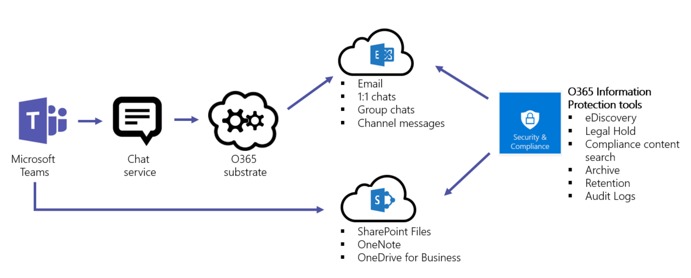
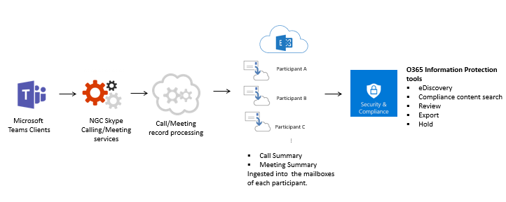

Overview of security and compliance in Microsoft Teams
======================================================

Microsoft Teams is built on the Office 365 hyper-scale, enterprise-grade cloud, delivering the advanced security and compliance capabilities our customers expect.

Teams is Tier D-compliant. This includes the following standards: ISO 27001, ISO 27018, SSAE16 SOC 1 and SOC 2, HIPAA, and EU Model Clauses (EUMC). Within the Microsoft compliance framework, Microsoft classifies Office 365 applications and services into four categories. Each category is defined by specific compliance commitments that must be met for an Office 365 service, or a related Microsoft service, to be listed in that category.

Services in compliance categories C and D that have industry-leading compliance commitments are enabled by default. Services in categories A and B come with controls to turn on or turn off these services for an entire organization. Details can be found in the [Compliance Framework for Industry Standards and Regulations](https://go.microsoft.com/fwlink/?linkid=855777). Teams also supports Cloud Security Alliance compliance.

Teams also enforces team-wide and organization-wide two-factor authentication, single sign-on through Active Directory, and encryption of data in transit and at rest. Files are stored in SharePoint and are backed by SharePoint encryption. Notes are stored in OneNote and are backed by OneNote encryption. The OneNote data is stored in the team SharePoint site. The Wiki tab can also be used for note taking and it's content is also stored within the team SharePoint site.

We also added support for audit log search, eDiscovery and legal hold for channels, chats and files as well as mobile application management with Microsoft Intune. Go to the Office 365 Security & Compliance Center to manage these settings. 

To learn more about Office 365 security & compliance, read [Configure your Office 365 tenant for increased security](https://docs.microsoft.com/office365/securitycompliance/tenant-wide-setup-for-increased-security)

## Auditing and Reporting

Audit log search plugs right into the Office 365 Security & Compliance Center and exposes abilities to set alerts and/or report on Audit event by making available, export of workload specific or generic event sets for admin use and investigation, across an unlimited auditing timeline. All Audit Log data is available for setting up of alerts within the Office 365 Security & Compliance Center, as well as for filtering and export for further analysis. Please refer to this [link](https://support.office.com/article/Search-the-audit-log-in-the-Office-365-Security-Compliance-Center-0d4d0f35-390b-4518-800e-0c7ec95e946c) to learn more about how to conduct an Audit log search for Microsoft Teams events in the Office 365 Security & Compliance Center. 

## Compliance Content Search

Content Search can be used to search for all Teams data through rich filtering capabilities and exported to a specific container for compliance and litigation support. This can be done with or without an eDiscovery case. This enables compliance admins to gather Teams data across all users, review and export it for further processing. Please refer to this [link](https://support.office.com/article/content-search-in-office-365-53390468-eec6-45cb-b6cd-7511f9c909e4) to learn more about how to conduct a compliance content search for Microsoft Teams content in the Office 365 Security & Compliance Center. 

Tip: The kind Microsoft Teams can be used to filter through to Microsoft Teams only content i.e. Chat and Channel Messages, Meetings and Calls. 

## eDiscovery

Electronic discovery is the electronic aspect of identifying, collecting and producing electronically stored information (ESI) in response to a request for production in a law suit or investigation. Capabilities include case management, preservation, search, analysis, and export of Teams data. This includes chat, messaging and files, meeting and call summaries. For Teams meetings and Calls, a summary of the events that happened in the meeting and call are created and made available in eDiscovery. 

For more details about how to do eDiscovery in Security & Compliance Center and run compliance content search for Teams content, please go to the links below: 

[eDiscovery](https://support.office.com/article/manage-legal-investigations-in-office-365-2e5fbe9f-ee4d-4178-8ff8-4356bc1b168e) 

[Content Search](https://support.office.com/article/search-for-content-in-office-365-df2d1e0f-b476-42c9-aade-4a260b24f193)

Customers can leverage in-place eDiscovery or [Advanced eDiscovery] per their requirements(https://support.office.com/article/Office-365-Advanced-eDiscovery-fd53438a-a760-45f6-9df4-861b50161ae4). The following table outlines the differences between the two:

| |In-place eDiscovery  |Advanced eDiscovery  |
|---------|---------|---------|
|Case Management     |X        |X         |
|Access Control  |X         |X         |
|Content Searches     |X         | X        |
|Hold(s)   |X         | X        |
|Export     |X         |X         |
|Duplication Detection     |-         |X         |
|Relevance Searches with Machine Learning    |-         |X         |
|Unstructured Data Analysis      |-         |X         |

## Legal Hold

During a litigation, it is often required that all data associated with a user (custodian) or a Team is preserved immutably so it can be used as evidence for the case. This is achieved by placing either a user (user mailbox) or a Team on legal hold. When any team within Teams is put on In-Place Hold (subset of the mailbox or site collection thru targeted queries or filtered content) or Litigation Hold (entire mailbox or site collection), the hold is placed on the groups mailbox. This ensures that even if end users delete or edit channel messages that are ingested into the group mailbox, immutable copies of that content are maintained and available in eDiscovery search. Legal Holds are generally applied within the context of an eDiscovery case. Please see [this](https://support.office.com/article/overview-of-preservation-policies-9c3b1d52-40ce-4ba3-a520-9ae0be15538a) help article to understand more about preservation and holds in the Office 365 Security & Compliance Center. 

## Information Protection Architecture for Microsoft Teams. 

The following figure indicates the ingestion flow of Teams data to both Exchange and SharePoint for Teams Files and Messages. 

The following figure indicates the ingestion flow of Teams Meetings and calling data to Exchange.

> [!IMPORTANT]
> There can be up to a 24-hour delay to discover Teams content.

Licensing
---------------

When it comes to the information protection capabilities, Office 365 subscriptions and the associated standalone licenses will determine the available feature set.

| Information Protection Capability | Office 365 Business Essentials | Office 365 Business Premium | Office 365 Enterprise E1 | Office 365 Enterprise E3/E4 | Office 365 Enterprise E5 |
|-----------------------------------|--------------------------------|-----------------------------|--------------------------|-----------------------------|--------------------------|
|              Archive              |               -                |              -              |            -             |             Yes             |           Yes            |
|        In-Place eDiscovery        |               -                |              -              |            -             |             Yes             |           Yes            |
|        Advanced eDiscovery        |               -                |              -              |            -             |              -              |           Yes            |
|            Legal Hold             |               -                |              -              |            -             |             Yes             |           Yes            |
|     Compliance Content Search     |               -                |             Yes             |           Yes            |             Yes             |           Yes            |
|      Auditing and Reporting       |              Yes               |             Yes             |           Yes            |             Yes             |           Yes            |
|       Conditional Access\*        |              Yes               |             Yes             |           Yes            |             Yes             |           Yes            |

> [!NOTE]
> \*Conditional Access requires additional licenses

| |  |  |
|---------|---------|---------|
|     |Decision point         |Does your organization have the required licenses to meet Compliance and Security business requirements?         |
|    |Next steps         |Review your organization's current licensing and confirm it meets all business requirements for compliance and security.         |

Before enabling any of these features, ensure you have access to the Security & Compliance Center in the Microsoft 365 admin center. By default, tenant admins have access.

Content Search and eDiscovery do not require enablement in the Security & Compliance Center.

Location of data in Teams
-------------------------

Data in Teams resides in the geographic region associated with your Office 365 tenant. Currently, Teams supports the Australia, Canada, France, India, Japan, UK, Americas, APAC, and EMEA regions. 

> [!IMPORTANT]
> Teams currently offers data residency in Australia, Canada, France, India, Japan, and the UK for new tenants only. 
> A new tenant is defined as any tenant that hasn’t had a single user from the tenant sign in to Teams. Existing tenants from Australia, India, and Japan will continue to have their Teams data stored in the APAC region. Existing tenants in Canada will continue to have their data stored in the Americas. Existing tenants in France and the United Kingdom will continue to have their data stored in the EMEA region.

To learn more about the launch of India and UK data residency for Teams, read Ansuman Acharya's blog post, [Microsoft Teams launches India Data Residency, other geos coming soon](https://techcommunity.microsoft.com/t5/Microsoft-Teams-Blog/Microsoft-Teams-Launches-Australia-and-Japan-Data-Residency/ba-p/237827). 

For more information on Canada data residency for Teams, read Varun Sagar's blog post, [Microsoft Teams Launches Canada Data Residency, Australia and Japan coming soon](https://techcommunity.microsoft.com/t5/Microsoft-Teams-Blog/Microsoft-Teams-Launches-Canada-Data-Residency-Australia-and/ba-p/227178). 

To learn more about the launch of Australia and Japan data residency for Teams, read Varun Sagar's blog post, [Microsoft Teams Launches Australia and Japan Data Residency](https://go.microsoft.com/fwlink/?linkid=867773). 

To learn more about the launch of France data residency for Teams, read Varun Sagar's blog post, [Microsoft Teams Launches France Data Residency](https://techcommunity.microsoft.com/t5/Microsoft-Teams-Blog/Microsoft-Teams-launches-France-Data-Residency/ba-p/364466).

To see which region houses data for your tenant, go to the [Microsoft 365 admin center](https://portal.office.com/adminportal/home) > **Settings** > **Organization profile**. Scroll down to **Data location**. 

How do Conditional Access policies work for Teams?
-------------------------

Microsoft Teams relies heavily on Exchange Online, SharePoint Online, and Skype for Business Online for core productivity scenarios, like meetings, calendars, interop chats, and file sharing. Conditional access policies that are set for these cloud apps apply to Microsoft Teams when a user directly signs in to Microsoft Teams - on any client. 

Microsoft Teams is supported separately as a cloud app in Azure Active Directory conditional access policies. Conditional access policies that are set for the Microsoft Teams cloud app apply to Microsoft Teams when a user signs in. However, without the correct policies on other apps like Exchange Online and SharePoint Online, users may still be able to access those resources directly. For more information about setting up a conditional access policy in the azure portal, go to: (https://docs.microsoft.com/azure/active-directory/active-directory-conditional-access-azure-portal-get-started) 

Microsoft Teams desktop clients for Windows and Mac support modern authentication. Modern authentication brings sign-in based on the Azure Active Directory Authentication Library (ADAL) to Microsoft Office client applications across platforms.

Microsoft Teams desktop application supports AppLocker.  For more information about AppLocker prerequisites, please see: Requirements to use AppLocker (https://docs.microsoft.com/windows/security/threat-protection/windows-defender-application-control/applocker/requirements-to-use-applocker).

Privacy in Teams
--------------------------

As a customer of Office 365, you own and control your data. Microsoft does not use your data for anything other than providing you with the service that you have subscribed to. As a service provider, we do not scan your email, documents, or teams for advertising or for purposes that are not service-related. Microsoft doesn’t have access to uploaded content. Like OneDrive for Business and SharePoint Online, customer data stays within the tenant.

Check out more about our trust and security related information at the [Microsoft Trust Center](https://microsoft.com/trustcenter). Teams follows the same guidance and principles as the Microsoft Trust Center.

Related topics
----------------------
[Office 365 ATP Safe Links](https://docs.microsoft.com/office365/securitycompliance/atp-safe-links#how-to-get-atp-safe-links-protection)
