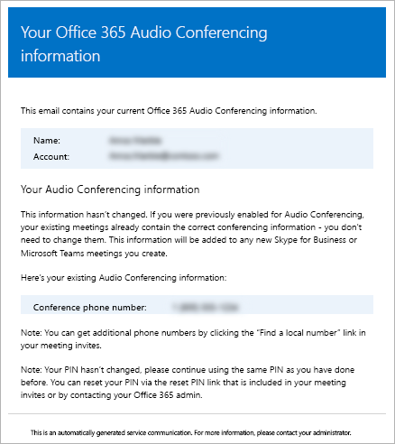

# Send an email to a user with their Audio Conferencing information in Microsoft Teams

Sometimes Microsoft Teams users may need you to send them their Audio Conferencing information. You can do this by clicking **Send conference info via email** under the properties for a user. When you send this email, it will contain all of the audio conferencing information, including:
  
- The conference phone or dial-in phone number for the user.
    
- The user's conference ID.
    
   
Here is an example of the email that is sent:
  

> [!NOTE]
> [!INCLUDE [updating-admin-interfaces](includes/updating-admin-interfaces.md)]
  
## Send an email with audio conferencing information to a user

###  Using the Microsoft Teams admin center

1. In the left navigation, click **Users**, and then select the user from the list of available users.

2. At the top of the page, click **Edit**.

3. Under **Audio Conferencing**, click **Send conference info in email**.

## What else should you know about this email?

- There are several emails that are sent to users in your organization after they are enabled for audio conferencing:
    
  - When an **Audio Conferencing** license is assigned to them.
    
  - When you manually reset the user's audio conferencing PIN.
    
  - When you manually reset the user's conference ID.
    
  - When an **Audio Conferencing** license is removed from them.
    
  - When the audio conferencing provider for a user is changed from Microsoft to another provider or **None**.
    
  - When the audio conferencing provider for a user is changed to Microsoft.
  
## Want to know more about Windows PowerShell?

Windows PowerShell is all about managing users and what users are allowed or not allowed to do. With Windows PowerShell, you can manage Office 365 using a single point of administration that can simplify your daily work when you have multiple tasks to do. To get started with Windows PowerShell, see these topics:
    
  - [Why you need to use Office 365 PowerShell](https://go.microsoft.com/fwlink/?LinkId=525041)
    
  - [Best ways to manage Office 365 with Windows PowerShell](https://go.microsoft.com/fwlink/?LinkId=525142)
    
For more information about Windows PowerShell, see the [Microsoft Teams PowerShell reference](https://docs.microsoft.com/powershell/module/teams/?view=teams-ps) for more information.
    
  
## Related topics

[Try or purchase Audio Conferencing in Office 365](/SkypeForBusiness/audio-conferencing-in-office-365/try-or-purchase-audio-conferencing-in-office-365)
