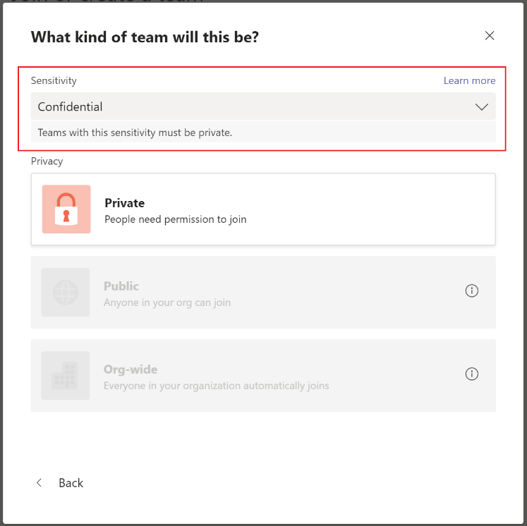
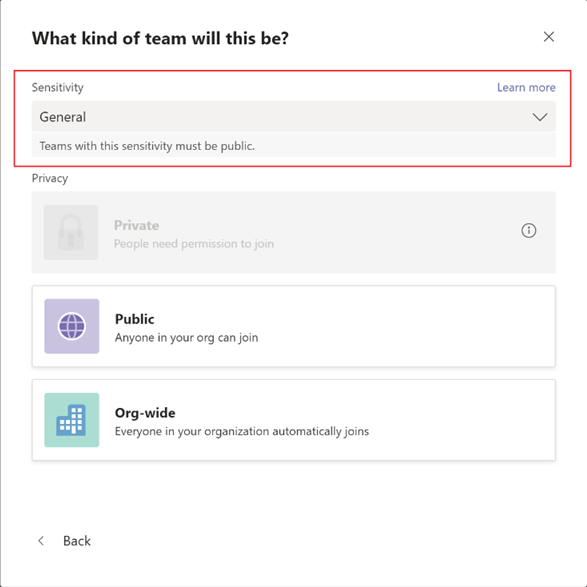
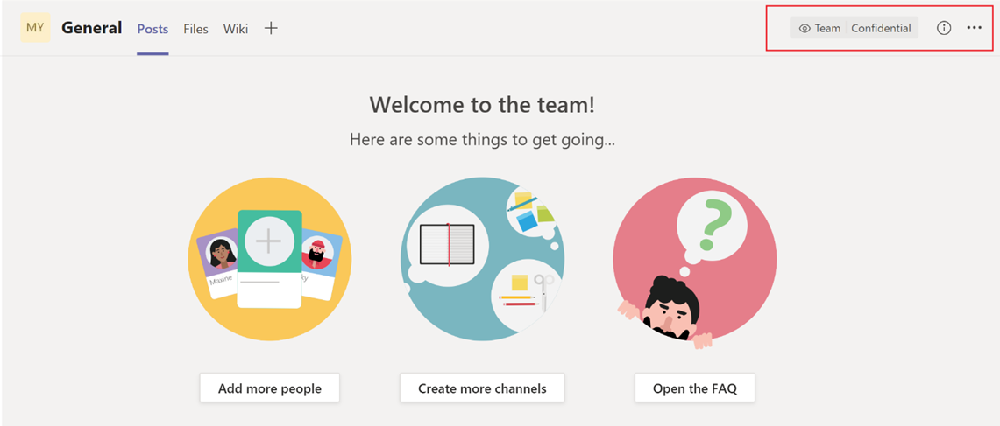
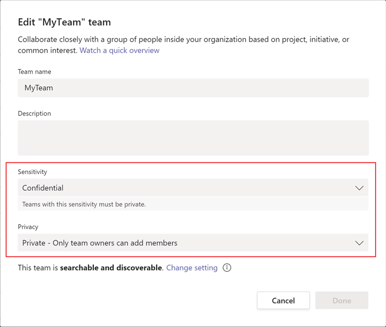

# Sensitivity labels for Microsoft Teams

[Sensitivity labels](/microsoft-365/compliance/sensitivity-labels) allow Teams admins to protect and regulate access to sensitive organizational content created during collaboration within teams. After you configure sensitivity labels with their associated policies in the [Microsoft Purview compliance portal](/microsoft-365/compliance/go-to-the-securitycompliance-center), these labels can be applied to teams in your organization.

Sensitivity labels are currently unsupported in class teams for customers using Teams Education SKUs. To learn more about licensing, see [Microsoft Teams service description](/office365/servicedescriptions/teams-service-description).

## What's the difference between sensitivity labels and Teams classification?

Sensitivity labels are different from Teams classification, also known as Azure AD group classification. Classifications are text strings that can be associated with a Microsoft 365 group but don't have any actual policies associated with them. You use classification as metadata and then must use other methods such as internal tools and scripts, to enforce policies.

The benefit of using sensitivity labels is that their policies are automatically enforced end-to-end through a combination of the Microsoft 365 Groups platform, the Microsoft Purview compliance portal, and Teams services. Sensitivity labels provide powerful infrastructure support for securing your organization's sensitive data and ensuring compliance with your internal policies or regulations.

If you currently use Teams classification, see the following documentation for more information and instructions how to convert these values to sensitivity labels: [Classic Azure AD group classification](/microsoft-365/compliance/sensitivity-labels-teams-groups-sites#classic-azure-ad-group-classification).

## Example scenarios for sensitivity labels

Example scenarios for how you can use sensitivity labels with Teams in your organization include:

- [Set the privacy level (public or private) for teams](#set-the-privacy-level-for-teams)
- [Control guest access to teams](#control-guest-access-to-teams)

### Set the privacy level for teams

You can create and configure a sensitivity label that, when applied during team creation, allows users to create teams with a specific privacy (public or private) setting.

For example, you create and publish a sensitivity label named "Confidential" that has the label privacy option configured as **Private**. As a result, any team that's created with this label must be a private team. 

When a user creates a new team and selects the **Confidential** label, the only privacy option that's available to the user is **Private**. Other privacy options such as Public and Org-wide aren't available for the user to select:

Similarly, you create and publish a sensitivity label named "General" that has the label privacy option configured as **Public**. When a user creates a new team, they can only create public or org-wide teams when they select this label:

When the team is created, the sensitivity label is visible to users in the upper-right corner of channels in the team. 

A team owner can change the sensitivity label and the privacy setting of the team at any time by going to the team, and then click **Edit team**.

### Control guest access to teams

You can use sensitivity labels to control guest access to your teams. Teams created with a label that doesn't allow guest access are only available to users in your organization. People outside your organization can't be added to the team.

## Microsoft Teams admin center

You can apply sensitivity labels when you create or edit a team in the Microsoft Teams admin center. 
Sensitivity labels are also visible in team properties and in the **Classification** column on the **Manage teams** page of the Microsoft Teams admin center.

## Limitations

Before you use sensitivity labels for Teams, be aware of the following limitations:

- **Sensitivity labels aren't supported by Teams Graph APIs and PowerShell cmdlets**
    
    Users won't be able to specify sensitivity labels while creating teams directly through Teams Graph APIs or Teams PowerShell cmdlets. However Modern Groups Graph APIs and PowerShell cmdlets do allow the creation of groups with sensitivity labels. This means that you can create groups with sensitivity labels by using these methods, and then convert these groups into teams.

- **Support for private channels**
    
    Private channels that are created in a team inherit the sensitivity label that was applied on a team. The same label is automatically applied on the SharePoint site collection for the private channel.
    
    However, if a user directly changes the sensitivity label on a SharePoint site for a private channel, that label change isn't reflected in the Teams client. In this scenario, users continue to see the original sensitivity label applied on the team in the private channel header.

## How to create and configure sensitivity labels for Teams

Use the instructions from the Microsoft Purview documentation to create and configure sensitivity labels for Teams: 

- [Use sensitivity labels to protect content in Microsoft Teams, Microsoft 365 groups, and SharePoint sites](/microsoft-365/compliance/sensitivity-labels-teams-groups-sites).
