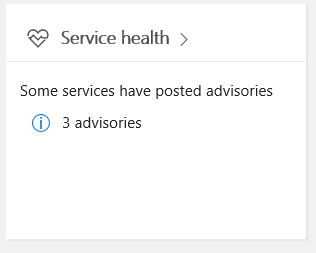

Verify service health for Microsoft Teams
===========================================

Service health for Microsoft Teams is displayed on the Office 365 Admin portal main page. Before troubleshooting issues, it's a good practice to verify that the Teams service is healthy.

Also, keep in mind that, Microsoft Teams is built on top of additional Office 365 services, so when looking at Service Health, remember to also check the status of Exchange, SharePoint, and OneDrive for Business. Service Health issues for these other services does not automatically mean that Teams is impacted (e.g. Address Book downloads in Exchange are unavailable), but that you should review the advisories for those affected services to determine if there is an impact to Microsoft Teams.

