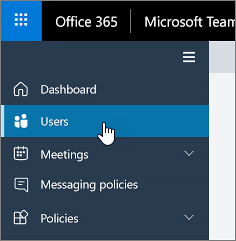
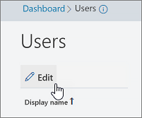
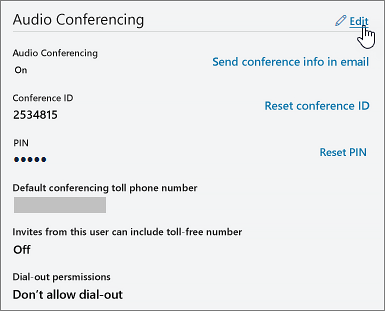

# Set the phone numbers included on invites in Microsoft Teams

Audio Conferencing in Office 365 enables users in your organization to create Microsoft Teams meetings, and then allow users to dial in to those meetings using a phone.
  
A conferencing bridge gives you a set of dial-in phone numbers for your organization. All of them can be used to join the meetings that a meeting organizer has created, but you can select which ones will be included on their meeting invites.
  
> [!NOTE]
> There can be a maximum of one toll and one toll-free phone number on the meeting invite for a meeting organizer, but there is also a link located at the bottom of each meeting invite that opens the full list of all dial-in phone numbers that can be used to join a meeting. 

> [!NOTE]
> [!INCLUDE [updating-admin-interfaces](includes/updating-admin-interfaces.md)]
  
## Initial assignment of phone numbers that are included in the meeting invites for new users

The phone numbers that get included in the meeting invites of users enabled for Audio Conferencing are defined by the default conferencing toll phone number and the default conferencing toll-free phone number user's settings. Each setting specifies which toll and toll-free number will be included in the meeting invite of a given user. As noted above, each meeting invite contains one toll number, one optional toll-free number and a link that opens the full list of all dial-in phone numbers that can be used to join a given meeting.

For a new user, the default conferencing toll numbers is assigned based on the country that is set in the Office 365 profile of the user when the user is enabled for the Audio Conferencing service. If there is a toll number in the conference bridge that matches the country of the user, that number will be automatically assigned as the default toll number of the user. If there isn't one, the number that is defined as the default toll number of the conference bridge will be assigned as the default toll number of the user.  

Once the user is enabled for the Audio Conferencing service, the default toll and toll-free phone numbers of the user can be changed by the tenant administrator from their initial values at any moment.

## Set or change the default audio conferencing phone number for a meeting organizer or user

 **Using the Microsoft Teams admin center**

1. In the left navigation, click **Users**, and then select the user from the list of available users.

    

2. At the top of the page, click **Edit**.

    

3. Next to **Audio Conferencing**, click **Edit**. 
    
    

4. Use the **Toll number** or **Toll-free number** fields to enter the numbers for the user.

> [!IMPORTANT]
> When you change a user's audio conferencing settings, recurring and future Microsoft Teams meetings must be updated and sent to attendees. 

## Want to use Windows PowerShell?

Windows PowerShell is all about managing users and what users are allowed or not allowed to do. With Windows PowerShell, you can manage Office 365 using a single point of administration that can simplify your daily work when you have multiple tasks to do. To get started with Windows PowerShell, see these topics:
    
  - [Why you need to use Office 365 PowerShell](https://go.microsoft.com/fwlink/?LinkId=525041)
    
  - [Best ways to manage Office 365 with Windows PowerShell](https://go.microsoft.com/fwlink/?LinkId=525142)
    
For more information about Windows PowerShell, see the [Microsoft Teams PowerShell reference](https://docs.microsoft.com/powershell/module/teams/?view=teams-ps) for more information. 
  
    
## Related topics

[Try or purchase Audio Conferencing in Office 365](/SkypeForBusiness/audio-conferencing-in-office-365/try-or-purchase-audio-conferencing-in-office-365)

[Change the phone numbers on your Audio Conferencing bridge](change-the-phone-numbers-on-your-audio-conferencing-bridge.md)
