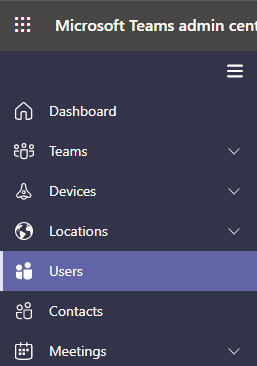

# Set the phone numbers included on invites in Microsoft Teams

Audio Conferencing in Microsoft 365 and Office 365 enables users in your organization to create Microsoft Teams meetings, and then allow users to dial in to those meetings using a phone number.

A conferencing bridge gives you a set of dial-in phone numbers for your organization. All of them can be used to join the meetings that a meeting organizer has created, but you can select which ones will be included on their meeting invites.

In addition to the phone numbers included in the meeting invite for a meeting organizer, there is also a link located at the bottom of each meeting invite that opens the full list of all dial-in phone numbers that can be used to join a meeting.

> [!NOTE]
> [!INCLUDE [updating-admin-interfaces](includes/updating-admin-interfaces.md)]

## Initial assignment of phone numbers that are included in the meeting invites for users

The phone numbers included in the meeting invites of users enabled for Audio Conferencing are defined in the *TeamsAudioConferencingPolicy* that's assigned to users. When a *TeamsAudioConferencingPolicy* is assigned to a user, all toll and toll-free phone numbers added in the policy are included in meeting invites for users who have that policy. If a user is assigned a *TeamsAudioConferencingPolicy* and there aren't any toll or toll-free phone numbers added to the policy, then in that case the phone numbers that appear in the meeting invites of these users are defined by the default conferencing toll phone number and the default conferencing toll-free phone number in each individual user's settings.

> [!NOTE]
> Toll or toll-free phone numbers added to the *TeamsAudioConferencingPolicy* of a user take precedence over the phone numbers set individually using the default conferencing toll phone number and the default conferencing toll-free phone number in a user's settings.

As noted above, In addition to phone numbers, each meeting invite contains a link that opens the full list of all dial-in phone numbers that can be used to join a given meeting.

> [!IMPORTANT]
> It can take up to 24 hours for the assigned phone numbers to show up on your meeting invite. If you aren't seeing updated numbers appear, please wait at least 24 hours before contacting support.

### New users

The toll and toll-free phone numbers included in meeting invites for new users are also defined by the *TeamsAudioconferencingPolicy* that's assigned to those users. By default, all new users are assigned the Global *TeamsAudioconferencingPolicy*. The Global policy doesn't have any phone numbers added (Unless this is changed by the Tenant Administrator). In this case the phone numbers that get included in the meeting invites of users enabled for Audio Conferencing are defined by the default conferencing toll phone number and the default conferencing toll-free phone number found in each user's settings.

For a new user, the default conferencing toll numbers is assigned based on the Usage Location set in the Microsoft 365 administration center of the user when the user is enabled for the Audio Conferencing service. If there's a toll number in the conference bridge that matches the country of the user, that number will be automatically assigned as the default toll number of the user. If there isn't one, the number that's defined as the default toll number of the conference bridge will be assigned as the default toll number of the user.  

Once the user is enabled for the Audio Conferencing service, the default toll and toll-free phone numbers of the user can be changed by the tenant administrator from their initial values as needed.

## Set or change the default audio conferencing phone number for users in Powershell using the *TeamsAudioConferencingPolicy* cmdlet

Please see [Audio Conferencing policy settings for toll and toll-free numbers](audio-conferencing-toll-free-numbers-policy.md)

## Set or change the default audio conferencing phone number for a meeting organizer or user individually

You must be a Teams service admin to make these changes. See [Use Teams administrator roles to manage Teams](./using-admin-roles.md) to read about getting admin roles and permissions.

1. Log in to the Microsoft Teams admin center.

2. In the left navigation, click **Users**.

    

3. Click the user name from the list of available users.

4. Next to **Audio Conferencing**, click **Edit**.

    

5. Use the **Toll number** or **Toll-free number** fields to enter the numbers for the user.

> [!IMPORTANT]
> When you change a user's audio conferencing settings, recurring and future Microsoft Teams meetings must be updated and sent to attendees.

> [!NOTE]
> The phone numbers entered in this setting are only used if the *TeamsAudioConferencingPolicy* assigned to the user doesn't have any phone numbers added.

## Want to use Windows PowerShell

Windows PowerShell is all about managing users and what users are allowed or not allowed to do. With Windows PowerShell, you can manage Microsoft 365 or Office 365 by using a single point of administration that can simplify your daily work when you have multiple tasks to do. To get started with Windows PowerShell, see these topics:

- [Why you need to use Office 365 PowerShell](/microsoft-365/enterprise/why-you-need-to-use-microsoft-365-powershell)

- [Best ways to manage Microsoft 365 or Office 365 with Windows PowerShell](/previous-versions//dn568025(v=technet.10))

To set or change the default audio conferencing phone number for a meeting organizer or user using [Microsoft Teams PowerShell](/powershell/module/teams/?view=teams-ps), set the **`ServiceNumber`** or **`TollFreeServiceNumber`** parameters of the [Set-CsOnlineDialInConferencingUser](/powershell/module/skype/set-CsOnlineDialInConferencingUser?view=skype-ps) cmdlet to one of the available numbers.

## Related topics

[Try or purchase Audio Conferencing in Microsoft 365 for Microsoft Teams](try-or-purchase-audio-conferencing-in-office-365-for-teams.md)

[Change the phone numbers on your Audio Conferencing bridge](change-the-phone-numbers-on-your-audio-conferencing-bridge.md)
