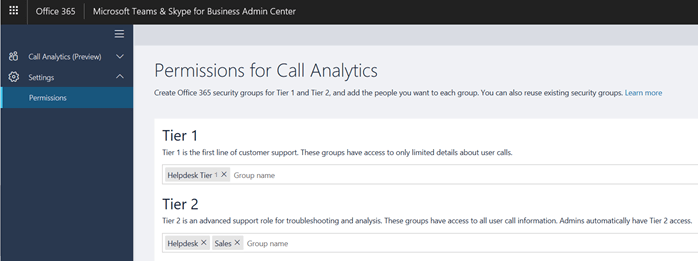

# Set up Call Analytics

As a Skype for Business Online admin, you can use Call Analytics to troubleshoot Skype for Business and Microsoft Teams call quality and connection problems. You may find it useful to set up the following capabilities in Call Analytics:
  
- Set permissions that let other personnel, such as helpdesk agents, use Call Analytics but prevent them from accessing the rest of the Skype for Business admin center. 
    
- Add building, site, and tenant information to Call Analytics by uploading a .tsv or .csv data file.
    
**Call Analytics is now available in the Microsoft Teams and Skype for Business Admin Center.** To see all of the call information and data for a user, use the **Call History** tab. You can do this by looking on the user's profile page by either searching for the user from the dashboard or finding the user from **Users** in the left navigation.

> [!IMPORTANT]
> Helpdesk agent permissions and network topology upload will be available in the new admin portal in the coming months. In the meantime, you can continue to use https://adminportal.services.skypeforbusiness.com for Tier 1 and Tier 2 helpdesk access.
  
## Set Call Analytics permissions

As the admin, you get full access to all the features of Call Analytics. In addition, you can use a helpdesk model in Call Analytics that includes Tier 1 and Tier 2 permission groups. Users with Tier 1 permissions can access only a limited view of Call Analytics. Users with Tier 2 permissions can access the full functionality of Call Analytics. Both permission levels prevent access to the rest of the Microsoft Teams and Skype for Business Admin Center. You can grant access to the tiers by adding a group that contains the user to either the Tier 1 or the Tier 2 section of the Permissions page. For details, see [Set up tiered permissions in Call Analytics](set-up-call-analytics.md#BKMK_SetUpTier).
  
Tier 1 helpdesk agents handle basic call-quality problems. Tier 1 agents don't investigate issues with meetings; they collect related information and then escalate to a Tier 2 agent. Tier 2 agents see information in detailed call logs that's hidden from Tier 1 agents. The following table gives an overview of information available to agents using Call Analytics.

|**Activity**|**Information in Call Analytics**|**What the Tier 1 agent sees**|**What the Tier 2 agent sees**|
|:-----|:-----|:-----|:-----|
|**Calls**   |Caller name    |Only the name of the user for whom the agent searched.    |User name.    |
||Recipient name    |Shows as Internal User or External User.    |Recipient name.    |
||Caller phone number    |Entire phone number except last three digits are obfuscated with asterisk symbols. For example, 15552823***.    |Entire phone number except last three digits are obfuscated with asterisk symbols. For example, 15552823***.    |
||Recipient phone number    |Entire phone number except last three digits are obfuscated with asterisk symbols. For example, 15552823***.    |Entire phone number except last three digits are obfuscated with asterisk symbols. For example, 15552823***.    |
||**Call Details** > **Advanced** tab   |Information not shown.    |All details shown, such as device names, IP address, subnet mapping, and more.    |
||**Call Details** > **Advanced** > **Debug** tab   |Information not shown.    |All details shown, such as DNS suffix and SSID.    |
|**Meetings**   |Participant names    |Only the name of the user for whom the agent searched. Other participants identified as Internal User or External User.    |All names shown.    |
||Participant count    |Number of participants.    |Number of participants.    |
||Session details    |Session details shown with exceptions. Only the name of the user for whom the agent searched is shown. Other participants identified as Internal User or External User. Last three digits of telephone number obfuscated with asterisk symbols.    |Session details shown. User names and session details shown. Last three digits of telephone number obfuscated with asterisk symbols.    |
   
 **Set up tiered permissions in Call Analytics**

 **Using the Microsoft Teams and Skype for Business Admin Center**
  
1. Create Office 365 security groups for Tier 1 and Tier 2, and add the people you want to each group. You can also reuse existing security groups. For more information, see [Create, edit, or delete a security group in the Office 365 admin center](https://support.office.com/article/55c96b32-e086-4c9e-948b-a018b44510cb).
    
2. In the Office 365 admin center, go to **Admin centers** > **Skype for Business**.

    > [!NOTE]
    > If you are in the **Microsoft Teams and Skype for Business Admin Center**, in the left navigation, click **Legacy portal**.
  
3. Select **Tools** > **Skype for Business Call Analytics (preview)** > **Settings**, and then click **Permissions**.
    
4. Add the Office 365 security groups to the **Tier 1** and **Tier 2** boxes. You can add multiple groups to each role.
    
     
  
   Users with either of these permission levels get to Call Analytics via the dedicated URL *https://adminportal.services.skypeforbusiness.com*.
  
## Upload a .tsv or .csv file to add building, site, and tenant information

You can add building, site, and tenant information to Call Analytics by uploading a .csv or .tsv file. With this information, Call Analytics can map IP addresses to physical locations. You or helpdesk agents might find this information useful to help spot trends in call problems. For example, why are many users in the same building having similar call quality issues? 

If you're a Teams and Skype for Business admin, you can use an existing data file from the Teams & Skype for Business Call Quality Dashboard. First, you download the file from Call Quality Dashboard, and then you upload it to Call Analytics. 

- To download an existing data file, go to **Microsoft Teams & Skype for Business Admin Center** > **Call Quality Dashboard** > **Upload now**. In the **My uploads** list, click **Download** next to the file you want.

- To upload the new file, go to **Microsoft Teams & Skype for Business Admin Center** > **Locations**, and then select **Upload location data** or **Replace location data**.
  
If you're creating the .tsv or .csv file from scratch, see [Tenant data file format and Building data file structure](turning-on-and-using-call-quality-dashboard.md#BKMKTenantDataFile).
  
## Related topics

[Use Call Analytics to troubleshoot poor call quality](use-call-analytics-to-troubleshoot-poor-call-quality.md)

[Call Analytics and Call Quality Dashboard](difference-between-call-analytics-and-call-quality-dashboard.md)

  
 
