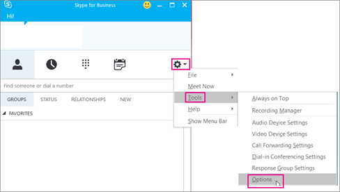
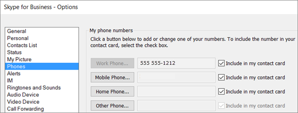

# Set up Calling Plans

Calls to other Skype for Business users are free, but if you want your users to be able to call phones outside of your business, get a Domestic Calling Plan or an International Calling Plan in Office 365. It's easy to set this up for your business. 

## Step 1: Find out if Calling Plans are available in your country/region
Go to [Country and region availability for Audio Conferencing and Calling Plans](country-and-region-availability-for-audio-conferencing-and-calling-plans/country-and-region-availability-for-audio-conferencing-and-calling-plans.md) and select your country or region to get availability information about Calling Plans, as well as information about Audio Conferencing, Phone System, toll and toll-free numbers, and Communications Credits.
  
## Step 2: Buy and assign licenses
1. If the Phone System in Office 365 feature isn't included in your plan, you may need to purchase **Phone System** add-on licenses. After you have **Phone System** licenses, purchase [Calling Plans for Office 365](calling-plans-for-office-365.md). See [Microsoft Teams add-on licensing](teams-add-on-licensing/microsoft-teams-add-on-licensing.md), and buy the licenses and plan. 
    
    > [!TIP]
    > **Phone System** licenses and Calling Plans in Office 365 go together, so to see the option to purchase Calling Plans, you must first have the **Phone System** licenses.
  
2. First assign the licenses, and then assign a Calling Plan to the people in your organization. See [Assign Microsoft Teams licenses](assign-teams-licenses.md).
    
## Step 3: Get phone numbers
There are three ways to get new user numbers:

- **Use the Skype for Business admin center.** For some countries/regions, you can get numbers for your users using the Skype for Business admin center, see [Getting phone numbers for your users](/microsoftteams/getting-phone-numbers-for-your-users).
    
- **Port your existing numbers.** You can port or transfer existing numbers from your current service provider or phone carrier to Office 365. See [Transfer phone numbers to Office 365](transfer-phone-numbers-to-office-365.md) or [Manage phone numbers for your organization](manage-phone-numbers-for-your-organization/manage-phone-numbers-for-your-organization.md) for more information to help you do this.  
  
- **Use a request form for new numbers.** Sometimes (depending on your country/region) you won't be able to get your new phone numbers using the Skype for Business admin center, or you will need specific phone numbers or area codes. If so, you will need to download a form and send it back to us. See [Manage phone numbers for your organization](manage-phone-numbers-for-your-organization/manage-phone-numbers-for-your-organization.md) for more information. 

## Step 4: Add emergency addresses and locations for your organization

An emergency address must be associated with a phone number; when this association happens can vary among country and regions. For example, in the United States, you need to associate an emergency address when you assign the phone number to the user. In the United Kingdom, you need to associate an emergency address to the phone number when you are getting the phone numbers from Office 365 or transferring phone numbers from your current service provider. 

**To add an emergency address for your organization**

 **Using the Skype for Business admin center**

In the Skype for Business admin center, go to  **Voice** > **Emergency locations** > **Add new address**. See [Add or remove and emergency address for your organization](/skypefor business/what-are-calling-plans-in-office-365/add-or-remove-an-emergency-address-for-your-organization) for details.

**To add an emergency location for your organization** 

 **Using the Skype for Business admin center**

In the Skype for Business admin center, go to **Voice** > **Emergency locations** > **Add new address**. See [Add, change, or remove an emergency location  for your organization](/skypefor business/what-are-calling-plans-in-office-365/add-or-remove-an-emergency-address-for-your-organization) for details.

    
## Step 5: Assign an emergency address and a phone number to a user

When you are setting up Calling Plans in Office 365, you must assign a phone number and emergency address to each of your users. The emergency address must be created before you can associate it with a phone number. 

**To add an emergency address for a user** 

 **Using the Skype for Business admin center**

In the Skype for Business admin center, go to **Voice** > **Voice users** > **Emergency location** > **Assign number** > **Change location**. See [Assign or change an emergency address for a user](/skypeforbusiness/what-are-calling-plans-in-office-365/assign-or-change-an-emergency-address-for-a-user) for more details.

   > [!NOTE]
   > You can also assign an emergency address when you assign a phone number.

**To assign a phone number to a user**

 **Using the Skype for Business admin center**

In the Skype for Business admin center, go to **Voice** > **Voice users** > **Assign number** > **Change location**. See [Assign, change, or remove a phone number for a user](/microsoftteams/assign-change-or-remove-a-phone-number-for-a-user) for more details.

## Step 6: Tell your users about their new phone numbers

We recommend sending mail or using your business's preferred communication method to tell the people about their new phone numbers. 

Here's how they can see that phone number in their **Skype for Business** app:
  
1. Sign in to Skype for Business on your desktop.
    
2. Choose **Settings** > **Tools** > **Options**. 
    
     
  
3. Then choose **Phones**. 
    
    
 
In **Microsoft Teams**, users can see their phone number by clicking **Calls** in the left navigation. The phone number is shown above the dial pad.

## What else do you need to know?

- An emergency address is often referred to as a civic address, street address, or a physical address. It is the street or civic address of a place of business for your organization.
    
- Emergency locations aren't validated, only emergency addresses are.
    
- If you want to know more about emergency addresses, see [What are emergency locations, addresses and call routing?](what-are-emergency-locations-addresses-and-call-routing.md)
    
## Do you want to automate assigning phone numbers?

If you know Windows PowerShell, you can use the following cmdlets to automate assigning phone numbers to your users. 
  
- [Get-CsOnlineTelephoneNumber](https://technet.microsoft.com/library/mt243818.aspx): Retrieves the telephone numbers from the Business Voice Directory.
    
- [Set-CsOnlineVoiceUser](https://technet.microsoft.com/library/mt243817.aspx): Sets the telephone numbers.
    
To learn more, see [Quick reference: Using Windows PowerShell to do common Skype for Business Online management tasks](https://technet.microsoft.com/library/dn362776%28v=ocs.15%29.aspx).
  
   > [!NOTE]
   > If you need to get more telephone numbers than this, please [contact support for business products - Admin Help](https://support.office.com/article/32a17ca7-6fa0-4870-8a8d-e25ba4ccfd4b).

## Related topics
[Transferring phone numbers common questions](transferring-phone-numbers-common-questions.md)

[Different kinds of phone numbers used for Calling Plans](different-kinds-of-phone-numbers-used-for-calling-plans.md)

[Manage phone numbers for your organization](manage-phone-numbers-for-your-organization/manage-phone-numbers-for-your-organization.md)

[Emergency calling terms and conditions](emergency-calling-terms-and-conditions.md)

[Skype for Business Online: Emergency Calling disclaimer label](https://github.com/MicrosoftDocs/OfficeDocs-SkypeForBusiness/blob/live/Teams/downloads/emergency-calling/emergency-calling-label-(en-us)-(v.1.0).zip?raw=true)

  
 