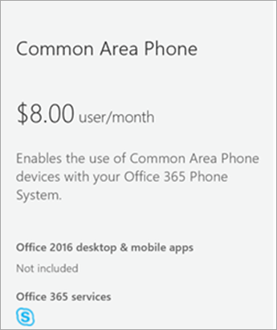
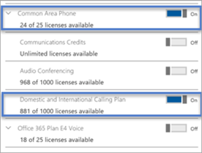
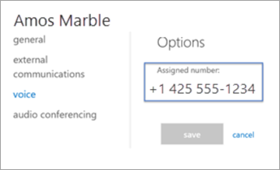

# Set up the Common Area Phone license for Microsoft Teams
> [!NOTE]
> Common area phones do not support voicemail.

A common area phone is typically placed in an area like a lobby or another area which is available to many people to make a call; for example, a reception area, lobby, or conference phone. Common area phones are set up as devices rather than users, and can automatically sign into a network.

In the steps below, we’ll help you set up an account for Phone System to deploy common area phones for your organization. For a more complete meeting room experience, including audio conferencing, consider purchasing the dedicated Meeting Room license with a meeting room device. 

The first things you need to do are purchase a Common Area Phone (CAP) license and make sure that you have a certified phone. To search for and learn more about certified phones, go to [Microsoft Teams devices](https://products.office.com/microsoft-teams/across-devices?ms.url=officecomteamsdevices&rtc=1). 

## Step 1 - Buy the licenses

1. In the Microsoft 365 admin center, go to **Billing** > **Purchase services** and then expand **Other plans**.

    

2. Select **Common Area Phone** > **Buy now**.

3. On the **Checkout** page click **Buy now**.

4. Expand **Add-on subscriptions** and then click to buy a Calling Plan. Choose either the **Domestic Calling Plan** or **Domestic and International Calling Plan**.

> [!NOTE]
> You don't need a Phone System license. It's included with the Common Area Phone license.

For more information on licenses, see [Microsoft Teams add-on licensing](teams-add-on-licensing/microsoft-teams-add-on-licensing.md).

## Step 2 - Create a new user account for the phone and assign the licenses

1. In the Microsoft 365 admin center, go to **users** > **active users** > **add a user**.

2. Enter a user name like “Main" for the first name and "Reception” for the second name.

3. Enter a display name if it doesn't autogenerate one like "Main Reception."

4. Enter a user name like "MainReception" or "Mainlobby."

5. For common area phones, you might want to set a password manually or have the same password for all your common area phones. Also, you might think about clearing the **Make this user change their password when they first sign in** check box.

6. Assign the licenses to the user. On the same page, click to expand **Product licenses**. Turn on the Common Area Phone and pick either a **Domestic Calling Plan** or a **Domestic and International Calling Plan**. 

    

For more information, see [Add a user](https://docs.microsoft.com/office365/admin/add-users/add-users?redirectSourcePath=%252farticle%252f1970f7d6-03b5-442f-b385-5880b9c256ec&view=o365-worldwide).

## Step 3 - Assign a phone number to the Common Area Phone user account

Use the Skype for Business admin center to assign a number to the user.

1. In the Microsoft 365 admin center, select **Admin centers** > **Teams & Skype** > **Legacy portal**.

2. In the Skype for Business admin center, select **Voice** > **Phone numbers**.

3.	Select a number from the list of phone numbers and click **Assign**.

4. On the **Assign** page, in the Voice user box, type the name of the user who will be using the phone, and then select the user in the **Select a voice user** drop-down list.

5. While you're there you will need to add an emergency address. Choose **Search by city**, **Search by description**, or **Search by location** from the drop-down list, and then enter the city, description, or location in the text box. Once you search, look under **Select emergency address** to pick the right one for you.

6. Click **Save** and your user should look like this:

   

> [!NOTE]
> Users will only show up if they have a Phone System license applied. If you just did this, then sometimes it takes a bit for the user to show up in the list.

For more information, see [Getting phone numbers for your users](/microsoftteams/getting-phone-numbers-for-your-users).

You can also take your phone number that you have with another carrier and "port" or transfer it over to Office 365. See [Transfer phone numbers to Office 365](transfer-phone-numbers-to-office-365.md).

