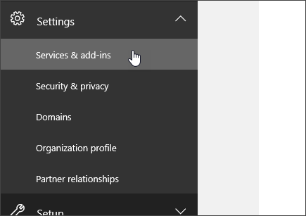
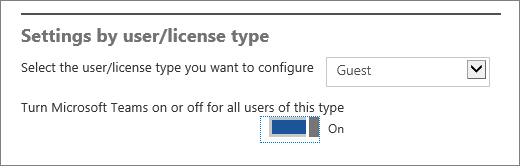

Turn on or off guest access to Microsoft Teams
======================================

  

As the Office 365 admin, you must enable the guest feature before you or your organization's users (specifically, team owners) can add guests. 

The guest settings are set in Azure Active Directory. It takes 2 hours to 24 hours for the changes to be effective across your Office 365 organization. If a user sees the message "Contact your administrator" when they try to add a guest to their team, it's likely that either the guest feature hasn't been enabled or the settings haven’t become effective yet.

> [!IMPORTANT]
> To enable the full experience of the guest access feature, it's important to understand the core authorization dependency between Microsoft Teams, Azure Active Directory, and Office 365. For more information, see [Authorize guest access in Microsoft Teams](Teams-dependencies.md).

1. Sign in with your Office 365 global admin account at [https://portal.office.com/adminportal/home](https://portal.office.com/adminportal/home).
    
  
2. In the navigation menu, choose **Settings** and then select **Services &amp; add-ins**.
    
     
  
 

  
3. Select **Microsoft Teams**.
    
     
  
  
4. In **Select the user/license type you want to configure**, select **Guest**.
   
    
      

  
  
5. Click or tap the toggle next to **Turn Microsoft Teams on or off for all users of this type** to **On** to turn on Teams and guest access for your organization, and then choose **Save**. 
    
  

