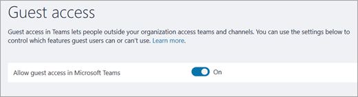

Turn on or off guest access to Microsoft Teams
======================================

As the Office 365 admin, you must enable the guest feature before you or your organization's users (specifically, team owners) can add guests. 

The guest settings are set in Azure Active Directory. It takes 2 hours to 24 hours for the changes to be effective across your Office 365 organization. If a user sees the message "Contact your administrator" when they try to add a guest to their team, it's likely that either the guest feature hasn't been enabled or the settings aren't effective yet.

> [!IMPORTANT]
> To enable the full experience of the guest access feature, it's important to understand the core authorization dependency between Microsoft Teams, Azure Active Directory, and Office 365. For more information, see [Authorize guest access in Microsoft Teams](Teams-dependencies.md).

## Guest access vs. external access (federation)

[!INCLUDE [guest-vs-external-access](includes/guest-vs-external-access.md)]

## Configure guest access in the Microsoft Teams admin center

1.	Sign in to the Microsoft Teams admin center.

2.	Select **Org-wide settings** > **Guest access**.

3. Set the **Allow guest access in Microsoft Teams** toggle switch to **On**.

    

4.	Set the toggles under **Calling**, **Meeting**, and **Messaging** to **On** or **Off**, depending on the capabilities you want to allow for guest users.

    - **Make private calls** – Turn this setting **On** to allow guests to make peer-to-peer calls.
    - **Allow IP video** - Turn this setting **On** to allow guests to use video in their calls and meetings.
    - **Screen sharing mode** – This setting controls the availability of screen sharing for guest users. 
       - Turn this setting to **Disabled** to remove the ability for guests to share their screens in Teams. 
       - Turn this setting to **Single application** to allow sharing of individual applications. 
       - Turn this setting to **Entire screen** to allow complete screen sharing.
    - **Allow Meet Now** – Turn this setting **On** to allow guests to use the Meet Now feature in Microsoft Teams.
    - **Edit sent messages** - Turn this setting **On** to allow guests to edit messages they previously sent.
    - **Guests can delete sent messages** – Turn this setting **On** to allow guests to delete messages they previously sent.
    - **Chat** – Turn this setting **On** to give guests the ability to use chat in Teams.
    - **Use Giphys in conversations** – Turn this setting **On** to allow guests to use Giphys in conversations. Giphy is an online database and search engine that allows users to search for and share animated GIF files. Each Giphy is assigned a content rating.
    - **Giphy content rating** –  Select a rating from the drop-down list:
       - **Allow all content** - Guests will be able to insert all Giphys in chats, regardless of the content rating.
       - **Moderate** - Guests will be able to insert Giphys in chats, but will be moderately restricted from adult content.
       - **Strict** – Guests will be able to insert Giphys in chats, but will be strictly restricted from inserting adult content.
    - **Use Memes in conversations** - Turn this setting **On** to allow guests to use Memes in conversations.
    - **Use Stickers in conversations** – Turn this setting **On** to allow guests to use stickers in conversations. 


5.	Click **Save**.

## Use PowerShell to turn guest access on or off

1.	Download the Skype for Business Online PowerShell module from https://www.microsoft.com/en-us/download/details.aspx?id=39366
 
2.	Connect a PowerShell session to the Skype for Business Online endpoint.

    ```
    Import-Module SkypeOnlineConnector
    $Cred = Get-Credential
    $CSSession = New-CsOnlineSession -Credential $Cred
    Import-PSSession -Session $CSSession
    ```
3.	Check your configuration and if `AllowGuestUser` is `$False`, use the [Set-CsTeamsClientConfiguration](https://docs.microsoft.com/powershell/module/skype/set-csteamsclientconfiguration?view=skype-ps) cmdlet to set it to `$True`.

    ```
    Get-CsTeamsClientConfiguration

    Identity                         : Global
    AllowEmailIntoChannel            : True
    RestrictedSenderList             :
    AllowDropBox                     : True
    AllowBox                         : True
    AllowGoogleDrive                 : True
    AllowShareFile                   : True
    AllowOrganizationTab             : True
    AllowSkypeBusinessInterop        : True
    ContentPin                       : RequiredOutsideScheduleMeeting
    AllowResourceAccountSendMessage  : True
    ResourceAccountContentAccess     : NoAccess
    AllowGuestUser                   : True
    AllowScopedPeopleSearchandAccess : False
    
    Set-CsTeamsClientConfiguration -AllowGuestUser $True -Identity Global
    ```
You can now have guest users in Teams for your organization.

## More information

Watch the following video for more details about guest access.

|  |  |
|---------|---------|
| Adding Guests in Microsoft Teams   | <iframe width="350" height="200" src="https://www.youtube.com/embed/1daMBDyBLZc" frameborder="0" allowfullscreen></iframe>   | 
