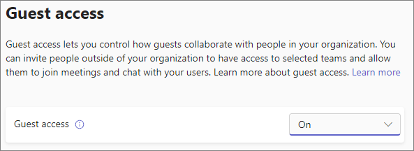

# Turn on or turn off guest access to Microsoft Teams

> [!Note]

> Until **February 2021**, guest access is turned off by default. You must turn on guest access for Teams before admins or team owners can add guests. After you turn on guest access, it might take a few hours for the changes to take effect. If users see the message **Contact your administrator** when they try to add a guest to their team, it's likely that either guest access hasn't been turned on or the settings aren't effective yet.

> After **February 2021**, guest access in Microsoft Teams will be turned on by default for new customers & existing customers who haven't configured this setting. When this change is implemented, if you've not already configured guest access capability in Microsoft Teams, that capability will be enabled in your tenant. If you want guest access to remain disabled for your organization, you'll need to confirm that the guest access setting is set to **Off** instead of **Service default**.

> [!IMPORTANT]
> Turning on guest access depends on settings in Azure Active Directory, Microsoft 365, SharePoint, and Teams. For more information, see [Collaborate with guests in a team](https://docs.microsoft.com/microsoft-365/solutions/collaborate-as-team).

## Configure guest access in the Teams admin center

1. Sign in to the [Microsoft Teams admin center](https://admin.teams.microsoft.com/).

2. Select **Org-wide settings** > **Guest access**.

3. Set **Allow guest access in Microsoft Teams** to **On**.

    

4. Under **Calling**, **Meeting**, and **Messaging**, select **On** or **Off** for each capability, depending on what you want to allow for guest users.

      - **Make private calls** – Turn this setting **On** to allow guests to make peer-to-peer calls.
      - **Allow IP video** - Turn this setting **On** to allow guests to use video in their calls and meetings.
      - **Screen sharing mode** – This setting controls the availability of screen sharing for guest users.
          - Turn this setting to **Disabled** to remove the ability for guests to share their screens in Teams.
          - Turn this setting to **Single application** to allow sharing of individual applications.
          - Turn this setting to **Entire screen** to allow complete screen sharing.
      - **Allow Meet Now** – Turn this setting **On** to allow guests to use the Meet Now feature in Microsoft Teams.
      - **Edit sent messages** - Turn this setting **On** to allow guests to edit messages they previously sent.
      - **Guests can delete sent messages** – Turn this setting **On** to allow guests to delete messages they previously sent.
      - **Chat** – Turn this setting **On** to give guests the ability to use chat in Teams.
      - **Use Giphys in conversations** – Turn this setting **On** to allow guests to use Giphys in conversations. Giphy is an online database and search engine that allows users to search for and share animated GIF files. Each Giphy is assigned a content rating.
      - **Giphy content rating** –  Select a rating from the drop-down list:
          - **Allow all content** - Guests will be able to insert all Giphys in chats, regardless of the content rating.
          - **Moderate** - Guests will be able to insert Giphys in chats, but will be moderately restricted from adult content.
          - **Strict** – Guests can insert Giphys in chats, but will be restricted from inserting adult content.
      - **Use memes in conversations** - Turn this setting **On** to allow guests to use Memes in conversations.
      - **Use Stickers in conversations** – Turn this setting **On** to allow guests to use stickers in conversations.

    

5. Select **Save**.

## External access (federation) vs. guest access

[!INCLUDE [guest-vs-external-access](includes/guest-vs-external-access.md)]

## See also

[Set up secure collaboration with Microsoft 365](https://docs.microsoft.com/microsoft-365/solutions/setup-secure-collaboration-with-teams)

[Block guest users from a specific team](https://docs.microsoft.com/microsoft-365/solutions/per-group-guest-access)

[Set-CsTeamsClientConfiguration](https://docs.microsoft.com/powershell/module/skype/set-csteamsclientconfiguration)
