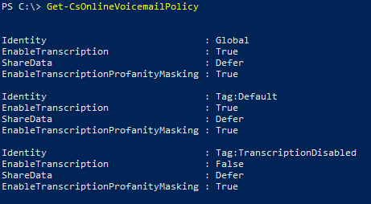

# Set up Cloud Voicemail

This article is for the [Office 365 admin](https://support.office.com/article/da585eea-f576-4f55-a1e0-87090b6aaa9d) who wants to set up the Cloud Voicemail feature for everyone in the business.

> [!NOTE]
> Cloud Voicemail supports depositing voicemail messages only in an Exchange mailbox and doesn't support any third-party email systems. 

## Cloud-only environments: Set up Cloud Voicemail

For Skype for Business Online and Calling Plans users, Cloud Voicemail is automatically set up and provisioned for users after you assign a **Phone System** license and a phone number to them.
  
1. If the Phone System feature isn't included in your plan, you may need to purchase **Phone System** add-on licenses. You may also need to purchase an Exchange Online license. See [Microsoft Teams add-on licensing](teams-add-on-licensing/microsoft-teams-add-on-licensing.md).
    
2. [Assign or remove licenses for Office 365 for business](http://support.office.com/article/997596b5-4173-4627-b915-36abac6786dc), the [Assign Microsoft Teams licenses](assign-teams-licenses.md), and the Exchange Online licenses to the people in your business. After you do that, they will be able to receive voicemail messages!
    
3. Support for voicemail transcription has been added as of March 2017 and is enabled by default for all organizations and users. You can disable transcription for your organization by using Windows PowerShell and following the steps below.

## Phone System with on-premises environments

The following information is about configuring Cloud Voicemail to work with on-premises Calling Plan environments.
  
1. If the Phone System feature isn't included in your plan, you may need to purchase **Phone System** add-on licenses. You also need to purchase an Exchange Online license. See [Microsoft Teams add-on licensing](teams-add-on-licensing/microsoft-teams-add-on-licensing.md).
    
2. [Assign or remove licenses for Office 365 for business](http://support.office.com/article/997596b5-4173-4627-b915-36abac6786dc), the [Assign Microsoft Teams licenses](assign-teams-licenses.md), and the Exchange Online licenses to the people in your business.
    
3. Follow instructions matching on-premises PSTN calling solution deployed for your users. For Cloud Connector Edition, follow instructions in the **Enable users for Phone System voice and voicemail services** section of the [Configure Skype for Business Cloud Connector Edition guide](https://technet.microsoft.com/library/mt605228.aspx). For PSTN calling with Skype for Business Server, follow [Enable the users for Enterprise Voice on premises](https://docs.microsoft.com/en-us/skypeforbusiness/skype-for-business-hybrid-solutions/plan-your-phone-system-cloud-pbx-solution/enable-the-users-for-enterprise-voice-on-premises). For Teams Direct Routing, follow  the **Configure the phone number and enable enterprise voice and voicemail** section of [Configure Direct Routing](https://docs.microsoft.com/en-us/microsoftteams/direct-routing-configure#configure-the-phone-number-and-enable-enterprise-voice-and-voicemail).

4. Support for voicemail transcription has been added as of March 2017 and is enabled by default for all organizations and users. You can disable transcription for your organization by using Windows PowerShell and following the steps below.

5. Voicemail messages are delivered to users' Exchange mailbox via SMTP routed through Exchange Online Protection. To enable successful delivery of these messages, please be sure that Exchange Connectors are configured correctly between your Exchange servers and Exchange Online Protection; [Use Connectors to Configure Mail Flow](https://docs.microsoft.com/en-us/exchange/mail-flow-best-practices/use-connectors-to-configure-mail-flow/use-connectors-to-configure-mail-flow). 

6. To enable Voicemail features such as customizing greetings, and visual voicemail in Skype for Business clients, connectivity from Office 365 to the Exchange server mailbox via Exchange Web Services is required. To enable this connectivity you must configure the new Exchange Oauth authentication protocol described in [Configure OAuth authentication between Exchange and Exchange Online organizations](https://technet.microsoft.com/en-us/library/dn594521(v=exchg.150).aspx), or run the Exchange Hybrid Wizard from Exchange 2013 CU5 or greater. Additionally, you must configure integration and Oauth between Skype for Business Online and Exchange server described in [Configure Integration and OAuth between Skype for Business Online and Exchange Server](https://docs.microsoft.com/en-us/skypeforbusiness/deploy/integrate-with-exchange-server/oauth-with-online-and-on-premises). 

## Setting voicemail policies in your organization

> [!WARNING]
> For Skype for Business customers, disabling voicemail through a Microsoft Teams calling policy might also disable the voicemail service for your Skype for Business users.

Voicemail transcription is enabled by default and transcription profanity masking is disabled by default for all organizations and users; however, you can control them by using the [Set-CsOnlineVoicemailPolicy](https://technet.microsoft.com/library/mt798310.aspx) and [Grant-CsOnlineVoicemailPolicy](https://technet.microsoft.com/library/mt798311.aspx) cmdlets.

Voicemail messages received by users in your organization are transcribed in the region where your Office 365 tenant is hosted. The region where your tenant is hosted might not be the same region where the user receiving the voicemail message is located. To view the region where your tenant is hosted, go to the [Organization profile](https://go.microsoft.com/fwlink/p/?linkid=2067339) page and then click **View details** next to **Data location**.

> [!IMPORTANT]
> You can't create a new policy instance for transcription and transcription profanity masking using the **New-CsOnlineVoiceMailPolicy** cmdlet, and you can't remove an existing policy instance using the **Remove-CsOnlineVoiceMailPolicy** cmdlet.

You can manage the transcription settings for your users using voicemail policies. To see all available voicemail policy instances, you can use the [Get-CsOnlineVoicemailPolicy](https://technet.microsoft.com/library/mt798311.aspx) cmdlet.

 **PS C:\\> Get-CsOnlineVoicemailPolicy**
  

  
### Turning off transcription for your organization

Because the default setting for transcription is on for your organization, you may want to disable it by using [Set-CsOnlineVoicemailPolicy](https://technet.microsoft.com/library/mt798310.aspx). To do this, run:

```
Set-CsOnlineVoicemailPolicy -EnableTranscription $false
```

### Turning on transcription profanity masking for your organization

Transcription profanity masking is disabled by default for your organization. If there is a business requirement to enable it, you can enable transcription profanity masking by using [Set-CsOnlineVoicemailPolicy](https://technet.microsoft.com/library/mt798310.aspx). To do this, run:

```
Set-CsOnlineVoicemailPolicy -EnableTranscriptionProfanityMasking $true
```

### Turning off transcription for a user

User policies are evaluated before the organizational default settings. For example, if voicemail transcription is enabled for all of your users, you can assign a policy to disable transcription for a specific user by using the [Grant-CsOnlineVoicemailPolicy](https://technet.microsoft.com/library/mt798309.aspx) cmdlet.

To disable transcription for a single user, run:

```
Grant-CsOnlineVoicemailPolicy -PolicyName TranscriptionDisabled -Identity sip:amosmar@contoso.com
```

### Turning on transcription profanity masking for a user

To enable transcription profanity masking for a specific user, you can assign a policy to enable transcription profanity masking for a specific user by using the [Grant-CsOnlineVoicemailPolicy](https://technet.microsoft.com/library/mt798309.aspx) cmdlet.

To enable transcription profanity masking for a single user, run:

```
Grant-CsOnlineVoicemailPolicy -PolicyName TranscriptionProfanityMaskingEnabled -Identity sip:amosmar@contoso.com
```

> [!IMPORTANT]
> The voicemail service in Office 365 caches voicemail policies and updates the cache every 4 hours. So, policy changes that you make can take up to 4 hours to be applied.

## Help your users learn Skype for Business voicemail features

We have training information and articles to help your users be successful with Skype for Business voicemail. Point them to the following articles:

- [Check Skype for Business voicemail and options](https://support.office.com/article/2deea7f8-831f-4e85-a0d4-b34da55945a8): This article explains how to listen to your voicemail in Skype for Business, change your voice mail greeting, change your voicemail settings, and listen to your voicemail at different speeds.

- [Skype for Business 2016 training](https://support.office.com/article/eb2081bc-fd0a-4eda-94da-5a39f369ee74)

## Related topics
[Set up Skype for Business Online](/skypeforbusiness/set-up-skype-for-business-online/set-up-skype-for-business-online)

[Here's what you get with Phone System in Office 365](here-s-what-you-get-with-phone-system.md)

[Plan for Skype for Business Server and Exchange Server migration](https://docs.microsoft.com/en-us/SkypeForBusiness/hybrid/plan-um-migration)


