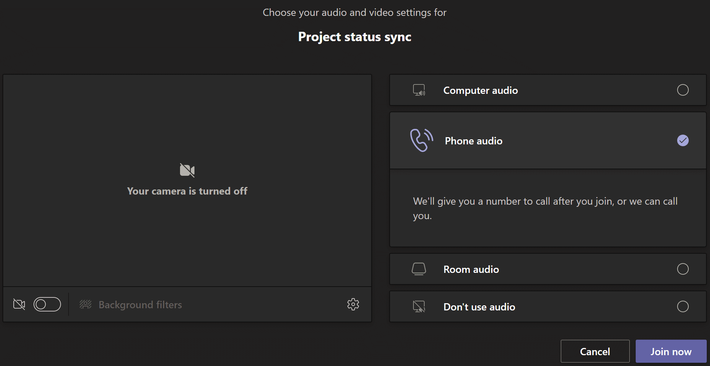
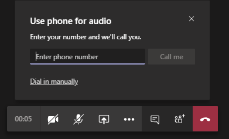
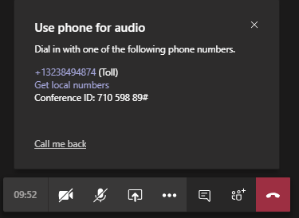
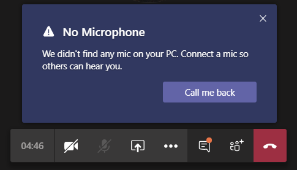

# Set up the Call me feature for your users

In Microsoft Teams, the **Call me** feature gives users a way to join the audio portion of a meeting by phone. This is handy in scenarios when using a computer for audio might not be possible. Users get the audio portion of the meeting through their cell phone or land line and the content portion of the meeting&mdash;such when another meeting participant shares their screen or plays a video&mdash;through their computer.

## The user experience

### Join a meeting by using phone for audio

Click **Join** to join a meeting, and then click **Phone audio** on the  **Choose your audio and video settings** screen. From here, users can have the meeting call and join them or dial in manually to the meeting.

**Let the Teams meeting call**

On the **Use phone for audio** screen, the user enters their phone number, and then clicks **Call me**. The meeting calls the user and joins them to the meeting.

**Dial in manually**

Another way to join is to dial in directly to the meeting. On the **Use phone for audio** screen, click **Dial in manually** to get a list of phone numbers to use to dial in to the meeting.

### Switch to using phone for audio during a meeting

If a user joins a meeting by using their computer and they experience audio or device issues during the meeting, the user can easily switch to using their phone for audio. Teams detects when an audio or device issue occurs and redirects the user to use their phone.

Here's an example of the message and the **Call me back** option that's displayed when Teams doesn't detect a microphone.

The user clicks **Call me back** in the dialog box, which displays the **Use phone for audio** screen. From here, they can enter their phone number and have the Teams meeting call and join them to the meeting or dial in manually to the meeting.

## Set up the Call me feature

To enable the Call me feature for users in your organization, the following must be configured:

- Audio Conferencing is enabled for users in your organization who schedule meetings (meeting organizers). To learn more, see [Set up Audio Conferencing for Teams](set-up-audio-conferencing-in-teams.md) and [Manage the Audio Conferencing settings for a user in Teams](manage-the-audio-conferencing-settings-for-a-user-in-teams.md).

- Users can dial out from meetings. To learn more, see [Manage the Audio Conferencing settings for a user in Teams](manage-the-audio-conferencing-settings-for-a-user-in-teams.md).

If a user doesn't have dial out from meetings enabled, the **Call me** option isn't available and the user won't receive a call to join them to the meeting. Instead, the user sees a list of phone numbers on the **Use phone for audio** screen that they can use to dial in manually to the meeting on their phone.
