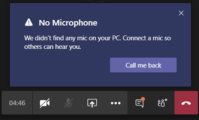

# Set up the Call me feature for your users

In Microsoft Teams, the **Call me** feature gives users a way to join the audio portion of a meeting by phone. This is handy in scenarios when using a computer for audio might not be possible. Users get the audio portion of the meeting through their cell phone or land line and the content portion of the meeting&mdash;such as when another meeting participant shares their screen or plays a video&mdash;through their computer.

> [!IMPORTANT]
> 
> During periods of high meeting volume (which we've been experiencing in conjunction with the COVID-19 outbreak), we recommend that users join meetings by clicking the <strong>Join Teams Meeting</strong> button rather than dialing in by using the PSTN conference numbers or by using <strong>Call me at</strong>. This helps ensure quality audio during times when high meeting volume is causing congestion on the PSTN network.

> [!NOTE]
> [!INCLUDE [updating-admin-interfaces](includes/updating-admin-interfaces.md)]

## The user experience

### Join a meeting by using phone for audio

Click **Join** to join a meeting, then **Phone audio** on the **Choose your video and audio options** screen, and click **Join now**. From here, users can have the meeting call and join them or dial in manually to the meeting.

**Let the Teams meeting call**

On the **Use phone for audio** screen, the user enters their phone number, and then clicks **Call me**. The meeting calls the user and joins them to the meeting.

**Dial in manually**

Another way to join is to dial in directly to the meeting. On the **Use phone for audio** screen, click **Dial in manually** to get a list of phone numbers to use to dial in to the meeting.

### Get a call back when something goes wrong with audio during a meeting

If a user experiences audio issues when using their computer during a meeting, the user can easily switch to using their phone for audio. Teams detects when an audio or device issue occurs and redirects the user to use their phone by displaying a **Call me back** option.

Here's an example of the message and the **Call me back** option that's displayed when Teams doesn't detect a microphone.

The user clicks **Call me back**, which brings up the **Use phone for audio** screen. From here, they can enter their phone number and have the Teams meeting call and join them to the meeting or dial in manually to the meeting.

## Set up the Call me feature

To enable the Call me feature for users in your organization, the following must be configured:

- Audio Conferencing is enabled for users in your organization who schedule meetings (meeting organizers). To learn more, see [Set up Audio Conferencing for Teams](set-up-audio-conferencing-in-teams.md) and [Manage the Audio Conferencing settings for a user in Teams](manage-the-audio-conferencing-settings-for-a-user-in-teams.md).

- Meeting organizer can dial-out from meetings. To learn more, see [Manage the Audio Conferencing settings for a user in Teams](manage-the-audio-conferencing-settings-for-a-user-in-teams.md).

If the meeting organizer doesn't have dial-out from meetings enabled, the **Phone audio** option on the **Choose your video and audio options** screen isn't available to anyone, and other users can't receive a call to join them to the meeting. For users with dial-out enabled, once they have joined the meeting, they can join others dialing their number from the **Show participants** icon.
