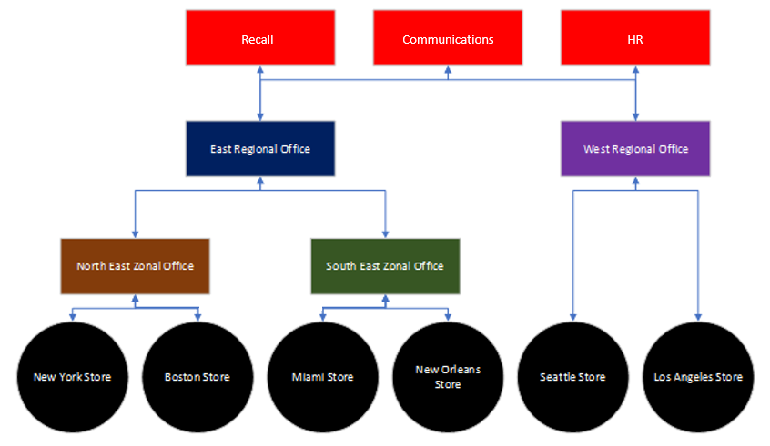

# Set up your team targeting hierarchy

> **This feature is currently in private preview.**

To create a hierarchy of teams that can be used by your organization to publish content to a large set of teams, you need to set up your team targeting schema. The schema defines how all the teams in your hierarchy are related to each other and the attributes that can be used to filter your teams. After you create the schema, you upload it to Teams and the hierarchy is applied throughout your organization. After the schema is uploaded, apps within the Teams client can use it. 

> [!IMPORTANT]
> You won't see a hierarchy of teams when you're browsing teams or channels within them. To see the hierarchy of teams, you need to use an app that supports it. For the initial release, only the Tasks app supports hierarchical teams. The remainder of this article discusses setting up a team hierarchy in the context of publishing tasks to recipient teams. Before you set up your team targeting hierarchy, see [Manage the Tasks app for your organization in Teams](manage-tasks-app.md) for an overview of task publishing.

Here's an example of how the hierarchy is represented in the Tasks app in Teams. After a task list is created, members of the publishing team can then select the recipient teams to send (publish) the task list to. When selecting teams, the publishing team can filter by hierarchy, by attributes, or a combination of both.<br>


## Plan your hierarchy

Before you create the schema that defines your hierarchy, you need to do some planning and decide how you want to shape your organization. This includes deciding which organizational groups need to publish tasks to other groups. Each node in the hierarchy represents a working group or group of groups. Nodes at the bottom of the hierarchy (those without children) are teams that can receive tasks while other nodes (parents) are organizational groups with permission to publish tasks downward. A team can only be represented one time in the hierarchy.

For example, in the following hierarchy, Recall, Retail Communications, and HR, can publish tasks to every bottom node (team) in the hierarchy, whereas North East Zone can only publish tasks to the New York Store and Boston Store teams. This hierarchy allows the Recall, Retail Communications, and HR groups to publish tasks that apply to the entire company, such as benefits information or messages from the CEO. North East Zone can publish tasks, such as personnel scheduling, weather information, and so on, only to the New York Store and Boston Store teams.



## Create your hierarchy

The schema that defines your hierarchy is based on a comma-separated values (CSV) file. Each row in the CSV file corresponds to one node within the hierarchy of teams. Each row contains information that names the node within the hierarchy, optionally links it to a team, and includes attributes that can be used to filter teams in apps that support it.

You can also define buckets, which are categories that the publishing team can use to organize content sent to recipient teams to make it easier for them to view, sort, and focus on relevant content.

### Add required columns

The CSV file must contain the following three columns, in the following order, starting at the first column. A node must be linked to a team for it to receive tasks. During private preview, we support 500 nodes. At launch, we expect to support at least 2,000 nodes by default. We plan to work with customers to raise this limit for larger organizations.

| Column name   | Required | Description   |
----------------|----------|---------------|
| TargetName    | Yes      | This is the name of the node. The name can be up to 100 characters long and contain only the characters A-Z, a-z, and 0-9. Node names must be unique. |
| ParentName    | Yes       | This is the name of the parent node. The value you specify here must match the value in the TargetName field of the parent node exactly. If you want to add more than one parent node, separate each parent node name with a semicolon (;). You can add up to 25 parent nodes, and each parent node name can be up to 2500 characters long. A node can have multiple parent nodes only if the parent nodes are root nodes.   <br><br>**IMPORTANT** Be careful not to create a loop where a parent higher up in the hierarchy references a child node lower in the hierarchy. This isn't supported. |
| TeamId        | Yes, if the team publishes tasks or receives tasks from a parent node       | This contains the ID of the team you want to link a node to. A node must be linked to a team if it's is at the bottom of your hierarchy, if you want users to be able to publish from that node, or if you want users to be able to see reporting for that node and its descendants. For example, if your manager for the West Region Office wants to see task completion reporting for the nodes that belong in that region.<br><br>If you want to add a node only for the purpose of grouping other nodes in the hierarchy, you don't need to link that node to a team and can leave this field blank. You can link each node to only one team.<br>To get the ID of a team you want to link a node to, run the following PowerShell command: `Get-Team | Export-Csv TeamList.csv`. This lists the teams in your organization and includes the name and ID for each team. Find the name of the team you want to link to, and then copy the ID into this field.|

### Add attribute columns

After you add the three required columns, you can add optional attribute columns. These attributes can be used to filter nodes so that you can more easily select the ones you want to publish tasks to. There are two ways to define your attributes, depending on whether values for that attribute are mutually exclusive.

|Ways to add attributes|Description |Example  |
|---|---------|---------|
|If the values for an attribute are mutually exclusive, the column name you specify becomes the name of the attribute.|Each row can contain one value for that attribute, and each value can be up to 100 characters long. The set of attribute values you specify in the attribute column will be displayed as available filter values for that attribute in Teams apps that use the hierarchy. Each attribute column can have up to 50 unique values. |You want users to be able to filter stores by layout. The values for this attribute are mutually exclusive because a store can have only one layout. <br><br>To add an attribute to filter stores by layout, add a column named Store layout. In this example, values for the Store layout attribute are Compact, Standard, and Large.
|If you need to indicate multiple values for an attribute and the values aren't mutually exclusive, use the **AttributeName:UniqueValue** format for the column names. |The text string before the colon (:) becomes the name of the attribute. All columns that contain the same text string before the colon (:) are grouped together into a section in the filtering menu. Each of the strings after the colon become the values for that section.<br><br>Each row can have a value of 0 (zero) or 1 for that attribute. A value of 0 means that the attribute doesn't apply to the node and a value of 1 means that the attribute applies to that node.|You want users to be able to filter stores by department. A store can have multiple departments and so the values for this attribute aren't mutually exclusive.<br><br>In this example, we add Departments:Clothing, Departments:Electronics, Departments:Foods, Departments:Home and Garden, Departments:Sporting goods as attribute columns. Departments becomes the attribute name and users can filter by the Clothing, Electronics, Foods, Home and Garden, and Sporting goods departments.|

When you add an attribute column, keep the following in mind:

- The column name you specify or the column name that you specify before the colon (:) becomes the name of the attribute. This value will be displayed in the Teams apps that use the hierarchy.
- The column name can be up to 100 characters long and contain only the characters A-Z, a-z, and 0-9, and spaces. Column names must be unique.
- At launch, we plan to allow 50 attribute columns.

### Add bucket columns

You can add bucket columns to create buckets, which are groupings into which tasks can be organized. Each bucket gets its own column in the CSV file. The buckets you create are made available to the publishing team. The publishing team can then use these buckets to categorize tasks for the recipient teams. If a bucket doesn't already exist on a team, buckets are created on-demand when tasks are published.

By categorizing the work one time centrally, the publishing team can pre-organize the task list for all the tens, hundreds, or thousands of recipient teams that receive the task list. The recipient teams can then sort and filter their tasks by bucket to focus on the area most relevant to their work.

When you add a bucket column, note the following:

- The column name becomes the name of the bucket. Each bucket you specify will appear in the Buckets list in the Teams apps that use the hierarchy. We recommend that you don't include sensitive information in bucket names. At this time, publishing teams can't remove a bucket through publishing after it's created.
- The column name must be preceded by a hashtag (#). It can be up to 100 characters long and contain only the characters A-Z, a-z, and 0-9. For example, #Operations and #Frozen Goods.
- At launch, we expect to support 25 bucket columns. We plan to work with customers to increase this limit for larger organizations.

### Example

Here's an example of a schema CSV file that would be created to support the hierarchy shown in the image above. This schema contains the following:

- Three required columns named `TargetName`, `ParentName`, and `TeamId`
- Three attribute columns named `Store layout`, `Departments:Clothing`, and `Departments:Foods`
- Three bucket columns named `Fresh Foods`, `Frozen Foods`, and `Womenswear`

The `Store layout` attribute has values that include `Compact`, `Standard`, and `Large`. The `Departments` attribute columns can be set to a value of `0` (zero) or `1`. The `Store` layout and `Departments` attributes aren't shown in the image above. They're added here to help show how attributes can be added to node entries. The same is true for the three bucket columns.


| TargetName             | ParentName                      | TeamId                       | Store layout|Departments:Clothing|Departments:Foods|#Fresh Foods|#Frozen Foods|#Womenswear|
|------------------------|-------------------------|--------------------------------------|-------------|---|---|---|---|---|
| Recall                 |                         | db23e6ba-04a6-412a-95e8-49e5b01943ba |||||||
| Communications         |                         | 145399ce-a761-4843-a110-3077249037fc |||||||
| HR                     |                         | b8f7db91-201c-4cf9-9f7e-90a4894ed8e4 |||||||
| East Regional Office   |                         |                                      |||||||
| West Regional Office   |                         |                                      |||||||
| North East Zone        | East Regional Office    |                                      |||||||
| South East Zone        | East Regional Office    |                                      |||||||
| New York Store         | North East Zone         | e2ba65f6-25e7-488b-b8f0-b8562d5de60a |Large|1|1||||
| Boston Store           | North East Zone         | 0454f08a-0507-437c-969a-682eb2fae7fc |Standard|1|1||||
| Miami Store            | South East Zone         | 619d6e4e-5f68-4b36-8e1f-16c98d7396c1 |Compact|0|1||||
| New Orleans Store      | South East Zone         | 6be960b8-72af-4561-a343-9ac4711874eb |Compact|0|1||||
| Seattle Store          | West Regional Office    | 487c0d20-4e55-4dc2-8187-a24c826e0fee |Standard|1|1||||
| Los Angeles Store      | West Regional Office    | 204a1287-2efb-4a8a-88e0-56fbaf5a2389 |Large|1|1||||

## Apply your hierarchy

> [!IMPORTANT]
> To perform this step, you must install and use the latest version of the Teams PowerShell module from the PowerShell Test Gallery. For steps on how to do this, see [Install the latest Teams PowerShell module from the PowerShell Test Gallery](#install-the-latest-teams-powershell-module-from-the-powershell-test-gallery).

After you've defined your hierarchy in the schema CSV file, you're ready to upload it to Teams. To do this, run the following command. You must be a global admin or Teams service admin to perform this step.

```powershell
Set-TeamTargetingHierarchy -FilePath "C:\ContosoTeamSchema.csv"
```

## Remove your hierarchy

> [!IMPORTANT]
> To perform this step, you must install and use the latest version of the Teams PowerShell module from the PowerShell Test Gallery. For steps on how to do this, see [Install the latest Teams PowerShell module from the PowerShell Test Gallery](#install-the-latest-teams-powershell-module-from-the-powershell-test-gallery).

If you want to immediately disable the **Published lists** tab for all users in your organization, you can remove your hierarchy. Users won't have access to the **Published lists** tab or any of the functionality on the tab.  This includes the ability to create new task lists to publish, access draft lists, publish, unpublish, and duplicate lists, and view reporting. Removing the hierarchy doesn't unpublish tasks that were previously published. These tasks will remain available for recipient teams to complete. 

To remove your hierarchy, run the following command. You must be an admin to perform this step. 

```powershell
Remove-TeamTargetingHierarchy
```

### Teams Powershell module

#### Install the latest Teams PowerShell module from the PowerShell Test Gallery

The latest publicly available version of the Teams PowerShell module (currently [1.0.5](https://www.powershellgallery.com/packages/MicrosoftTeams/1.0.5)) doesn't support managing the team hierarchy. Use these steps to install the latest version of the Teams PowerShell module, with team hierarchy support, from the PowerShell Test Gallery.

> [!NOTE]
> Don't install the Teams PowerShell module from the PowerShell Test Gallery side-by-side with a version of the module from the public PowerShell Gallery. Follow these steps to first uninstall the Teams PowerShell module from the public PowerShell Gallery, and then install the latest version of the module from the PowerShell Test Gallery.

1. Close all existing PowerShell sessions.
2. Start a new instance of the Windows PowerShell module.
3. Run the following to uninstall the Teams PowerShell module from the public PowerShell Gallery:

    ```PowerShell
    Uninstall-Module -Name MicrosoftTeams
    ```

4. Close all existing PowerShell sessions.
5. Start the Windows PowerShell module again, and then run the following to register the PowerShell Test Gallery as a trusted source:

    ```PowerShell
    Register-PSRepository -Name PSGalleryInt -SourceLocation https://www.poshtestgallery.com/ -InstallationPolicy Trusted
    ```

6. Run the following to install the latest Teams PowerShell module from the PowerShell Test Gallery:

    ```PowerShell
    Install-Module -Name MicrosoftTeams -Repository PSGalleryInt -Force
    ```

7. Run the following to verify that the latest version of the Teams PowerShell module from the PowerShell Test Gallery is successfully installed:

    ```PowerShell
    Get-Module -Name MicrosoftTeams
    ```

#### Update to the latest version of the Teams PowerShell module from the PowerShell Test Gallery

If you already installed the Teams PowerShell module from the PowerShell Test Gallery, use the following steps to update to the latest version.

1. Close all existing PowerShell sessions.
2. Start a new instance of the Windows PowerShell module.
3. Run the following to update the currently installed version of the Teams PowerShell module from the PowerShell Test Gallery:

    ```PowerShell
    Update-Module -Name MicrosoftTeams -Force
    ```

4. Run the following to verify that the latest version of the Teams PowerShell module from the PowerShell Test Gallery is successfully installed:

    ```PowerShell
    Get-Module -Name MicrosoftTeams
    ```

## Troubleshooting

### You receive an error message when you upload your schema file

Take note of the error message as it should include troubleshooting information to indicate why the schema couldn't be uploaded. Review and edit your schema CSV file based on the information in the error message and then try again.

## Related topics

- [Manage the Tasks app for your organization in Teams](manage-tasks-app.md)
