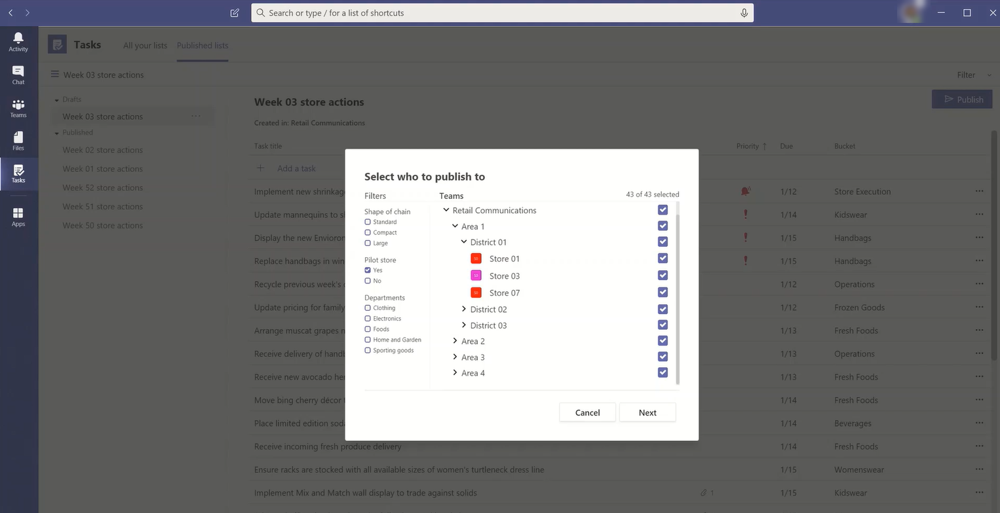

# Set up your team targeting hierarchy

Setting up a team targeting hierarchy will allow your organization to publish content to a large set of teams. The team targeting hierarchy defines how all the teams in your hierarchy are related to each other, which users can publish tasks, and which teams users have permissions to publish to. Publishing features are disabled for all users unless a team targeting hierarchy is set up for your organization. To set up a team targeting hierarchy, you'll need to create a file that defines the hierarchy and then upload it to Teams to apply it to your organization. After the schema is uploaded, apps within Teams can use it.

> [!IMPORTANT]
> For the initial release, only the Tasks app supports hierarchical teams.  Applying a team targeting hierarchy to your organization will enable [task publishing](https://support.microsoft.com/office/publish-task-lists-to-create-and-track-work-in-your-organization-095409b3-f5af-40aa-9f9e-339b54e705df) in the Tasks app. You won't see a hierarchy of teams in other areas of Microsoft Teams.

Here's an example of how the hierarchy is represented in the Tasks app in Teams. After a task list is created, members of the publishing team can then select the recipient teams to send (publish) the task list to. When selecting teams, the publishing team can filter by hierarchy, by attributes, or a combination of both.<br>



## Terminology

The following terms will be important as you navigate hierarchies. Teams will be referred to as **nodes**.

* **Root nodes** are the topmost nodes in the hierarchy. In the example, Retail Communications is a root node.
* **Parent nodes** and **child nodes** are terms that represent a relationship between two connected nodes. In the example, District 01 is a child node of Area 1.
* Multiple levels of children are referred to as **descendants**. District 01, Store 01, Store 03, Store 07, District 02, and District 03 are all descendants of Area 1.
* A node with no children is called a **leaf node**. They are at the bottom of a hierarchy.
* **Recipient teams** are teams that have been selected to receive a specific set of content to be published. They must be leaf nodes.

## Plan your hierarchy

Before you create the schema that defines your hierarchy, you need to do some planning and decide how you want to shape your organization.  One of the first priorities is deciding which organizational groups need to publish tasks to other groups. Each node in the hierarchy represents a working group or group of groups.

### Permissions to publish

Permission to publish depends on whether a user is a member of any teams in the hierarchy plus the relationship of that team or set of teams to other teams in the hierarchy.

> [!NOTE]
> The owner of a team is also granted publishing permissions.

* If a user is a member of at least one team that has descendants in the hierarchy, that user can publish to those descendants without being a member of all teams they want to publish to.
* If a user is a member of a least one team in the hierarchy but isn't a member of any team with descendants in the hierarchy, that user can see and receive published content from their organization.
* If a user isn't a member of any team in the hierarchy, that user won't see any publishing-related functionality.

### Guidelines

* There can only be one hierarchy file applied per organization. However, you can include different parts of your organization together as distinct hierarchies of nodes within one file. For example, Contoso Pharmaceuticals has a Pharmacy root node and a Retail root node. Both root nodes have multiple rows of descendants and there's no overlap between them.
* Only leaf nodes can be recipients of a publication. Other nodes in the hierarchy are helpful for selecting recipients of a publication.
* A team can only be represented one time in a hierarchy.
* A hierarchy can contain up to 15,000 nodes. We plan to work with customers to raise this limit for larger organizations.

### Example hierarchy

For example, in the following hierarchy, Recall, Communications, and HR can publish tasks to every bottom node (team) in the hierarchy, but Northeast Zone can only publish tasks to the New York Store and Boston Store teams. The example hierarchy allows the Recall, Communications, and HR groups to publish tasks that apply to the entire company, such as benefits information or messages from the CEO. Northeast Zone can publish tasks like personnel scheduling, weather information, and so on, only to the New York Store and Boston Store teams.


## Create your hierarchy

> [!NOTE]
> The remainder of this article discusses setting up a team hierarchy in the context of publishing tasks to recipient teams. Refer to [Manage the Tasks app for your organization in Teams](./manage-tasks-app.md) for an overview of the Tasks app, where task publishing appears when enabled.

The schema that defines your hierarchy is based on a comma-separated values (CSV) file. The file must be in UTF-8 format. Each row in the CSV file corresponds to one node within the hierarchy of teams. Each row contains information that names the node within the hierarchy, optionally links it to a team, and includes attributes that can be used to filter teams in apps that support it.

You can also define **buckets**, which are categories that the publishing team can use to organize content sent to recipient teams to make it easier for them to view, sort, and focus on relevant content.

### Add required columns

The CSV file must contain the following three columns, in the following order, starting at the first column. A node must be linked to a team for it to receive tasks.

| Column name   | Required | Description   |
----------------|----------|---------------|
| DisplayName    | Yes      | This field is the name of the node. The name can be up to 100 characters long and contain only the characters A-Z, a-z, and 0-9. Node names must be unique. |
| ParentName    | Yes       | This is the name of the parent node. The value you specify here must match the value in the **DisplayName** field of the parent node exactly. If you want to add more than one parent node, separate each parent node name with a semicolon (;). You can add up to 25 parent nodes, and each parent node name can be up to 2500 characters long. A node can have multiple parent nodes only if the parent nodes are root nodes.   <br><br>**IMPORTANT** Be careful not to create a loop where a parent higher up in the hierarchy references a child node lower in the hierarchy. This isn't supported. |
| TeamId        | Yes, if the team publishes tasks or receives tasks from a parent node       | This contains the ID of the team you want to link a node to. Each node must refer to a unique team, so each TeamId value may appear only once in the hierarchy file. To get the ID of a team you want to link a node to, run the following PowerShell command: `Get-Team | Export-Csv TeamList.csv`. This command lists the teams in your organization and includes the name and ID for each team. Find the name of the team you want to link to, and then copy the ID into this field.|

> [!NOTE]
> If a node isn't a root node or a leaf node and you don't need the team membership to grant the corresponding permissions for publishing and reporting, you can leave the TeamId blank. This method can be used to add more granularity when choosing recipient teams or for viewing completion reports without having a corresponding team.

### Add attribute columns

After you add the three required columns, you can add optional attribute columns. These attributes can be used to filter nodes so that you can more easily select the ones you want to publish tasks to. There are two ways to define your attributes, depending on whether values for that attribute are mutually exclusive.

|Ways to add attributes|Description |Example  |
|---|---------|---------|
|If the values for an attribute are mutually exclusive, the column name you specify becomes the name of the attribute.|Each row can contain one value for that attribute, and each attribute column can have up to 50 unique values. Each value can be up to 100 characters long. The set of attribute values you specify in the attribute column will be displayed as filter values for that attribute when selecting recipient teams using the team targeting hierarchy.|You want users to be able to filter stores by layout. The values for this attribute are mutually exclusive because a store can have only one layout. <br><br>To add an attribute to filter stores by layout, add a column named Store layout. In this example, values for the Store layout attribute are Compact, Standard, and Large.
|If you need to indicate multiple values for an attribute and the values aren't mutually exclusive, use the **AttributeName:UniqueValue** format for the column names. <br><br>**IMPORTANT** Make sure to use the English-only colon (:) as unicode isn't supported as an attribute column delimiter. |The text string before the colon (:) becomes the name of the attribute. All columns that contain the same text string before the colons (:) are grouped together into a section in the filtering menu. Each of the strings after the colon become the values for that section.<br><br>Each row can have a value of 0 (zero) or 1 for that attribute. A value of 0 means that the attribute doesn't apply to the node and a value of 1 means that the attribute applies to that node.|You want users to be able to filter stores by department. A store can have multiple departments and so the values for this attribute aren't mutually exclusive.<br><br>In this example, we add Departments:Clothing, Departments:Electronics, Departments:Foods, Departments:Home and Garden, Departments:Sporting goods as attribute columns. Departments becomes the attribute name and users can filter by the Clothing, Electronics, Foods, Home and Garden, and Sporting goods departments.|

When you add an attribute column, keep the following in mind:

* The column name you specify or the column name that you specify before the colon (:) becomes the name of the attribute. This value will be displayed in the Teams apps that use the hierarchy.
* You can have up to 50 attribute columns in your hierarchy.
* The column name can be up to 100 characters long and contain only the characters A-Z, a-z, and 0-9, and spaces. Column names must be unique.

### Add bucket columns

You can add bucket columns to create buckets, which are groupings into which tasks can be organized. Each bucket gets its own column in the CSV file. The buckets you create are made available to the publishing team. The publishing team can then use these buckets to categorize tasks for the recipient teams. If a bucket doesn't already exist on a team, buckets are created on-demand when tasks are published.

By categorizing the work items one time centrally, the publishing team can pre-organize the task list for all the tens, hundreds, or thousands of recipient teams that receive the task list. The recipient teams can then sort and filter their tasks by bucket to focus on the area most relevant to their work.

When you add a bucket column, note the following:

* The column name becomes the name of the bucket. Each bucket you specify will appear in the Buckets list in the Teams apps that use the hierarchy.
* We recommend that you don't include sensitive information in bucket names. At this time, publishing teams can't remove a bucket through publishing after it's created.
* The column name must be preceded by a hashtag (#). It can be up to 100 characters long and contain only the characters A-Z, a-z, and 0-9. For example, #Operations and #Frozen Goods.
* A hierarchy may contain up to 25 bucket columns. We plan to work with customers to increase this limit for larger organizations.

### Example

Here's an example of a schema CSV file that would be created to support the hierarchy shown in the previous image. This schema contains the following:

* Three required columns named `TargetName`, `ParentName`, and `TeamId`
* Three attribute columns named `Store layout`, `Departments:Clothing`, and `Departments:Foods`
* Three bucket columns named `Fresh Foods`, `Frozen Foods`, and `Women's Wear`

The `Store layout` attribute has values that include `Compact`, `Standard`, and `Large`. The `Departments` attribute columns can be set to a value of `0` (zero) or `1`. The `Store` layout and `Departments` attributes aren't shown in the image above. They're added here to help show how attributes can be added to node entries. The same is true for the three bucket columns.

```CSV
TargetName,ParentName,TeamId,Store layout,Departments:Clothing,Departments:Foods,#Fresh Foods,#Frozen Foods,#Women's Wear
Recall,,db23e6ba-04a6-412a-95e8-49e5b01943ba,,,,,,
Communications,,145399ce-a761-4843-a110-3077249037fc,,,,,,
HR,,125399ce-a761-4983-a125-3abc249037fc,,,,,,
East Regional Office,HR;Communications;Recall,,,,,,,
West Regional Office,HR;Communications;Recall,,,,,,,
Northeast Zone,East Regional Office,,,,,,,
Southeast Zone,East Regional Office,,,,,,,
New York Store,Northeast Zone,e2ba65f6-25e7-488b-b8f0-b8562d5de60a,Large,1,1,,,
Boston Store,Northeast Zone,0454f08a-0507-437c-969a-682eb2fae7fc,Standard,1,1,,,
Miami Store,Southeast Zone,619d6e4e-5f68-4b36-8e1f-16c98d7396c1,Compact,0,1,,,
New Orleans Store,Southeast Zone,6be960b8-72af-4561-a343-9ac4711874eb,Compact,0,1,,,
Seattle Store,West Regional Zone,487c0d20-4e55-4dc2-8187-a24c826e0fee,Standard,1,1,,,
Los Angeles Store,West Regional Zone,204a1287-2efb-4a8a-88e0-56fbaf5a2389,Large,1,1,,,
```

## Apply your hierarchy

> [!NOTE] 
> To perform this step, you must install and use the Teams PowerShell public preview module from the PowerShell Gallery. For steps on how to install the module, see Install Teams PowerShell.

> [!NOTE]
> Government Community Cloud (GCC) customers must use [cmdlet preview version 2.4.0-preview](https://www.powershellgallery.com/packages/MicrosoftTeams/2.4.0-preview) or later to ensure data is routed to the GCC environment, rather than the public cloud environment.

After you've defined your hierarchy in the schema CSV file, you're ready to upload it to Teams. To do this, run the following command. You must be a global admin or Teams service admin to do this step.

```powershell
Set-TeamTargetingHierarchy -FilePath "C:\ContosoTeamSchema.csv"
```

### Update your hierarchy

You can upload a new hierarchy to replace the old one using the same PowerShell command as above. Each time you upload a new hierarchy, it replaces the previous hierarchy.

### Check the status of your hierarchy

You can run the following command to check the status of your hierarchy upload.

```powershell
Get-TeamTargetingHierarchyStatus
```

The command will return the following fields:

Field|Description
-----|------------
Id | The unique ID for the upload.
Status | Upload status. Values include **Starting**, **Validating**, **Successful**, and **Failed**
ErrorDetails | Details if there's an upload error. For more information about the error details, see the Troubleshooting section. If there's no error, this field is blank.
LastUpdatedAt | Timestamp and date of when the file was last updated.
LastModifiedBy | The ID of the last user who modified the file.
FileName | The file name of the CSV.

## Remove your hierarchy

If you want to immediately disable the **Published lists** tab for all users in your organization, you can remove your hierarchy. Users won't have access to the **Published lists** tab or any of the functionalities on the tab.  This includes the ability to create new task lists to publish, access draft lists, publish, unpublish, and duplicate lists, and view reporting. Removing the hierarchy doesn't unpublish tasks that were previously published. These tasks will remain available for recipient teams to complete.

To remove your hierarchy, run the following command. You must be an admin to perform this step.

```powershell
Remove-TeamTargetingHierarchy
```

When confirming deletion, the status message will still display the previous schema is present, although attempting to delete again returns an error that the object is null.

## Create a sample hierarchy

### Install the Teams PowerShell module

> [!IMPORTANT]
> To perform this step, you must install and use the Teams PowerShell public preview module from the [PowerShell Gallery](https://www.powershellgallery.com/packages/MicrosoftTeams/). For steps on how to install the module, see [Install Teams PowerShell](teams-powershell-install.md).

### Sample script

The following script can be used to create the teams and upload a .csv file to your Microsoft Teams tenant. If you have an existing hierarchy, this script will replace it.

#### Create teams for a simple hierarchy

```powershell
$tm1 = New-Team -DisplayName "HQ"
$tm2 = New-Team -DisplayName "North"
$tm3 = New-Team -DisplayName "Store 1"
$tm4 = New-Team -DisplayName "Store 2"
$tm5 = New-Team -DisplayName "South"
$tm6 = New-Team -DisplayName "Store 3"
$tm7 = New-Team -DisplayName "Store 4"
```

#### Use team data to create comma-separated output (DisplayName, ParentName, TeamId)

```powershell
$csvOutput = "DisplayName" + "," + "ParentName" + "," + "TeamId" + "`n"
$csvOutput = $csvOutput + $tm1.DisplayName + "," + "," + $tm1.GroupID + "`n"
$csvOutput = $csvOutput + $tm2.DisplayName + "," + $tm1.DisplayName + "," + $tm2.GroupID + "`n"
$csvOutput = $csvOutput + $tm3.DisplayName + "," + $tm2.DisplayName + "," + $tm3.GroupID + "`n"
$csvOutput = $csvOutput + $tm4.DisplayName + "," + $tm2.DisplayName + "," + $tm4.GroupID + "`n"
$csvOutput = $csvOutput + $tm5.DisplayName + "," + $tm1.DisplayName + "," + $tm5.GroupID + "`n"
$csvOutput = $csvOutput + $tm6.DisplayName + "," + $tm5.DisplayName + "," + $tm6.GroupID + "`n"
$csvOutput = $csvOutput + $tm7.DisplayName + "," + $tm5.DisplayName + "," + $tm7.GroupID 
```

#### Save output to a .csv file in the **Downloads** folder

```powershell
$csvOutputPath = $env:USERPROFILE + "\downloads\testhierarchy-" + (Get-Date -Format "yyyy-MM-dd-hhmmss") + ".csv" 
$csvOutput | Out-File $csvOutputPath
```

#### Upload the hierarchy

```powershell
Set-TeamTargetingHierarchy -FilePath $csvOutputPath
Get-TeamTargetingHierarchyStatus
```

## Troubleshooting

### How to view error details

You can run the following command to understand what is causing an error and return the error details.

```powershell
(Get-TeamTargetingHierarchyStatus).ErrorDetails.ErrorMessage
```

### You receive an error message when you upload your schema CSV file

Take note of the error message as it should include troubleshooting information to indicate why the schema couldn't be uploaded. Review and edit your schema CSV file based on the information in the error message and then try again.

### You receive an "Error: InvalidTeamId" error message when you upload your schema CSV file

When you try to upload your schema CSV file, you get the following error message:

```console
Error: InvalidTeamId
Description: TeamID in row # doesn't match a valid Group ID. Please view our documentation to learn how to get the proper GroupID for each team.
```

Check to make sure that you're using the correct TeamId for the team in your schema CSV file. The TeamId should be the same as the Group ID of the Microsoft 365 group that backs the team. You can look up the Group ID of the team in the Microsoft Teams admin center.

1. In the left navigation of the [Microsoft Teams admin center](https://admin.teams.microsoft.com/), go to **Teams** > **Manage teams**.
2. If the **Group ID** column isn't displayed in the table, select **Edit columns** in the upper-right corner of the table, and then turn on **Group ID**.
3. Find the team in the list, and then locate the Group ID.

Make sure that the TeamId in your schema CSV file matches the Group ID that's displayed in the Microsoft Teams admin center.

## Related topics

* [Manage the Tasks app for your organization in Teams](manage-tasks-app.md)
* [Teams PowerShell overview](teams-powershell-overview.md)
