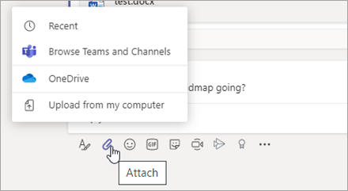
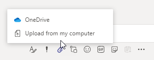
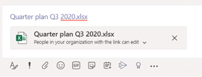
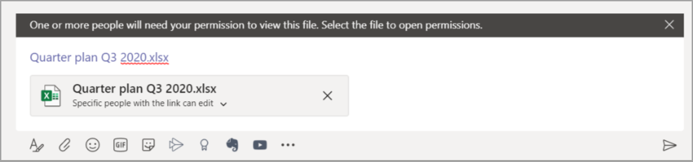

# Sharing files in Microsoft Teams

In Microsoft Teams, users can share content with other Teams users within and outside their organization. Sharing files and folders in Teams is based on the settings configured in SharePoint and OneDrive, so whatever you set up for SharePoint and OneDrive will affect sharing in Teams as well.

## Overview

Users can share files from OneDrive, from teams and sites they have access to, and from their computer. To share a file, users can do the following:

- In a channel, click **Attach** (the paperclip icon), select **Recent**, **Browse Teams and Channels**, **OneDrive**, or **Upload from my computer**, and then choose the file they want to share.   
    
- In a chat, click **Attach** (the paperclip icon), select  or **OneDrive** or **Upload from my computer**, and then choose the file they want to share.  
    
- Copy and paste the sharing link in the compose box. 
    

### Permissions of shared files and sharing links

When users share a file from within Teams, they can set who can access the file just like they do across Microsoft 365. They can give access to anyone, people in your organization, people with existing access, or specific people (which can include the people in a 1:1 chat, group chat, or channel).  When a file is shared, the file preview is available in the message, along with all file actions such as **Open online**, **Download**, and **Copy link**. By default, the file opens in Teams.

When users share a file in a chat or channel, they're notified whether some or all recipients don't have permission to view the file. They can change the permissions on the file before they share it by clicking the arrow next to the file preview that now appears in the message.

## Related topics

[How SharePoint Online and OneDrive for Business interact with Microsoft Teams](sharepoint-onedrive-interact.md)

[Change the default link type for a site](/sharepoint/change-default-sharing-link)

[Collaborate with guests in a team](/microsoft-365/solutions/collaborate-as-team)