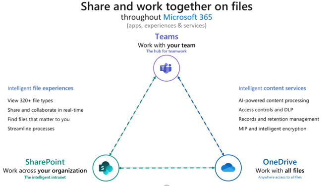
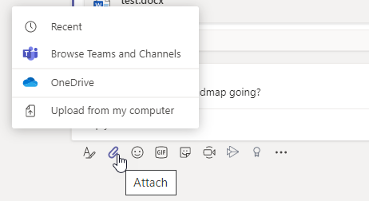
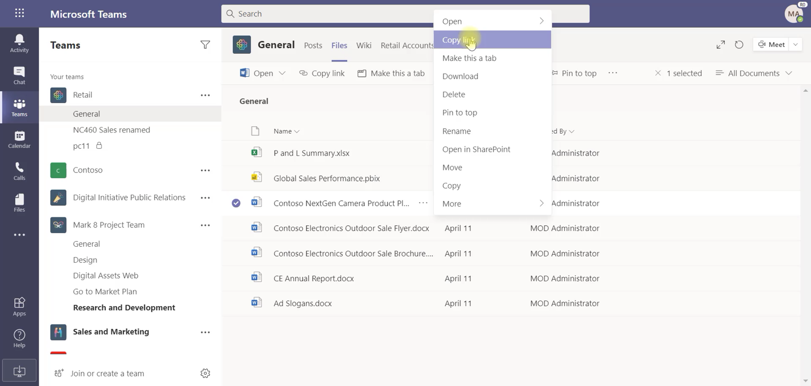
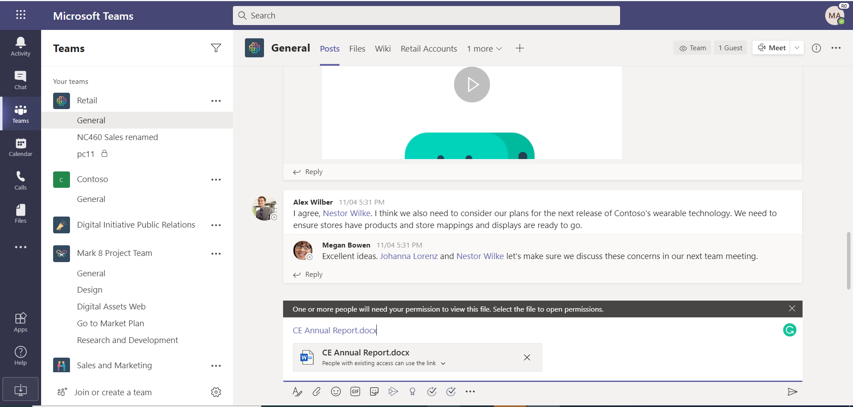

# Sharing files in Microsoft Teams

The Sharelink feature in Microsoft Teams lets users share content with other Teams users within and outside their organization. Sharing in Teams is based on the settings configured in SharePoint and OneDrive, so whatever you set up for SharePoint and OneDrive will control sharing in Teams as well.

## Overview

With the Sharelink feature, users can share files from OneDrive and from teams and sites they have access to. To share a file, users can do the following:

- In a chat, click **Attach** (the paperclip icon), select **Recent**, **Browse Teams and Channels**, or **OneDrive**, and then choose the file they want to share.  
    
- Copy and paste the sharing link in the compose box.

    

### What you need to know about the Sharelink file sharing experience

### Permissions of a shared file or sharing link

When users share a file by browsing to it in OneDrive or teams, and channels, all recipients are granted access along with the [default permission that's set at the organization level](https://docs.microsoft.com/sharepoint/change-default-sharing-link). 

When a user copies and pastes a sharing link, the permissions set on that sharing link are honored and the SharePoint URL is shortened to the file name. In other words, Teams uses just the file name to link to a file.

When users share a file from within Teams, they can set who can access the file. They can give access to anyone, people in your organization, people with existing access, or specific people (which can include the people in a 1:1 chat, group chat, or channel).

When users share a file in a chat or channel, they're notified whether some or all the recipients don't have permission to view the file. They can change the permissions on the file before they share it by clicking the arrow next to the file preview that now appears in the message.

When a file is shared, the file opens by default in Teams and is available as a file preview in the message, along with all available file actions. In some cases, the sharing link may not have converted to a preview by the time a user sends the message. The file preview will be generated asynchronously, but in this scenario, the sharing link won't be shortened to the only the file name.

### Get link is now Copy link

The **Get link** option in Teams has been changed to **Copy link**. Users can copy a SharePoint file link and change sharing permissions just like they do across Microsoft 365. The default permission of the link is the same as the default permission set at the organization level unless SharePoint site level permissions override it.

  

## Configure sharing in OneDrive and SharePoint

For more information about sharing files in OneDrive and SharePoint, including how to configure sharing and how to turn sharing on and off, see:

- [External sharing overview](https://docs.microsoft.com/sharepoint/external-sharing-overview) - describes what happens when users share, depending on what they're sharing and with whom.

- [Turn external sharing on or off](https://docs.microsoft.com/sharepoint/turn-external-sharing-on-or-off) - describes how global and SharePoint admins can change their organization-level sharing settings for SharePoint and OneDrive.

- [Change external sharing for a site](https://docs.microsoft.com/sharepoint/change-external-sharing-site) – describes how global and SharePoint admins can turn external sharing on or off for a site.

- [Change the default link type when users get links for sharing](https://docs.microsoft.com/sharepoint/change-default-sharing-link) - describes how to set the default link type so that it's more restrictive.

## More information

- [How SharePoint Online and OneDrive for Business interact with Microsoft Teams](sharepoint-onedrive-interact.md)

- [SharePoint and Teams: better together](https://techcommunity.microsoft.com/t5/Microsoft-SharePoint-Blog/SharePoint-and-Teams-Better-Together/ba-p/189593)

- [Share OneDrive files and folders](https://support.office.com/article/Share-OneDrive-files-and-folders-9fcc2f7d-de0c-4cec-93b0-a82024800c07#OS_Type=OneDrive_-_Business)

- [Share SharePoint files or folders](https://support.office.com/article/share-sharepoint-files-or-folders-1fe37332-0f9a-4719-970e-d2578da4941c)
