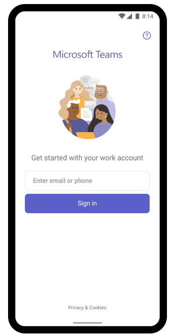

# How different technologies affect Microsoft Teams sign-in

If you need to understand how technologies like single sign-on (SSO), modern authentication (MS), and multifactor authentication (MA) affect users' experience of sign-in, this article helps clarify what users and admins can expect to see. It also outlines the sign-in behavior for macOS, Android, and iOS devices, how sign-in works using multiple accounts, how to remove automatically filled credentials or "pre-fill" at the sign-in screen, how to restrict sign-in, and how to simplify the sign-in experience with domain-less sign-in on shared and managed mobile devices.

Bookmark this article if your role involves knowing Microsoft Team's expected behaviors during sign-in.

## Microsoft Teams and Windows users: sign-in recommendations

Microsoft recommends that organizations use recent versions of Windows 10 with either Hybrid Domain Join or Microsoft Entra join configuration. Using recent versions ensures that users' accounts are primed in Windows' Web Account Manager, which in turn enables single sign-on to Teams and other Microsoft applications. Single sign-on provides a better user experience (silent sign-in) and a better security posture.

Microsoft Teams uses modern authentication to keep the sign-in experience simple and secure. To see how users sign in to Teams, read [Sign in to Teams](https://support.office.com/article/sign-in-to-teams-ea4b1443-d11b-4791-8ae1-9977e7723055).

### How modern authentication (MA) affects your sign-in: what users will see when MA is on

Modern authentication is part of a process that lets Teams know that users have already entered their credentials&mdash;such as their work email and password&mdash;elsewhere, and they shouldn't be required to enter them again to start the app. The experience varies depending on a couple factors, like if users are working in a Windows operating system, or on a Mac.

Sign-in behavior will also vary depending on whether your organization has enabled single-factor authentication or multifactor authentication. Multifactor authentication usually involves verifying credentials via a phone, providing a unique code, entering a PIN, or presenting a thumbprint. 

Modern authentication is available for every organization that uses Teams. If users aren't able to complete the process, there might be an underlying issue with your organization's Microsoft Entra configuration. For more information, see [Why am I having trouble signing in to Microsoft Teams?](https://support.office.com/article/why-am-i-having-trouble-signing-in-to-microsoft-teams-a02f683b-61a3-4008-9447-ee60c5593b0f)

Here's a rundown of the behavior users can expect with each modern authentication scenario.

- If users already signed in to Windows or to other Office apps with their work or school account, when they start Teams they're taken straight to the app. There's no need for them to enter their credentials.

- Microsoft recommends using Windows 10 version 1903 or later for the best single sign-on experience.

- If users aren't signed in to their Microsoft work or school account anywhere else, when they start Teams, they're asked to provide either single-factor or multifactor authentication (SFA or MFA). This process depends on what your organization has decided they'd like the sign-in procedure to require.

- If users are signed in to a domain-joined computer, when they start Teams, they might be asked to go through one more authentication step, depending on whether your organization opted to require MFA or if their computer already requires MFA to sign in. If their computer already requires MFA to sign in, when they open up Teams, the app automatically starts.

- On domain-joined PCs, when SSO isn't possible, Teams may pre-fill its sign-in screen with the user principal name (UPN). There are cases where you may not want this, especially if your organization uses different UPNs on-premises and in Microsoft Entra ID. If that's the case, **you can use the following Windows registry key to turn off pre-population of the UPN**:

  Computer\HKEY_CURRENT_USER\Software\Microsoft\Office\Teams<br/>
  SkipUpnPrefill(REG_DWORD)<br/>
  0x00000001 (1)

    > [!NOTE]
    > Skipping or ignoring user name pre-fill for user names that end in ".local" or ".corp" is on by default, so you don't need to set a registry key to turn these off.

### Microsoft Teams sign-in to another account on a domain-joined computer

Users on domain-joined computer may not be able to sign in to Teams with another account in the same Active Directory domain.

## macOS users and Microsoft Teams sign-in prompts

On macOS, Teams will prompt users to enter their username and credentials and may prompt for multifactor authentication depending on your organization's settings. Once users enter their credentials, they won't be required to provide them again. From that point on, Teams automatically starts whenever they're working on the same computer.

## Microsoft Teams sign-in for iOS and Android users

Upon sign in, mobile users will see a list of all the Microsoft 365 accounts that are either currently signed-in or were previously signed-in on their device. Users can tap on any of the accounts to sign in. There are two scenarios for mobile sign in:

1. If the selected account is currently signed in to other Office 365 or Microsoft 365 apps, then the user is taken straight to Teams. There's no need for the user to enter their credentials.

2. If the user isn't signed in to their Microsoft 365 account anywhere else, they're asked to provide single-factor or multifactor authentication (SFA or MFA), depending on what your organization configured for mobile sign-in policies.

> [!NOTE]
> For users to experience the sign-n experience as described in this section, their devices must be running Teams for iOS version 2.0.13 (build 2020061704) or later, or Teams for Android version 1416/1.0.0.2020061702 or later.

## Using Microsoft Teams with multiple accounts

Teams for iOS and Android supports the use of multiple work or school and multiple personal accounts side by side. Teams desktop applications will support one work/school and one personal account side by side in December 2020, with support for multiple work/school accounts coming at a later date.

The following images show how users can add multiple accounts in Teams mobile applications.

:::image type="content" source="media/sign-in-multiple-accounts.png" alt-text="Adding multiple accounts in Teams." lightbox="media/sign-in-multiple-accounts.png":::

## Restrict sign-in to Microsoft Teams

Organization may want to restrict how corporate-approved apps are used on managed devices, for example to restrict students' or employees' ability to access data from other organizations or use corporate-approved apps for personal scenarios. These restrictions can be enforced by setting Devices Policies that Teams applications recognize.

### How to restrict Microsoft Teams sign-in on mobile devices

Teams app for iOS and Android on enrolled devices can be configured to only allow a single corporate account to be provisioned within the app. This capability works with any MDM provider that uses the [Managed App Configuration](https://developer.apple.com/library/archive/samplecode/sc2279/Introduction/Intro.html) channel for iOS or the [Android Enterprise](https://developer.android.com/work/managed-configurations) channel for Android.

For users enrolled in Microsoft Intune, you can deploy the account configuration settings using the Intune portal.

Once account setup configuration has been configured in the MDM provider, and after the user enrolls their device, on the sign-in page, Teams for iOS and Android will only show the allowed account(s) on the Teams sign-in page. The user can tap on any of the allowed accounts on this page to sign in.

Set the following configuration parameters in the Azure Intune portal for managed devices.

|Platform |Key  |Value  |
|---------|---------|---------|
|iOS     |  **IntuneMAMAllowedAccountsOnly**       | **Enabled**: The only account allowed is the managed user account defined by the IntuneMAMUPN key.<br> **Disabled** (or any value that isn't a case insensitive match to **Enabled**): Any account is allowed.        |
|iOS     |   **IntuneMAMUPN**      |   UPN of the account allowed to sign in to Teams.<br> For Intune enrolled devices, the {{userprincipalname}} token may be used to represent the enrolled user account.       |
|Android     |**com.microsoft.intune.mam.AllowedAccountUPNs**         |    Only account(s) allowed are the managed user account(s) defined by this key.<br> One or more semi-colons;]- delimited UPNs.<br> For Intune enrolled devices, the {{userprincipalname}} token may be used to represent the enrolled user account.

Once the account setup configuration has been set, Teams will restrict the ability to sign in, so that only allowed accounts on enrolled devices will be granted access.

To create an app configuration policy for managed iOS/iPadOS devices, see [Add app configuration policies for managed iOS/iPadOS devices](/mem/intune/apps/app-configuration-policies-use-ios).

To create an app configuration policy for managed Android devices, see [Add app configuration policies for managed Android devices](/mem/intune/apps/app-configuration-policies-use-android).

### How to restrict Teams sign-in on desktop devices

Microsoft Teams apps on Windows and macOS are gaining support for device policies that restrict sign in to your organization. The policies can be set via usual Device Management solutions such as MDM (Mobile Device Management) or GPO (Group Policy Object).

When this policy is configured on a device, users can only sign in with accounts homed in a Microsoft Entra tenant that is included in the "Tenant Allow List" defined in the policy. The policy applies to all sign-ins, including first and additional accounts. If your organization spans multiple Microsoft Entra tenants, you can include multiple Tenant IDs in the Allow List. Links to add another account may continue to be visible in the Teams app, but they won't be operable.

> [!NOTE]
> 
>1. The policy only restricts sign-ins. It does not restrict the ability for users to be invited as a guest in other Microsoft Entra tenants, or switch to those other tenants (where users have been invited as a guest).
>2. The policy requires Teams for Windows version 1.3.00.30866 or higher, and Teams for macOS version 1.3.00.30882 (released mid-November 2020).

**Policies for Windows**
Administrative Template files (ADMX/ADML) are available from the [Download center](https://www.microsoft.com/download/details.aspx?id=49030) (the policy setting descriptive name in the administrative template file is "Restrict sign in to Teams to accounts in specific tenants"). Additionally, you can manually set keys in Windows Registry:

- Value Name: RestrictTeamsSignInToAccountsFromTenantList
- Value Type: String
- Value Data: Tenant ID, or comma-separated list of Tenant IDs
- Path: use one of the following

 Computer\HKEY_CURRENT_USER\SOFTWARE\Policies\Microsoft\Cloud\Office\16.0\Teams
 Computer\HKEY_CURRENT_USER\SOFTWARE\Policies\Microsoft\Office\16.0\Teams
 Computer\HKEY_CURRENT_USER\SOFTWARE\Microsoft\Office\16.0\Teams

Example:
SOFTWARE\Policies\Microsoft\Office\16.0\Teams\RestrictTeamsSignInToAccountsFromTenantList = Tenant ID
or
SOFTWARE\Policies\Microsoft\Office\16.0\Teams\RestrictTeamsSignInToAccountsFromTenantList = Tenant ID 1,Tenant ID 2,Tenant ID 3

**Policies for macOS**
For macOS managed devices, use .plist to deploy sign-in restrictions. The configuration profile is a .plist file that consists of entries identified by a key (which denotes the name of the preference), followed by a value, which depends on the nature of the preference. Values can either be simple (such as a numerical value) or complex, such as a nested list of preferences.

- Domain:
  - Teams: com.microsoft.teams2
  - Classic Teams: com.microsoft.teams
- Key: RestrictTeamsSignInToAccountsFromTenantList
- Data Type: String
- Comments: Enter comma separate list of Microsoft Entra tenant ID(s)

### Global sign in and Microsoft Teams  

Our improved sign-in experience on shared device provides a hassle free sign-in for Frontline Workers. Employees can pick a device from the shared device pool and do a single sign in to "make it theirs" for the duration of their shift. At the end of their shift, they should be able to perform sign out to globally sign out on the device. See [Sign out of Teams](/microsoftteams/sign-out-of-teams) to learn more. This will remove all of their personal and company information from the device so they can return the device to the device pool. To get this capability, the device must be set in shared mode. Make sure to end any active meeting or call on the device before signing out.

**Android**: To learn how to set up android devices in shared mode, see [How to use a shared device mode in Android](/azure/active-directory/develop/tutorial-v2-shared-device-mode#set-up-an-android-device-in-shared-mode).

**iOS**: To set a device in shared mode on iOS, see [How to use shared device mode on iOS](/azure/active-directory/develop/msal-ios-shared-devices). Download the Teams app from the app store once the device is set in shared mode.

The sign-in experience looks similar to our standard Teams sign-in experience.



## Simplify the sign-in experience with domain-less sign-in

You can simplify the sign-in experience on Teams for iOS and Android by pre-filling the domain name on the sign-in screen for users on shared and managed devices. Users sign in by entering the first part of their UPN (without the domain name). For example, if the username is 123456@contoso.com or adelev@contoso.com, users can sign in by using only "123456" or "adelev", respectively, and their password.

Signing in to Teams is faster and easier, especially for employees such as frontline workers on shared devices, who sign in and out regularly.

> [!NOTE]
> For users to experience the sign-in experience described in this section, their devices must be running Teams for iOS version 6.6.0 or later, or Teams for Android version 1416/1.0.0.2024053003 or later.

:::image type="content" source="media/teams-mobile-domainless-sign-in.png" alt-text="Screenshot of the sign-in screen showing the pre-filled domain name on Teams for iOS and Android." lightbox="media/teams-mobile-domainless-sign-in.png":::

| Name | Value |
|---|---|
| domain_name | A string value providing the domain of the tenant to appended. Use a semicolon delimited value to add multiple domains. |
| enable_numeric_emp_id_keypad | A boolean value used to indicate that the employee ID is all numeric and the number keypad should be enabled for easy entry. If the value isn't set, the alphanumeric keyboard opens.  |
 
Teams uses app configuration that works with any MDM provider that uses the [Managed App Configuration](https://developer.apple.com/library/archive/samplecode/sc2279/Introduction/Intro.html) channel for iOS or the [Android Enterprise](https://developer.android.com/work/managed-configurations) channel for Android.

If you're using Microsoft Intune, see [Manage collaboration experiences in Teams for iOS and Android with Microsoft Intune](/mem/intune/apps/manage-microsoft-teams).

To apply the app configuration policy using Graph API, see [managedDeviceMobileAppConfiguration resource type](/graph/api/resources/intune-apps-manageddevicemobileappconfiguration?view=graph-rest-1.0).  

## Enable domain-less sign-in for your custom apps

Domain-less sign in Teams relies on the app configuration channel, which is supported by all major MDM providers. All third-party or custom LOB applications on Android and iOS can support domain-less sign in, with some additional work.  

Follow these steps to implement domain-less sign-in in your app:

1. Set up the domain_name app configuration key for your app.
1. Use [Managed App Configuration](https://developer.apple.com/library/archive/samplecode/sc2279/introduction/intro.html) and [Android in the Enterprise](https://developer.android.com/work/managed-configurations) to read the configuration. Here's a sample of how to read the value in iOS and Android code.

    - iOS: ```UserDefaults.standard.object(forKey:"com.apple.configuration.managed")["domain_name"]```
    - Android: ```appRestrictions.getString("domain_name")```

        Learn more about how to [read and apply managed configurations](https://developer.android.com/work/managed-configurations#read-configurations) and [configure and test setup using TestDPC](https://github.com/android/enterprise-samples/tree/main/ManagedConfigurations#testing).

1. Customize your sign-in experience to collect the username and pre-fill the acquired domain_name on the screen. If you're using the Microsoft Authentication Library (MSAL), you can make the following call to acquire a token post collecting the username on your screen.

    - iOS: [Microsoft Authentication Library for iOS and macOS](https://github.com/AzureAD/microsoft-authentication-library-for-objc?tab=readme-ov-file#quick-sample)
    - Android: [Microsoft Authentication Library (MSAL) for Android](https://github.com/AzureAD/microsoft-authentication-library-for-android/?tab=readme-ov-file#step-4-create-an-msal-publicclientapplication)

## URLs and IP address ranges for Microsoft Teams

Teams requires connectivity to the Internet. To understand endpoints that should be reachable for customers using Teams in Office 365 plans, Government, and other clouds, read [Office 365 URLs and IP address ranges](/office365/enterprise/urls-and-ip-address-ranges).

## Related articles

[Teams Troubleshooting](/MicrosoftTeams/troubleshoot/teams)
